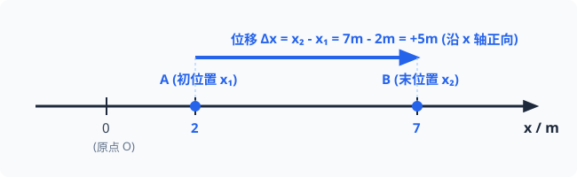
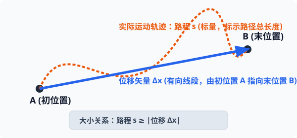

# 02 · 时间与位移

## 时刻与时间间隔

在物理学中，时间和时间间隔既有联系又有本质区别，在时间轴上的几何表现不同：

| 物理量 | 物理意义 | 时间轴上的几何表现 | 常见表述举例 |
| :--- | :--- | :--- | :--- |
| **时刻**（Instant） | 某一瞬间，代表事物发生的一个时间节点 | 时间轴上的**一个点** | “8点整上课”、“第3秒末”、“第4秒初” |
| **时间间隔**（Time Interval） | 两个时刻之间的跨度，代表物理过程持续的久暂 | 时间轴上的**一条线段** | “上一节课45分钟”、“前3秒内”、“第3秒内（持续1秒）” |

> [!NOTE]
> **关键用词习惯**：
> - “第 $n$ 秒初” 与 “第 $(n-1)$ 秒末” 对应时间轴上的**同一个时刻点**。
> - “第 $n$ 秒内” 指从时刻 $(n-1)$ 到时刻 $n$ 这段持续时间，时间跨度 $\Delta t = 1\ \text{s}$。
> - “前 $n$ 秒” 或 “$n$ 秒内” 指从时刻 $0$ 到时刻 $n$ 这段持续时间，时间跨度 $\Delta t = n\ \text{s}$。

---

## 位置、位移与路程

### 1. 位置（Position）
质点在某一时刻在空间中所处的具体坐标点。在一维坐标系中用坐标值 $x$ 描述。

  
   
  <em>图 1.2-1 一维坐标系中质点初位置 x₁、末位置 x₂ 与位移矢量 Δx = x₂ - x₁（正向位移标示）</em>

### 2. 位移（Displacement）
- **定义**：由物体的**初位置指向末位置**的有向线段。
- **数学表达式**：在一维坐标系中，初位置为 $x_1$，末位置为 $x_2$，则位移为：
  $$
  \Delta x = x_2 - x_1
  $$
- **物理属性**：**矢量**。
  - 大小：初末位置间有向线段的长度。
  - 方向：初位置指向末位置。正号表示位移方向与坐标轴正方向相同，负号表示相反。

### 3. 路程（Distance）
- **定义**：物体运动轨迹的实际长度。
- **物理属性**：**标量**，只有大小，没有方向，恒大于等于零。

### 4. 位移与路程的综合对比与矢量图解

  
   
  <em>图 1.2-2 质点从 A 沿曲线路径移动到 B：橙色虚线为路程 s（标量），蓝色有向线段为位移矢量 Δx</em>

| 对比维度 | 位移（$\Delta \vec{x}$） | 路程（$s$） |
| :--- | :--- | :--- |
| **物理属性** | **矢量**（有大小、有方向） | **标量**（只有大小，无方向） |
| **决定因素** | 仅取决于**初位置与末位置**，与运动路径无关 | 取决于运动的**实际轨迹路径** |
| **大小关系** | $|\Delta \vec{x}| \le s$ （位移大小恒小于等于路程） | $s \ge |\Delta \vec{x}|$ |
| **等号成立条件** | 仅在物体做**单向直线运动**时，位移的大小才等于路程 | 同左 |
| **极限微元关系** | 在无限小的时间间隔 $\Delta t \to 0$ 内，微元位移大小等于微元路程：$|\mathrm{d}\vec{x}| = \mathrm{d}s$ |

> [!WARNING]
> **高频易错警示**
> - [×] “物体的位移大小等于路程”。（必须注明“单向直线运动”前提，若有往返，位移大小必然小于路程）
> - [×] 质点沿半径为 $R$ 的圆周跑了一整圈，路程为 $2\pi R$，位移也是 $2\pi R$。（错！初末位置重合，位移大小为 $0$）
> - [√] 位移为零的运动，路程不一定为零；但路程为零的物体一定处于静止状态。

---

## 实验室位移与时间的测量仪器

在高中物理力学实验中，测量质点运动时间和位移的经典仪器是**打点计时器**：

  
   
  <em>图 1.2-3 电磁打点计时器（人教版教材插图）</em>

- **电磁打点计时器**：接 $8\ \text{V}$ 交流电源，打点周期 $T = 0.02\ \text{s}$（$50\ \text{Hz}$）。
- **电火花打点计时器**：接 $220\ \text{V}$ 交流电源，利用脉冲放电击穿墨粉盘打点，阻力极小，测量精度高。
