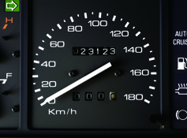
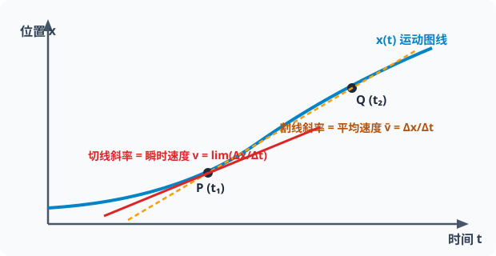
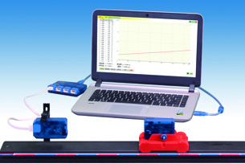
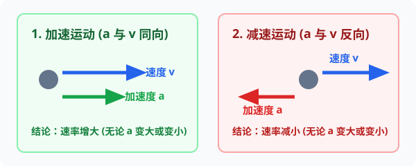

# 03 · 速度与加速度

## 速度：位置变化的快慢

### 1. 速度（Velocity）
- **物理意义**：描述物体位置变化快慢与方向的物理量。
- **定义式**：
  $$
  \vec{v} = \frac{\Delta \vec{x}}{\Delta t}
  $$
- **国际单位**：米每秒（$\text{m/s}$ 或 $\text{m}\cdot\text{s}^{-1}$），常用单位还有千米每小时（$\text{km/h}$），$1\ \text{m/s} = 3.6\ \text{km/h}$。
- **矢量性**：方向即位移 $\Delta \vec{x}$ 的方向，即质点运动的方向。

  
   
  <em>图 1.3-1 汽车速度计直接读取的数值是瞬时速率（标量）（人教版教材插图）</em>

### 2. 平均速度与瞬时速度

| 类别 | 物理定义 | 数学表征 | 几何直观（$x-t$ 图像） |
| :--- | :--- | :--- | :--- |
| **平均速度**（Average Velocity） | 质点在某段时间内的位移与发生这段位移所用时间的比值 | $\bar{\vec{v}} = \frac{\Delta \vec{x}}{\Delta t}$ | $x-t$ 图像上连接两点割线的**斜率** |
| **瞬时速度**（Instantaneous Velocity） | 运动物体在某一时刻（或经过某一位置）的速度 | $\vec{v} = \lim_{\Delta t \to 0} \frac{\Delta \vec{x}}{\Delta t} = \frac{\mathrm{d}\vec{x}}{\mathrm{d}t}$ | $x-t$ 图像上该时刻切线的**斜率** |

  
   
  <em>图 1.3-2 微积分导数视角：当 Δt → 0 时，割线 PQ 旋转逼近该点的切线，切线斜率即瞬时速度</em>

> [!TIP]
> **可汗学院极限思想（Calculus Intuition）**
> 可汗学院生动地将瞬时速度解释为：如果你把相机快门时间缩短到无限趋近于零（$\Delta t \to 0$），汽车在这极短瞬间的位移 $\Delta x$ 除以时间 $\Delta t$，就凝固成了仪表盘在这一刹那显示的指针读数。数学上即位移对时间的导数。

  
   
  <em>图 1.3-3 借助位移传感器与计算机直接采集微元数据绘制实时速度图象（人教版教材插图）</em>

---

## 加速度：速度变化的快慢

### 1. 加速度（Acceleration）
- **物理意义**：描述物体**速度变化快慢与变化方向**的物理量，即速度对时间的变化率。
- **定义式**：
  $$
  \vec{a} = \frac{\Delta \vec{v}}{\Delta t} = \frac{\vec{v} - \vec{v}_0}{\Delta t}
  $$
- **微元微积分形式**：
  $$
  \vec{a} = \lim_{\Delta t \to 0} \frac{\Delta \vec{v}}{\Delta t} = \frac{\mathrm{d}\vec{v}}{\mathrm{d}t} = \frac{\mathrm{d}^2\vec{x}}{\mathrm{d}t^2}
  $$
- **国际单位**：米每二次方秒（$\text{m/s}^2$ 或 $\text{m}\cdot\text{s}^{-2}$）。
- **矢量性**：加速度的方向**恒与速度变化量 $\Delta \vec{v}$ 的方向一致**。

### 2. 物体加速与减速的本质判据

  
   
  <em>图 1.3-4 加速与减速的本质判据：只要 a 与 v 同向即加速；只要 a 与 v 反向即减速</em>

一个物体是在做“加速”还是“减速”，**并不取决于 $a$ 是正还是负，也不取决于 $a$ 在增大还是减小**，而是取决于 $\vec{a}$ 与 $\vec{v}$ 的方向关系：

- **若 $\vec{a}$ 与 $\vec{v}$ 同向**（$a \cdot v > 0$）：即使加速度 $a$ 在逐渐减小，物体的速度依然在**增加**（只是增加得越来越慢，直到 $a=0$ 时速度达到极大值）。
- **若 $\vec{a}$ 与 $\vec{v}$ 反向**（$a \cdot v < 0$）：即使加速度 $a$ 在逐渐增大，物体的速度依然在**减小**（减小得越来越快，直到速度减为 $0$ 后开始反向运动）。

---

## $v$、$\Delta v$、$a$ 核心概念辨析

高考经典陷阱：混淆“速度大”、“速度变化大”与“速度变化快”。

| 概念 | 物理意义 | 决定因素 | 极值特例说明 |
| :--- | :--- | :--- | :--- |
| **速度 $v$** | 运动的快慢和方向 | 初始条件、受力历史 | 高铁高速匀速行驶（$350\ \text{km/h}$）：$v$ 很大，但 $a = 0$ |
| **速度变化量 $\Delta v$** | 速度改变了多少 | $\Delta v = a \Delta t$ | 飞机长距离加速，历时很长：$\Delta v$ 很大，但 $a$ 可能很小 |
| **加速度 $a$** | 速度改变的快慢 | 牛顿第二定律 $a = \frac{F_{合}}{m}$ | 炮弹发射瞬间刚点火：$v \approx 0$，但火药合力极大，故 $a$ 极大 |

> [!WARNING]
> **高考常考辨析正误**
> - [×] 加速度为正，物体一定做加速运动。（错！若初速度为负，加速度为正表示二者反向，物体做减速运动）
> - [×] 物体的加速度正在减小，其速度不可能增加。（错！只要加速度与速度同向，速度就会持续增加）
> - [√] 速度为零时，加速度可以不为零（如竖直上抛最高点、单摆摆到最高点瞬间）。
> - [√] 加速度很大，速度可能为零；速度很大，加速度也可以为零。
