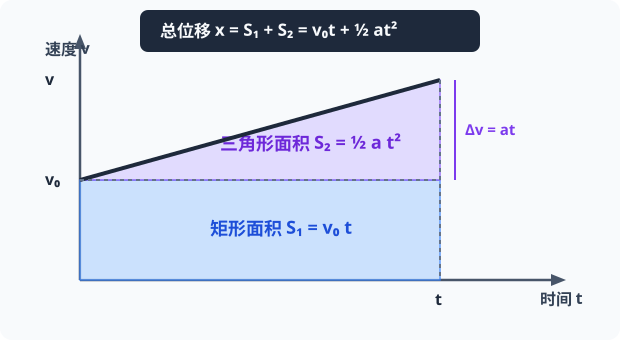
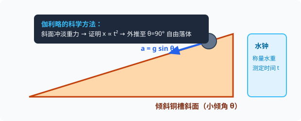
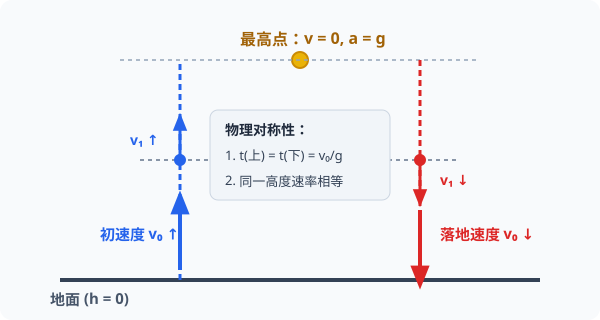

# 04 · 匀变速直线运动规律与自由落体

## 匀变速直线运动的本质

- **定义**：沿着一条直线，且**加速度保持不变**（大小和方向均恒定）的运动，称为**匀变速直线运动**（Uniformly Accelerated Linear Motion）。
- **分类**：
  - 匀加速直线运动：$a$ 与 $v$ 同向（加速）；
  - 匀减速直线运动：$a$ 与 $v$ 反向（减速）。

---

## 四大基本公式与决策矩阵

### 1. 四大基本公式推导

$$
\begin{cases}
(1)\ \text{速度与时间关系：} & v = v_0 + at \\[6pt]
(2)\ \text{位移与时间关系：} & x = v_0t + \frac{1}{2}at^2 \\[6pt]
(3)\ \text{位移与速度关系：} & v^2 - v_0^2 = 2ax \\[6pt]
(4)\ \text{平均速度与位移：} & x = \bar{v}t = \frac{v_0 + v}{2}t
\end{cases}
$$

  
   
  <em>图 1.4-1 可汗学院与微积分几何直观：v-t 图线下的梯形总面积等于位移 x = 矩形 S₁ (v₀t) + 三角形 S₂ (½ at²)</em>

> [!TIP]
> **可汗学院直观微元推导（几何面积法）**
> 在 $v-t$ 图像中，图线下方与时间轴围成的封闭图形是一块**梯形**：
>
> - 梯形上底为初速度 $v_0$，下底为末速度 $v$，高为时间 $t$；
> - 梯形面积分割为一个矩形（匀速运动部分：面积 $S_1 = v_0t$）和一个直角三角形（加速累积部分：高为 $at$，面积 $S_2 = \frac{1}{2}t \cdot at = \frac{1}{2}at^2$）；
> - 梯形总面积即位移：$x = S_1 + S_2 = v_0t + \frac{1}{2}at^2$，直观且无需复杂的代数套用。

::: tip 🪐 动态交互实验：运动学微元切片累积与 v-t 梯形面积积分
拖拽调节初速度 $v_0$、加速度 $a$ 与时间 $t$，观察微元切片逼近梯形面积，直观印证位移 $x = v_0 t + \frac{1}{2} a t^2$：
<ClientOnly>
<CCPhysicsSimulator model="kinematics" :height="360" />
</ClientOnly>
:::

### 2. 五量选三决策矩阵

运动学包含五个核心物理量：初速度 $v_0$、末速度 $v$、加速度 $a$、时间 $t$、位移 $x$。高考解题的核心思想是**“缺少哪个量，就直接选用不含该量的公式”**：

|         缺少量          | 选用公式                     | 典型适用场景                           |
| :---------------------: | :--------------------------- | :------------------------------------- |
|  **$x$**（未涉及位移）  | $v = v_0 + at$               | 已知初末速度和时间，求加速度或加速时间 |
| **$v$**（未涉及末速度） | $x = v_0t + \frac{1}{2}at^2$ | 已知时间求位移，或刹车制动类问题       |
|  **$t$**（未涉及时间）  | $v^2 - v_0^2 = 2ax$          | 空间行程已确定，求出站速度或起飞距离   |
| **$a$**（未涉及加速度） | $x = \frac{v_0 + v}{2}t$     | 已知初末速度和历时，快速求位移         |

---

## 三大核心推论

### 1. 逐差公式（连续相等时间间隔内位移差）

质点做匀变速直线运动，在任意连续相等的时间间隔 $T$ 内，位移之差恒为一个定值：

$$
\Delta x = x_{n} - x_{n-1} = aT^2
$$

更普遍的推广式（纸带处理与打点计时器实验核心公式）：

$$
x_m - x_n = (m - n)aT^2
$$

### 2. 中间时刻的瞬时速度

做匀变速直线运动的物体，在某段时间 $t$ 内的中间时刻的瞬时速度 $v_{\frac{t}{2}}$ 等于这段时间内的平均速度 $\bar{v}$：

$$
v_{\frac{t}{2}} = \bar{v} = \frac{v_0 + v}{2}
$$

### 3. 中间位置的瞬时速度

做匀变速直线运动的物体，经过位移中点 $\frac{x}{2}$ 处的瞬时速度 $v_{\frac{x}{2}}$ 满足：

$$
v_{\frac{x}{2}} = \sqrt{\frac{v_0^2 + v^2}{2}}
$$

> [!IMPORTANT]
> **大小比较定理**：无论是匀加速还是匀减速直线运动，只要 $a \neq 0$，恒有：
>
> $$
> v_{\frac{x}{2}} > v_{\frac{t}{2}}
> $$
>
> （当且仅当 $a = 0$ 做匀速运动时，两者相等：$v_{\frac{x}{2}} = v_{\frac{t}{2}}$）。

---

## 初速度为零（$v_0 = 0$）的常用比例关系

当物体做初速度为零的匀加速直线运动（或末速度为零的匀减速直线运动逆向看待）时：

### 1. 按连续相等时间间隔 $T$ 划分

- $1T$ 末、$2T$ 末、$3T$ 末 $\dots$ 瞬时速度之比：
  $$ v_1 : v_2 : v_3 : \dots : v_n = 1 : 2 : 3 : \dots : n $$
- 前 $1T$ 内、前 $2T$ 内、前 $3T$ 内 $\dots$ 总位移之比：
  $$ x_1 : x_2 : x_3 : \dots : x_n = 1 : 4 : 9 : \dots : n^2 $$
- 第 $1$ 个 $T$ 内、第 $2$ 个 $T$ 内、第 $3$ 个 $T$ 内 $\dots$ 各段连续位移之比（自然奇数比）：
  $$ \Delta x*I : \Delta x*{II} : \Delta x\_{III} : \dots : \Delta x_N = 1 : 3 : 5 : \dots : (2n - 1) $$

### 2. 按连续相等位移间隔 $x_0$ 划分

- 通过连续相等位移所用的时间之比：
  $$ t_1 : t_2 : t_3 : \dots : t_n = 1 : (\sqrt{2} - 1) : (\sqrt{3} - \sqrt{2}) : \dots : (\sqrt{n} - \sqrt{n-1}) $$

---

## 自由落体与竖直上抛运动

### 1. 自由落体运动（Free Fall）

- **定义**：物体只在重力作用下，从**静止**开始下落的运动。
- **运动性质**：初速度 $v_0 = 0$、加速度 $a = g$（取重力加速度，地面通常 $g \approx 9.8\ \text{m/s}^2$ 或 $10\ \text{m/s}^2$）的匀加速直线运动。
- **公式体系**：
  $$
  v = gt, \quad h = \frac{1}{2}gt^2, \quad v^2 = 2gh
  $$

  
   
  <em>图 1.4-2 伽利略通过小倾角斜面“冲淡重力”测得小球位移与时间平方成正比，外推得出自由落体匀加速规律</em>

### 2. 竖直上抛运动的对称性模型

  
   
  <em>图 1.4-3 竖直上抛时空对称性：上升时间等于下降时间；同一高度上升速率等于下落速率</em>

初速度为 $v_0$、方向竖直向上的自由飞行运动（仅受重力，加速度 $a = -g$）：

1. **时间对称性**：上升到最高点的时间等于从最高点落回原抛出点的时间：
   $$ t*{上} = t*{下} = \frac{v_0}{g} $$
2. **速度对称性**：物体经过空中同一高度点时，上升速度与下落速度**大小相等、方向相反**。
3. **最高点特征**：上升的最大高度 $H = \frac{v_0^2}{2g}$，最高点处瞬时速度 $v = 0$，但加速度仍为 $g$。
