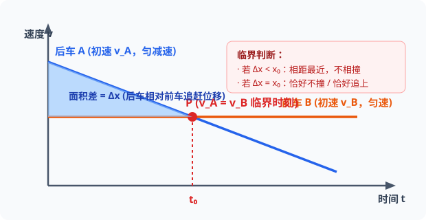
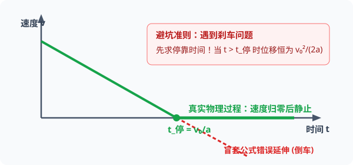

# 考点 · 运动图像与追及相遇

## 考点一 运动图像（$x-t$、$v-t$、$a-t$）核心识别矩阵

图像法是高考物理考查的核心题型之一，能够直观反映物理量随时间变化的函数关系。解题时需牢牢抓住**“轴、点、线、斜率、面积、截距”**六大几何要素：

| 图像类别 | 横轴与纵轴 | 斜率（Slope）的物理意义 | 面积（Area）的物理意义 | 截距与交点的物理意义 |
| :---: | :---: | :--- | :--- | :--- |
| **$x-t$ 图像** | $t$：时间 $x$：位置坐标 | **切线斜率表示速度 $v$**： $k > 0$ 正向运动；$k < 0$ 反向运动； $k = 0$ 瞬时静止；直线为匀速 | **无明确物理意义**（位移乘时间无物理意义） | **截距**：初始位置坐标； **交点**：两质点在同一时刻到达同一位置，即**相遇** |
| **$v-t$ 图像** | $t$：时间 $v$：瞬时速度 | **切线斜率表示加速度 $a$**： $k > 0$ 加速度沿正向； $k = 0$ 匀速运动；斜率变大表示 $a$ 增大 | **图线与时间轴包围的面积表示位移 $\Delta x$**： $t$ 轴上方为正位移，下方为负位移；代数和为总位移 | **截距**：初始速度； **交点**：两质点在同一时刻**速度相等**（注：并非相遇！） |
| **$a-t$ 图像** | $t$：时间 $a$：加速度 | 加速度对时间的变化率（加加速度/Jerk） | **图线与时间轴包围的面积表示速度变化量 $\Delta v$**： $\Delta v = \int a\,\mathrm{d}t$ | **截距**：初始时刻物体的加速度 |

> [!TIP]
> **可汗学院图像阅读黄金法则**
> - **微积分导数视角**：从 $x(t) \xrightarrow{\text{求导(斜率)}} v(t) \xrightarrow{\text{求导(斜率)}} a(t)$；
> - **微积分积分视角**：从 $a(t) \xrightarrow{\text{积分(面积)}} \Delta v \xrightarrow{\text{积分(面积)}} \Delta x$。
> 任何复杂的运动图像，只要还原为斜率或面积，都能迎刃而解。

---

## 考点二 追及与相遇问题

### 1. 追及与相遇的本质特征
- **相遇的条件**：在**同一时刻**到达**同一空间位置**（即两物体的位移与初始间距满足几何关系）。
- **极值临界条件**：**当两物体速度相等（$v_1 = v_2$）时，两物体之间的距离取得极值（极大值或极小值）**。

  
   
  <em>图 K1-1 后车 A 减速追前车 B 匀速：速度相等时刻 t₀ 为相遇与距离极值的唯一临界判据</em>

### 2. 两类经典追及模型

#### 模型一：初速度大的物体减速追赶前方初速度小的物体（“能否追上/会否相撞”模型）
- **物理情景**：后车以速度 $v_1$ 减速（$a_1$），前车以速度 $v_2$ 匀速或同向加速（$v_1 > v_2$），初始距离为 $x_0$。
- **临界状态**：在 $t$ 时刻，后车速度恰好减小到等于前车速度（$v_1' = v_2'$）。
  - **若此时两车位移差 $\Delta x < x_0$**：后车未能追上前车，**二者不会相撞**，此时两车相距**最近**，最近距离为 $d_{min} = x_0 - \Delta x$；
  - **若此时两车位移差 $\Delta x = x_0$**：后车恰好追上前车，是**恰好不相撞的临界状态**；
  - **若此时两车位移差 $\Delta x > x_0$**：两车在速度相等之前就已经发生相撞（或相遇错车）。

#### 模型二：初速度小的物体加速追赶前方匀速行驶的物体（“相距最远”模型）
- **物理情景**：前车以速度 $v_2$ 匀速，后车从静止开始以加速度 $a$ 同向加速追赶，初始距离为 $x_0$。
- **临界状态**：
  - 开始阶段后车速度小于前车速度，两车间距逐渐**增大**；
  - 当后车速度加速到与前车相等（$at = v_2$）瞬间，两车间距达到**最大值**：$d_{max} = x_0 + v_2 t - \frac{1}{2}at^2$；
  - 随后后车速度超过前车，间距逐渐减小，直到最后必然相遇追上。

---

## 考点三 求解追及相遇的三大方法

1. **物理分析法（临界极值法）**：
   先求出两物体**速度相等**的时间 $t_0$，分别代入两物体的位移公式，计算此时的位移差与初距离的关系。直观明了，不易出错。
2. **代数判别式法**：
   根据位移关系列出关于时间 $t$ 的一元二次方程 $At^2 + Bt + C = 0$：
   - 若判别式 $\Delta = B^2 - 4AC < 0$，无实数解，表示不相遇；
   - 若 $\Delta = 0$，有唯一实数解，表示恰好追上（相切临界）；
   - 若 $\Delta > 0$，有两个实数解，表示相遇两次（先相遇错车，后再次相遇）。
3. **$v-t$ 图像面积差法**：
   在同一个 $v-t$ 坐标系中分别画出两个物体的运动图线。图线相交点即为速度相等时刻，两图线与纵轴围成的“面积差”直观表示相对位移，结合初始间距 $x_0$ 可秒杀极值问题。

---

## 考点四 避坑指南：刹车陷阱（Braking Trap）

  
   
  <em>图 K1-2 刹车陷阱：汽车速度降为零后停在原地（水平绿线），盲套公式（红色虚线）会导致倒车计算错误</em>

> [!WARNING]
> **刹车陷阱高频考点警示**
> 汽车等实际物体做匀减速直线运动时，速度减为零后通常会**静止**，而不会倒退（除非存在反向持续外力拉动）。
> - **解题黄金第一步**：遇到匀减速刹车类问题，**必须先求刹车停止时间**：
>   $$
>   t_{停} = \frac{v_0}{a}
>   $$
> - **陷阱防范**：若题目给定的时间 $t > t_{停}$，计算位移时绝对**不能直接代入公式 $x = v_0t - \frac{1}{2}at^2$**！
> - **正确计算**：此时物体的实际位移就是刹车全过程位移：
>   $$
>   x = \frac{v_0^2}{2a}
>   $$
