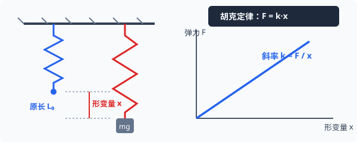

# 01 · 重力与弹力

## 重力与重心

### 1. 重力（Gravity）
- **产生机制**：由于**地球的吸引**而使物体受到的力。重力是万有引力在地球表面附近的一个主要分力（另一小部分分力提供物体随地球自转所需的向心力）。
- **大小计算**：
  $$
  G = mg
  $$
  （式中 $g$ 为当地重力加速度，纬度越高 $g$ 越**大**；海拔越高 $g$ 越**小**）。
- **方向**：**竖直向下**（垂直于水平面向下，并非恒指向地心）。

### 2. 重心（Center of Gravity）
- **物理本质**：物体各部分所受重力的**等效作用点**（等效替代思想）。
- **重心的位置决定因素**：
  1. 物体的**形状**；
  2. 物体的**质量分布**。
- **重心位置特点**：
  - 质量分布均匀、形状规则的物体，重心在其**几何中心**（如匀质球体球心、均匀圆环圆心）；
  - 重心**不一定在物体上**（例如空心圆环、三角尺、马蹄形磁铁的重心都在物体外部空隙处）。
- **薄板状物体重心测定法**：**悬挂法**（原理：二力平衡，两次悬挂线延长线的交点即为重心）。

---

## 弹力与胡克定律

### 1. 形变与弹力产生条件
- **弹性形变**：物体在受外力作用后发生形状或体积改变，在外力撤去后**能够完全恢复原状**的形变。
- **弹力定义**：发生弹性形变的物体，由于要恢复原状，对与它接触的物体产生的力的作用。
- **弹力产生的两个必要条件**：
  1. 两物体**直接接触**；
  2. 接触处发生**弹性形变**（挤压或拉伸）。

### 2. 常见弹力的方向判断

| 弹力类型 | 物理图景 | 施力物体与受力物体 | 弹力的确切方向 |
| :--- | :--- | :--- | :--- |
| **支持力 / 压力** | 面与面、点与面接触 | 发生挤压形变的支撑面或接触面 | **垂直于接触面**，并指向受力物体的内部（恢复原状方向） |
| **轻绳拉力** | 柔软不可伸长的轻绳 | 沿绳轴向收缩形变的轻绳 | **沿着绳子收缩的方向**，恒为拉力 |
| **轻杆弹力** | 刚性轻杆 | 发生拉伸、压缩或弯曲形变的轻杆 | **方向是任意的**（不一定沿着杆的方向，必须根据整体平衡或加速度状态联立求解） |

---

## 胡克定律（Hooke's Law）

英国科学家罗伯特·胡克通过大量弹簧拉伸实验总结得出：在弹性限度内，弹簧弹力的大小与弹簧的形变量（伸长量或压缩量）成正比。

  
   
  <em>图 2.1-1 弹簧形变量 x 与弹力 F 线性关系：F-x 图像切线斜率表示劲度系数 k</em>

### 1. 数学表达式
$$
F = k \cdot x = k |L - L_0|
$$
- $F$：弹簧的弹力（$\text{N}$）；
- $x$：弹簧的**形变量**（伸长量或压缩量，单位 $\text{m}$），绝对不能代入弹簧的总长度 $L$；
- $k$：弹簧的**劲度系数**（Stiffness），单位为牛每米（$\text{N/m}$）。

### 2. 劲度系数 $k$ 的决定因素
劲度系数反映了弹簧“软硬”程度，是弹簧自身的固有属性。由弹簧的**材料、钢丝粗细、弹簧外径以及有效匝数（长度）**决定。
- 弹簧剪短后，匝数变少，劲度系数 $k$ 将**增大**（剪成两半，每段的 $k$ 变为原先的 $2$ 倍）。

---

## 典型考点与易错辨析

> [!WARNING]
> **高考常考易错点**
> - [×] “物体的重心一定在物体上，且重力大小随高度增加而保持不变。”（错！重力加速度随高度增大而减小；空心甜甜圈的重心在其中心空洞处）
> - [×] “轻杆对球的支持力一定沿着杆的方向。”（错！只有两端铰接的轻二力杆弹力才沿杆方向；固定刚性杆的弹力方向可以是任意角度）
> - [√] 弹簧发生突变时，弹簧弹力**不能发生突变**（形变量恢复需要时间），而轻绳张力在断裂或松弛瞬间**可以突变为零**。
