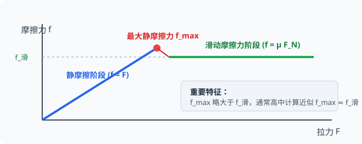

# 02 · 摩擦力

## 摩擦力的本质与产生条件

- **定义**：两个相互接触并挤压的物体，当它们发生相对运动或具有相对运动趋势时，在接触面上产生的阻碍相对运动或相对运动趋势的力。
- **产生摩擦力的三大充要条件**（缺一不可）：
  1. 接触面**粗糙**（不光滑）；
  2. 接触面之间存在**正压力**（有弹性挤压形变，$F_N \neq 0$）；
  3. 两物体间有**相对运动**或**相对运动趋势**。

> [!NOTE]
> 有弹力不一定有摩擦力；但**有摩擦力的地方必然存在弹力**！

---

## 静摩擦力与滑动摩擦力深度对比

  
   
  <em>图 2.2-1 摩擦力随拉力变化全景图：静摩擦力阶段 f = F 线性增长；达到 f_max 后突变为恒定滑动摩擦力</em>

### 1. 静摩擦力（Static Friction）
- **产生机理**：两物体接触且受挤压，具有**相对运动趋势**，但保持相对静止。
- **方向**：**沿着接触面切线方向**，并且与**相对运动趋势的方向相反**（可用假设光滑法判定趋势）。
- **大小特征**：
  - 静摩擦力是一个**被动力**，大小随平行于接触面的外力变化而自适应调节。
  - 根据牛顿平衡条件或牛二定律动力学方程列式求解（如水平推木箱未推动：$f = F_{推}$）。
  - **最大静摩擦力（$f_{max}$）**：静摩擦力增大的最大极限值，略大于滑动摩擦力。在通常高中物理计算中，若未作特殊说明，常近似认为：$f_{max} \approx f_{滑} = \mu F_N$。
  - 取值范围：
    $$
    0 < f_{静} \le f_{max}
    $$

### 2. 滑动摩擦力（Kinetic Friction）
- **产生机理**：两物体接触挤压，并且表面之间发生**相对滑动**。
- **方向**：沿着接触面切线方向，并且与**相对运动方向相反**。
- **大小计算公式**：
  $$
  f = \mu F_N
  $$
  - $\mu$：**动摩擦因数**（无量纲纯数），由接触面材料的粗糙程度、干湿程度决定，与接触面积大小无关，与物体运动速度大小无关；
  - $F_N$：接触面间的**正压力**（垂直于接触面的法向弹力），必须根据垂直方向受力平衡列式求解，绝对不能盲目认为恒等于 $mg$！

---

## 核心思维突破：摩擦力的方向判据与做功性质

### 1. “相对运动”不等同于“对地运动”
- 摩擦力阻碍的是两物体接触面的**相对运动**，而不是物体对地面的运动！
- 摩擦力**既可以充当阻力，也可以充当动力**：
  - 示例 1：人走路时，地面给鞋底向前的静摩擦力，正是人向前行走的动力；
  - 示例 2：传送带将静止货物由静止加速送达高处，静摩擦力对货物做正功，提供货物加速前进的动力。

### 2. 摩擦力做功的能量法则
- **静摩擦力**：由于接触点没有发生相对滑动，静摩擦力对系统**不做功或只转移机械能**，绝不产生内能（**静摩擦力不生热**）。
- **滑动摩擦力**：系统内一对滑动摩擦力做功的代数和恒为负，其绝对值等于系统摩擦产生的内能（**滑动摩擦生热**）：
  $$
  Q = f_{滑} \cdot \Delta x_{相对}
  $$
  （$\Delta x_{相对}$ 为两物体接触面间滑动的**相对路程**）。
