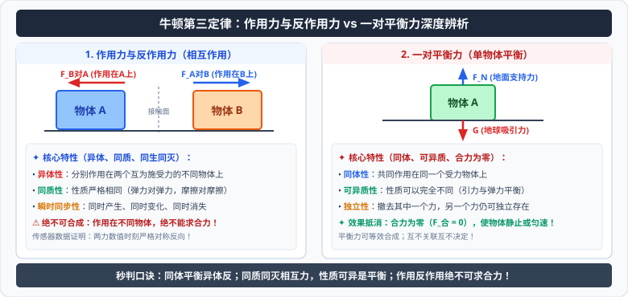

# 03 · 牛顿第三定律

  

## 作用力与反作用力

力是物体对物体的作用。只要谈到一个力，就必定同时存在**施力物体**和**受力物体**。

- **相互性**：两个物体之间的作用总是相互的。一个物体对另一个物体施加了力，另一个物体同时也对这个物体施加了力。
- **作用力与反作用力**：相互作用的一对力中，如果把其中一个力叫作**作用力**（Action），那么另一个力就叫作**反作用力**（Reaction）。两者的称谓是相对的，任何一个力都可以作为作用力。

---

## 牛顿第三定律的内容与表达式

### 1. 定律表述
**两个物体之间的作用力和反作用力总是大小相等，方向相反，作用在同一条直线上。**

### 2. 数学表达式
$$
\vec{F} = -\vec{F}'
$$
（负号表示两个力的方向相反）。

### 3. 作用力与反作用力的“四同”与“三异”特征

| 特征类别 | 核心内涵 | 物理深度剖析 |
| :--- | :--- | :--- |
| **同时产生** | **同生同灭** | 拔河比赛松手瞬间，绳子对两队选手的拉力同时突变为零，不存在先后延迟 |
| **同时变化** | **同步改变** | 磁铁相互靠近时，引力同时变大；相互远离时，引力同时减小 |
| **同性质** | **性质完全相同** | 作用力是引力，反作用力必是引力；作用力是弹力，反作用力必是弹力 |
| **同直线** | **共线反向** | 严格作用在两物体的连线或接触面法线上 |
| **异物性** | **分别作用在两个物体上** | 作用力作用在物体 A 上，反作用力作用在物体 B 上，产生各自独立的效果 |
| **不可抵消** | **绝对不能合成求合力** | 因为受力对象不同，不能把作用力与反作用力代数求和为零 |
| **效果独立** | **产生各自的加速度或形变** | 鸡蛋碰石头，两者受力大小严格相等，但鸡蛋因强度低破碎，石头完好 |

---

## 一对作用力反作用力 vs 一对平衡力

高考极其高频的混淆概念对比：

| 对比维度 | 一对作用力与反作用力 | 一对平衡力 |
| :--- | :--- | :--- |
| **受力对象** | **分别作用在两个相互作用的物体上**（异体） | **共同作用在同一个物体上**（同体） |
| **力的性质** | **必须是同一种性质的力**（同为弹力、摩擦力或引力） | **不一定相同**（如重力与支持力平衡，一为引力一为弹力） |
| **时效关联** | **同时产生、同时变化、同时消失** | **没有必然联系**（撤去一个力，另一个力可以继续存在） |
| **合成与效果** | **不能合成，无法抵消**，分别在不同物体上产生效果 | **合力为零**，两力效果互相抵消，物体保持平衡状态 |

> [!TIP]
> **可汗学院区分口诀：看受力对象与句式结构**
> - 作用力与反作用力句式：**“A 对 B 的力” 与 “B 对 A 的力”**（主宾互换，必然是作用力反作用力，大小恒相等，无论动静）；
> - 平衡力句式：**“A 对 C 的力” 与 “B 对 C 的力”**（受力对象都是 C，同体才能平衡）。

---

## 典型考点与辨析

> [!WARNING]
> **高考常考辨析正误**
> - [×] **拔河比赛胜负误区**：“赢的一方对绳子的拉力大于输的一方对绳子的拉力。”
>   - **纠正**：错！根据牛顿第三定律，两队选手对绳子的拉力大小严格相等。赢的决定性因素在于**地面给赢方的最大静摩擦力更大**！
> - [×] **马拉车加速误区**：“马加速拉车向前跑时，马对车的拉力大于车对马的拉力。”
>   - **纠正**：错！无论加速、减速还是匀速，马对车的拉力和车对马的拉力大小恒相等；马之所以能加速，是因为**地面对马向前的摩擦力大于车对马向后的拉力**。
> - [√] 人跳起离开地面的瞬间，人对地面的压力与地面对人的支持力大小严格相等。
