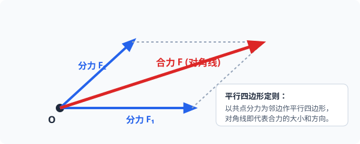

# 04 · 力的合成与分解

## 合力与分力的等效替代思想

- **等效替代**：如果一个力作用在物体上产生的效果，跟几个力共同作用在物体上产生的效果完全相同，那么这个力就叫作那几个力的**合力**，那几个力叫作这个力的**分力**。
- **力的合成**：求几个力的合力的过程。
- **力的分解**：求一个已知力的分力的过程（力的合成的逆运算）。

---

## 平行四边形定则与三角形定则

在物理学中，所有矢量的合成与分解都遵守**平行四边形定则**：

  
   
  <em>图 2.4-1 力的平行四边形定则：共点分力 F₁、F₂ 为邻边，对角线即代表合力 F 的大小与方向</em>

### 1. 定则表述
两个力合成时，以表示这两个力的线段为邻边作平行四边形，这两个邻边之间的对角线就表示合力的大小和方向。

### 2. 合力大小的数学计算与极值范围
设两分力大小分别为 $F_1$、$F_2$，两者夹角为 $\theta$：
$$
F = \sqrt{F_1^2 + F_2^2 + 2F_1 F_2 \cos\theta}
$$
- **夹角 $\theta = 0^\circ$（同向共线）**：合力最大，$F_{max} = F_1 + F_2$；
- **夹角 $\theta = 180^\circ$（反向共线）**：合力最小，$F_{min} = |F_1 - F_2|$；
- **夹角 $\theta = 90^\circ$（相互垂直）**：$F = \sqrt{F_1^2 + F_2^2}$；
- **夹角增大，合力减小**：在两分力大小不变的前提下，随着夹角 $\theta$ 从 $0^\circ$ 增大到 $180^\circ$，合力 $F$ 单调减小。
- **合力取值区间**：
  $$
  |F_1 - F_2| \le F \le F_1 + F_2
  $$

---

## 力的正交分解法（高频通用计算算法）

正交分解是将物体受到的多个不在同一直线上的共点力，投影分解到两个互相垂直的坐标轴上，化多维问题为一维代数和：

### 1. 建立坐标轴的黄金原则
1. **尽量让最多的力落在坐标轴上**，减少需要分解的力的个数；
2. 在动力学问题中，**通常以加速度 $\vec{a}$ 的方向（或运动方向）为 $x$ 轴正方向**，$y$ 轴垂直于加速度方向（此时 $a_y = 0$）。

### 2. 正交分解计算标准范式
将各力分别向 $x$ 轴和 $y$ 轴投影：
$$
\begin{cases}
F_x = F \cos\theta \\[4pt]
F_y = F \sin\theta
\end{cases}
$$
分别求出 $x$ 轴与 $y$ 轴方向的分力代数和：
$$
F_{合x} = \sum F_x, \quad F_{合y} = \sum F_y
$$
求总合力大小与方向：
$$
F_{合} = \sqrt{F_{合x}^2 + F_{合y}^2}, \quad \tan\alpha = \frac{F_{合y}}{F_{合x}}
$$
- **在平衡状态下**：
  $$
  \begin{cases}
  \sum F_x = 0 \\[4pt]
  \sum F_y = 0
  \end{cases}
  $$
