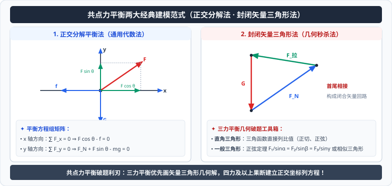

# 05 · 共点力的平衡条件

  

## 平衡状态与共点力平衡

### 1. 平衡状态（Equilibrium State）
- **定义**：物体处于**静止**或**匀速直线运动**的状态。
- **运动学本质**：物体的速度保持不变，**加速度严格为零**（$a = 0$）。
- **注意区分**：
  - 瞬时静止（如竖直上抛最高点、$v = 0$ 但 $a = g \neq 0$）**不是**平衡状态；
  - 匀速圆周运动（速度大小不变但方向时刻改变，$a = a_n \neq 0$）**不是**平衡状态。

### 2. 共点力平衡条件
作用在物体上同一点或作用线相交于同一点的力叫作**共点力**。

**在共点力作用下物体的平衡条件是合外力为零**：
$$
\vec{F}_{合} = \sum \vec{F} = \vec{0}
$$

### 3. 直角坐标系正交分解平衡方程
在一维或二维平面直角坐标系中，共点力平衡条件等价为各坐标轴方向的分力代数和独立为零：
$$
\begin{cases}
\sum F_x = 0 \\[6pt]
\sum F_y = 0
\end{cases}
$$

---

## 共点力平衡的重要推论

### 1. 二力平衡
若物体在两个力作用下处于平衡状态，则这两个力必定**大小相等、方向相反、作用在同一条直线上**。

### 2. 三力平衡与闭合矢量三角形
- **等效对消法则**：物体在三个共点力作用下处于平衡状态，则**任意两个力的合力，必然与第三个力大小相等、方向相反、作用在同一条直线上**。
- **闭合矢量三角形定理**：将这三个力依次首尾相接，必然构成一个**封闭的矢量三角形**（$\vec{F}_1 + \vec{F}_2 + \vec{F}_3 = \vec{0}$）。

### 3. 多力平衡推论
物体在 $N$ 个共点力作用下处于平衡状态，则**其中任意一个力，必定与其余 $(N-1)$ 个力的合力大小相等、方向相反**。

---

## 求解三力平衡的高效数学工具

### 1. 正交分解法（最通用标准算法）
- 建立互相垂直的 $x$ 轴和 $y$ 轴；
- 将未知力或倾斜力分解为 $F_x = F\cos\theta$ 和 $F_y = F\sin\theta$；
- 列方程 $\sum F_x = 0$、$\sum F_y = 0$ 联立求解。

### 2. 拉密定理（Lami's Theorem / 正弦定理推论）
当三个共点力处于平衡状态时，每个力的大小与其对角的正弦值成正比：
$$
\frac{F_1}{\sin\alpha_1} = \frac{F_2}{\sin\alpha_2} = \frac{F_3}{\sin\alpha_3}
$$
（式中 $\alpha_1$ 为 $F_2$ 与 $F_3$ 之间的夹角，以此类推）。
- **适用场景**：已知三个力的夹角或三力几何角度关系明确时，利用拉密定理可以一步直达结果，无需建立坐标系。

### 3. 相似三角形法
当受力物体的受力矢量三角形与物理情境中的几何空间结构三角形（如绳长、杆长、圆弧半径形成的几何三角形）相似时：
$$
\frac{F_1}{L_1} = \frac{F_2}{L_2} = \frac{F_3}{L_3}
$$
- **适用场景**：涉及球形容器、光滑圆弧轨道、定长轻绳悬挂物体的缓慢移动平衡问题。
