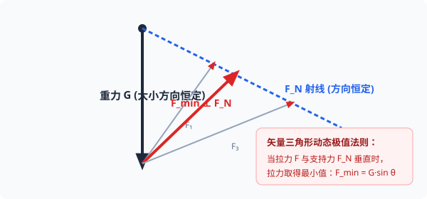

# 考点 · 受力分析规范与动态平衡模型

## 考点一 受力分析的标准操作规范与防错准则

受力分析是整个高中物理力学与电磁学的核心基本功。画错一个力，整道大题全盘皆输。

### 1. 受力分析四大标准步骤

1. **明确研究对象**：选取单个质点、物体，或者由几个物体构成的系统。
2. **按严谨次序找力（防多力、防漏力口诀）**：
   - **一重**：先画场力——重力 $G = mg$（方向恒竖直向下）；
   - **二弹**：绕研究对象巡视一周，找出所有接触面和接触点，逐一判断是否存在挤压或拉伸形变（支持力垂直接触面、绳拉力沿绳收缩）；
   - **三摩擦**：对每一个存在弹力的粗糙接触面，分析两物体间是否存在相对运动或相对运动趋势，画出摩擦力；
   - **四其他**：最后检查是否存在外加电场力（$qE$）、磁场力（洛伦兹力、安培力）或外加已知推拉力。
3. **检验与核对**：检查每个力是否都能明确指出其**施力物体**（找不出施力物体的力必是凭空臆造的假力！）。

> [!WARNING]
> **绝对不可凭空添加的“虚假力”**
>
> - [×] **“下滑力”**：物体在斜面上受到的是重力在平行斜面方向的**分力**（$mg\sin\theta$），绝不是另外存在一个叫“下滑力”的力。
> - [×] **“惯性力”**：在高中惯性系中，惯性是物体保持运动状态的内禀性质，不是力！
> - [×] **“向心力”**：向心力是圆周运动效果力，是由重力、弹力、摩擦力等实际力的合力充当的，受力分析图中绝对不能额外多画一个向心力！

::: tip 🪐 动态交互实验：斜面滑块受力动态正交分解与滑动临界
拖动倾角 $\theta$ 与动摩擦因数 $\mu$，直观观察重力 $mg$ 如何正交分解为沿斜面分力 $mg\sin\theta$ 与垂直斜面分力 $mg\cos\theta$，以及临界滑动状态转变：
<ClientOnly>
<CCPhysicsSimulator model="slope" :height="360" />
</ClientOnly>
:::

---

## 考点二 整体法与隔离法的决策模型

| 求解目标                                                                                       |  首选方法  | 核心逻辑与优势                                                                                                   |
| :--------------------------------------------------------------------------------------------- | :--------: | :--------------------------------------------------------------------------------------------------------------- |
| **求系统外部环境对整体的作用力** （如地面对斜面体的支持力、地面对系统的静摩擦力）           | **整体法** | 将系统内所有相对静止或具有相同加速度的物体视为一个整体，**系统内部各构件之间的内力自动相互抵消**，方程极其简洁。 |
| **求系统内部构件之间的相互作用力** （如斜面对木块的支持力、两物体间的挤压力、连接绳的拉力） | **隔离法** | 将目标物体从系统中单独隔离出来，单独画出其受力图并列平衡或牛二方程。                                             |

---

## 考点三 动态平衡三大经典解题模型

“动态平衡”指物体所受的外力在缓慢改变，但物体在整个移动过程中始终处于平衡状态（合外力时刻为零）。

### 1. 矢量三角形图解法（高频黄金题型）

- **适用条件**：
  1. 物体受到三个共点力处于平衡；
  2. 其中一个力**大小和方向都恒定**（通常为重力 $G$）；
  3. 第二个力**方向恒定**，大小未知（如斜面或挡板的支持力 $F_N$）；
  4. 第三个力**大小和方向都在连续改变**（如用绳缓慢拉动或旋转拉力 $F$）。

  
   
  <em>图 K2-1 动态平衡矢量三角形法：当动态拉力 F 与方向不变的支持力 F_N 垂直时，拉力取得最小值 F_min = G·sin θ</em>

- **解题步骤**：
  1. 画出恒定的重力矢量 $G$；
  2. 从重力起点引出方向恒定的力（支持力 $F_N$）的方向射线；
  3. 从重力末端向射线连线代表动态力 $F$；
  4. 旋转力 $F$ 的方向，观察三角形各边长度变化；**当 $F$ 与 $F_N$ 射线垂直时，垂线段最短，动态力取得唯一最小值！**

### 2. 相似三角形法

- **适用条件**：
  三个共点力平衡中，一个力恒定（重力），另外两个力的大小和方向均发生改变，但力矢量构成的三角形与空间实际几何结构的三角形（如杆长、绳长、几何半轴）始终保持相似。
- **解题公式**：
  $$
  \frac{G}{L_{竖直}} = \frac{F_1}{L_1} = \frac{F_2}{L_2}
  $$
  通过几何长度的变化趋势，即可直接判定力的大小增减。
