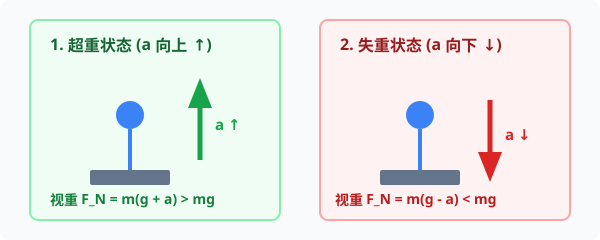

# 03 · 超重与失重

## 实重与视重的本质区别

- **实重（True Weight）**：物体实际受到的重力大小，即 $G = mg$。只要物体在地球表面附近的位置确定，它的实重就保持恒定，与其运动状态无关。
- **视重（Apparent Weight）**：弹簧测力计拉物体时的**拉力示数**，或台秤、地面支撑物体时的**支持力示数**。视重反映了物体与接触面之间的挤压剧烈程度。

---

## 超重与失重的物理本质与判定准则

  
   
  <em>图 3.3-1 超重与失重唯取决于加速度方向：a 向上超重 (视重变大)；a 向下失重 (视重变小)</em>

### 1. 超重现象（Overweight）
- **物理定义**：物体对支持物的压力（或对悬挂物的拉力）**大于**物体所受重力的现象（视重 $>$ 实重）。
- **本质动力学判据**：**物体的加速度方向具有竖直向上的分量（$a \uparrow$）**。
- **动力学方程**：
  $$
  F_N - mg = ma \implies F_N = m(g + a) > mg
  $$
- **对应的常见运动状态**：
  1. 竖直**向上加速**运动（$v \uparrow, a \uparrow$）；
  2. 竖直**向下减速**运动（$v \downarrow, a \uparrow$，如跳伞开伞瞬间、电梯下行刹车）。

### 2. 失重现象（Weightlessness）
- **物理定义**：物体对支持物的压力（或对悬挂物的拉力）**小于**物体所受重力的现象（视重 $<$ 实重）。
- **本质动力学判据**：**物体的加速度方向具有竖直向下的分量（$a \downarrow$）**。
- **动力学方程**：
  $$
  mg - F_N = ma \implies F_N = m(g - a) < mg
  $$
- **对应的常见运动状态**：
  1. 竖直**向下加速**运动（$v \downarrow, a \downarrow$）；
  2. 竖直**向上减速**运动（$v \uparrow, a \downarrow$，如竖直上抛上升阶段、电梯上行减速停靠）。

---

## 完全失重状态（Complete Weightlessness）

当物体向下的加速度恰好等于自由落体加速度时（$a = g \downarrow$）：
$$
F_N = m(g - g) = 0
$$
此时物体对支持面或悬吊物完全没有压力或拉力，称为**完全失重**。

### 1. 完全失重下的奇异物理现象
在完全失重环境下，一切由“重力挤压支持面”产生的次生效果全部消失：
- **液体浮力消失**：木块浸入水中不会浮起，阿基米德浮力定律失效；
- **液体压强消失**：液体内部各处压强为零，水滴在表面张力作用下自发形成完美的**球形**；
- **天平失效**：托盘天平无法再用来称量质量；
- **沉淀现象消失**：泥水混合物中的泥沙不会自然下沉沉淀。

### 2. 空间站中的航天员为何失重？
> [!IMPORTANT]
> **高考核心认知辨析**：
> 运行在 400 公里高空的中国空间站“天宫”或国际空间站，航天员并不是“脱离了地球引力”！事实上，在 400 公里高度，地球对航天员的引力仍约为地面的 $90\%$ 左右。
> 航天员处于完全失重状态的根本原因在于：**地球引力全部充当了空间站绕地球做匀速圆周运动的向心力**，空间站与航天员的向心加速度恰好等于该高度的自由落体加速度（$a = g' = \frac{GM}{r^2}$），航天器与人体同步“自由坠落”，因此相对完全无支撑压力！
