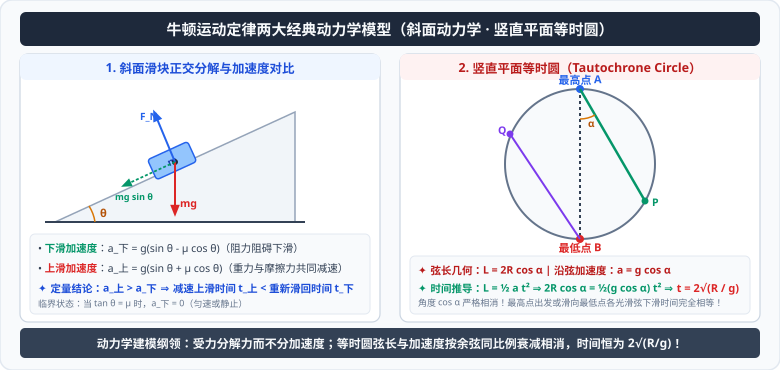

# 04 · 牛顿定律的综合应用

## 动力学两类基本问题

牛顿第二定律 $\vec{F}_{\text{合}} = m\vec{a}$ 建立了受力情况与运动状态变化之间的因果定量联系。在力学中，**加速度 $a$ 是连接“力”与“运动”的核心桥梁**。

```
受力分析 ───> 合外力 F_合 ───> 加速度 a ───> 运动学公式 ───> 速度 v、位移 x、时间 t
                            (a = F/m)
运动学状态 (v, x, t) ───> 加速度 a ───> 合外力 F_合 ───> 受力分析 ───> 求解未知力
```

### 1. 第一类问题：已知受力情况求运动情况
- **分析路径**：明确研究对象 $\rightarrow$ 受力分析 $\rightarrow$ 建立坐标系正交分解 $\rightarrow$ 求合外力 $F_{\text{合}}$ $\rightarrow$ 由牛顿第二定律求加速度 $a = \frac{F_{\text{合}}}{m}$ $\rightarrow$ 结合初始状态（$v_0, x_0$）由运动学公式求任意时刻的 $v(t), x(t)$ 或位移、速度。

### 2. 第二类问题：已知运动情况求受力情况
- **分析路径**：观察物体的运动轨迹与速度/位移数据 $\rightarrow$ 选定运动学公式求加速度 $a$ $\rightarrow$ 由牛顿第二定律求合外力 $F_{\text{合}} = ma$ $\rightarrow$ 进行受力分析列平衡或动力学方程 $\rightarrow$ 求解指定未知力（如摩擦力、拉力、支持力、阻力等）。

---

## 动力学建模规范：正交分解法

当物体受多个不同方向的共点力作用时，正交分解法是最具通用性与抗错性的分析方法。

### 1. 坐标系建立原则
建立平面直角坐标系 $x-y$ 时，通常遵循两大原则：
- **原则一（优先推荐）**：**分解力而不分解加速度**。通常以加速度 $\vec{a}$ 的方向（或可能的运动方向）为 $x$ 轴正方向，垂直于加速度方向为 $y$ 轴。
  - $x$ 轴方向：$\sum F_x = ma$
  - $y$ 轴方向：$\sum F_y = 0$
- **原则二（特定情境）**：**分解加速度而不分解力**。若物体受力大多沿水平或竖直方向，而加速度沿倾斜方向（如斜面上匀加速物体），也可建立水平、竖直坐标系：
  - $\sum F_x = m a_x = m a \cos\theta$
  - $\sum F_y = m a_y = m a \sin\theta$

---

## 典型动力学模型与深度剖析

<div style="text-align: center; margin: 20px 0;">
  
</div>

### 1. 斜面滑块模型（倾角 $\theta$，质量 $m$，动摩擦因数 $\mu$）

#### (1) 物体沿粗糙斜面下滑
以沿斜面向下为 $x$ 轴，垂直斜面向上为 $y$ 轴：
- $y$ 方向：$F_N - mg\cos\theta = 0 \implies F_N = mg\cos\theta$
- 滑动摩擦力：$F_f = \mu F_N = \mu mg\cos\theta$
- $x$ 方向：$mg\sin\theta - F_f = ma_{\text{下}}$
$$\therefore a_{\text{下}} = g(\sin\theta - \mu\cos\theta)$$
> **状态判据**：
> - 当 $\tan\theta > \mu$ 时，$a_{\text{下}} > 0$，滑块沿斜面加速下滑；
> - 当 $\tan\theta = \mu$ 时，$a_{\text{下}} = 0$，滑块保持静止或做匀速直线运动；
> - 当 $\tan\theta < \mu$ 时，下滑力不足以克服最大静摩擦力，静止物块无法自发下滑。

#### (2) 物体以初速度 $v_0$ 沿粗糙斜面上滑
上滑过程中，重力沿斜面向下的分力与滑动摩擦力同向（均沿斜面向下）：
$$mg\sin\theta + \mu mg\cos\theta = ma_{\text{上}}$$
$$\therefore a_{\text{上}} = g(\sin\theta + \mu\cos\theta)$$
显然，在相同倾角和摩擦因数下：
$$a_{\text{上}} > a_{\text{下}}$$
上滑减速到零所用时间 $t_{\text{上}} = \frac{v_0}{a_{\text{上}}}$ 显著小于从最高点下滑回原位置的时间 $t_{\text{下}} = \sqrt{\frac{2L}{a_{\text{下}}}}$。

---

### 2. 等时圆模型（Isoperimetric / Tautochrone Circle）

在竖直平面内，若光滑质点仅在重力与光滑导轨支持力作用下由静止沿斜面轨道下滑：

设竖直平面内有一半径为 $R$ 的圆，最高点为 $A$，最低点为 $B$：
1. **从最高点 $A$ 出发沿任意光滑弦轨道 $AP$ 下滑**：
   - 设轨道 $AP$ 与竖直方向夹角为 $\alpha$；
   - 物体受重力与法向弹力，沿轨道方向合力 $F = mg\cos\alpha$，加速度 $a = g\cos\alpha$；
   - 弦长 $L = 2R\cos\alpha$；
   - 由运动学公式 $L = \frac{1}{2}at^2$：
   $$2R\cos\alpha = \frac{1}{2}(g\cos\alpha)t^2 \implies t = 2\sqrt{\frac{R}{g}}$$
   下滑时间 $t$ 与弦的倾角 $\alpha$ 完全无关！从最高点出发沿所有光滑弦滑到圆周上的时间均相等。
2. **从圆周上任意点 $Q$ 沿光滑弦滑向最低点 $B$**：
   - 设轨道与竖直方向夹角为 $\beta$，同理可得下滑时间恒为 $t = 2\sqrt{\frac{R}{g}}$。

> [!TIP]
> **可汗学院直观思维：为什么时间与角度无关？**  
> 陡峭的轨道（$\alpha$ 小）加速度更大，但弦长也更长；平缓的轨道（$\alpha$ 大）弦长短，但加速度也按完全相同的比例 $\cos\alpha$ 衰减。几何长度与动力学加速度对角度的余弦调制恰好严格相消，体现了引力场与欧几里得圆几何的深层数学对称。

---

### 3. 斜向拉力作用下的最大加速度极值分析

水平地面上质量为 $m$ 的物体，受与水平方向成 $\theta$ 角斜向上的拉力 $F$ 作用：
- 竖直方向：$F_N + F\sin\theta = mg \implies F_N = mg - F\sin\theta$
- 水平方向：$F\cos\theta - \mu F_N = ma$
- 代入得：
$$a = \frac{F(\cos\theta + \mu\sin\theta) - \mu mg}{m}$$
利用辅助角公式：$\cos\theta + \mu\sin\theta = \sqrt{1+\mu^2}\sin(\theta + \varphi)$，其中 $\tan\varphi = \frac{1}{\mu}$（即 $\cot\varphi = \mu$）。
- 当 $\theta + \varphi = 90^\circ$，即 $\tan\theta = \mu$ 时，括号内取得最大值 $\sqrt{1+\mu^2}$，加速度达到最大值：
$$a_{\max} = \frac{F\sqrt{1+\mu^2} - \mu mg}{m}$$

---

## 典型考点与易错辨析

> [!WARNING]
> **高考常考辨析正误**
> - [×] “在分析上滑与下滑时，上滑的摩擦力一定大于下滑的摩擦力。”（错误！滑动摩擦力 $F_f = \mu mg\cos\theta$，只要支持力不变，上滑与下滑的摩擦力大小完全相等，只是方向相反导致加速度不同）
> - [×] “物体沿斜面匀加速下滑时，支持力对物体不做功，所以支持力不参与动力学方程。”（错误！支持力决定了最大静摩擦力和滑动摩擦力大小，纵向平衡方程 $\sum F_y=0$ 是求出横向合力的必经环节）
> - [√] 加速度是力与运动的唯一瞬时纽带：力改变，加速度瞬间改变；但物体的速度 $v$ 与位移 $x$ 具有连续性，不可突变。
