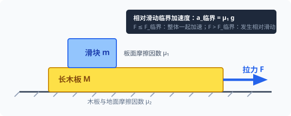

# 考点 · 动力学临界极值与连接体模型

## 连接体问题：整体法与隔离法

当系统中包含两个或两个以上相互关联的物体时，统称为**连接体系统**。

### 1. 整体法与隔离法的选择策略
- **整体法**：将多个物体视为一个整体质点组。
  - **优势**：只分析系统外力，**避开系统内部物体间的相互作用力（内力）**；
  - **适用条件**：系统中所有物体的**加速度大小和方向完全相同**。
- **隔离法**：将某个研究对象从系统中单独隔离出来，单独画受力分析图。
  - **适用条件**：当题目要求解系统内部的相互作用力（如接触面支持力、轻绳张力、静摩擦力等），或者各物体的加速度不同时。
- **解题黄金组合**：**先整体求加速度 $a$，再隔离求相互作用力**。

### 2. 加速度与内力分配定理
如图，光滑或同摩擦因数水平面上，质量为 $m_1$ 和 $m_2$ 的两物体由轻绳相连，拉力 $F$ 水平向右拉 $m_1$：
- **整体法**：$F - \mu(m_1+m_2)g = (m_1+m_2)a \implies a = \frac{F}{m_1+m_2} - \mu g$
- **隔离 $m_2$**：$T - \mu m_2 g = m_2 a$
- 将 $a$ 代入可得轻绳张力：
$$T = \frac{m_2}{m_1 + m_2} F$$
> [!TIP]
> **内力分配规律**：轻绳张力大小只取决于两物体的质量比与外力，**与接触面的动摩擦因数 $\mu$ 完全无关**（只要两物体与地面的摩擦因数相同）。拉力 $F$ 被两物体的质量按比例分摊，绳子只承受其后拖拽物体的惯性与摩擦阻力。

---

## 瞬时性问题：轻绳、轻弹簧与轻杆的动力学突变

牛顿第二定律 $\vec{F}_{\text{合}} = m\vec{a}$ 具有**瞬时对应性**：合外力改变的瞬间，加速度立即同步改变；但由于惯性，物体的**速度不能突变**。

### 1. 两类力学构件的形变与突变特性对比

| 物理模型 | 形变特点 | 恢复时间 | 状态改变瞬间受力特点 |
| :--- | :--- | :--- | :--- |
| **轻弹簧 / 橡皮筋** | 宏观形变明显（$\Delta x$ 大） | 形变恢复需要宏观时间 | **弹力不能突变**！在剪断其他约束的瞬间，弹簧两端形变量保持原值，$F = k\Delta x$ 瞬间恒定不变。 |
| **轻绳 / 细线 / 刚性接触面** | 微观微小形变（视为刚性） | 形变调整时间极短（瞬时） | **拉力/支持力可以突变**！剪断或接触状态改变瞬间，张力瞬间变为零或自适应跳变为新平衡值。 |

### 2. 经典剪断模型对比
天花板下悬挂小球 $A$（质量 $m$），$A$ 下方连接小球 $B$（质量 $m$）：
- **情况一：天花板与 $A$ 之间为轻弹簧，$A$ 与 $B$ 之间为轻绳**：
  - 平衡时：弹簧拉力 $F = 2mg$，细绳张力 $T = mg$。
  - **剪断细绳瞬间**：细绳张力 $T$ 瞬间变为 $0$；弹簧弹力**不能突变**，仍为 $2mg$。
    - 球 $A$：$F - mg = ma_A \implies a_A = \frac{2mg - mg}{m} = g$（方向竖直向上！）；
    - 球 $B$：仅受重力，$a_B = g$（方向竖直向下，做自由落体）。
- **情况二：天花板与 $A$ 之间为轻绳，$A$ 与 $B$ 之间为轻弹簧**：
  - 平衡时：轻绳张力 $T = 2mg$，弹簧弹力 $F = mg$。
  - **剪断轻绳瞬间**：轻绳拉力瞬间为 $0$；弹簧弹力**不能突变**，仍为 $mg$（向上拉 $B$，向下拉 $A$）。
    - 球 $A$：$mg + F = ma_A \implies a_A = \frac{mg + mg}{m} = 2g$（方向竖直向下！）；
    - 球 $B$：受向上弹力 $F$ 与向下重力 $mg$，合力为 $0 \implies a_B = 0$（瞬间处于悬浮平衡！）。

---

## 动力学临界极值问题的三大判据

物理状态发生质的飞跃的关键分界点称为**临界状态**。

### 1. 两物体即将分离的临界判据
两接触物体在分离瞬间：
- **弹力判据**：接触面间正压力恰好减为零，即 **$F_N = 0$**；
- **运动学判据**：分离瞬间两者仍紧密相邻，**具有相同的速度 $v_1 = v_2$ 和相同的加速度 $a_1 = a_2$**。

### 2. 相对滑动的临界判据
两接触物体由相对静止转为相对滑动的临界瞬间：
- **摩擦力判据**：接触面间的静摩擦力恰好达到**最大静摩擦力**，即 **$F_f = F_{f\max} = \mu F_N$**；
- **运动学判据**：两物体仍保持相对静止，拥有**相同的加速度 $a$**。

### 3. 轻绳即将松弛的临界判据
- 绳子张力恰好减小到零，即 **$T = 0$**。

---

## 经典综合模型一：滑块—木板模型（板块模型）

板块模型是高考考查综合动力学、摩擦力动态判定及多过程分析的终极题型。

### 1. 物理构型与参数
- 地面光滑（或动摩擦因数 $\mu_1$），长木板质量 $M$，物块质量 $m$；
- 物块与木板之间的动摩擦因数 $\mu_2$；
- 设外力 $F$ 水平作用在长木板 $M$ 上。

### 2. 相对滑动临界外力计算
求物块 $m$ 与木板 $M$ 保持相对静止共同加速的最大拉力 $F_{\text{临界}}$：
1. **分析临界受力**：当 $F$ 增大到临界值时，$m$ 与 $M$ 刚要相对滑动，此时 $m$ 所受静摩擦力达到最大值 $f_{\max} = \mu_2 mg$；
2. **隔离滑块 $m$**：
   $$f_{\max} = \mu_2 mg = m a_{\max} \implies a_{\max} = \mu_2 g$$
   滑块能获得的最大加速度为 $\mu_2 g$（由最大静摩擦力提供）；
3. **整体法求临界拉力**：
   $$F_{\text{临界}} = (M + m) a_{\max} = (M + m)\mu_2 g$$
4. **动力学结论**：
   - 当 $F \le (M + m)\mu_2 g$ 时：$m$ 与 $M$ 相对静止，以共同加速度 $a = \frac{F}{M+m}$ 运动；
   - 当 $F > (M + m)\mu_2 g$ 时：$m$ 与 $M$ 发生相对滑动，滑块加速度 $a_m = \mu_2 g$ 保持不变，木板加速度 $a_M = \frac{F - \mu_2 mg}{M} > a_m$。

### 3. $v-t$ 图像法求解板块追及与木板最小长度
若滑块以初速度 $v_0$ 滑上静止的长木板：
- 滑块做匀减速运动：$a_m = \mu_2 g$，$v_m(t) = v_0 - a_m t$；
- 木板做匀加速运动：$a_M = \frac{\mu_2 mg}{M}$，$v_M(t) = a_M t$；
- **共速时间 $t_1$**：$v_0 - a_m t_1 = a_M t_1 \implies t_1 = \frac{v_0}{a_m + a_M}$；
- **相对位移与板长约束**：
  $$\Delta x = x_m - x_M = \frac{1}{2} v_0 t_1 = \frac{v_0^2}{2(a_m + a_M)}$$
  在 $v-t$ 图像中，$\Delta x$ 严格对应**两条速度图线所围成的三角形面积**。滑块不滑落的充要条件是长木板长度 $L \ge \Delta x$。

---

## 经典综合模型二：传送带模型与共速临界转折

传送带模型的核心在于：**判断物体与传送带速度相等的瞬间，摩擦力的方向是否发生突变或消失**。

### 1. 水平传送带
物块以初速度 $v_0$ 滑上以恒定速度 $v$ 顺时针运行的水平传送带：
- **若 $v_0 < v$**：物块受向右的滑动摩擦力 $f = \mu mg$，向右加速 $a = \mu g$。
  - 若传送带足够长，物块加速到 $v$ 时**相对静止**，摩擦力瞬间变为 $0$，此后匀速运动；
  - 若传送带长度不足，物块一直匀加速滑出。
- **若 $v_0 > v$**：物块受向左的滑动摩擦力，向右匀减速，减速到 $v$ 后摩擦力变为 $0$，做匀速运动。

### 2. 倾斜传送带（倾角 $\theta$）
物块轻放在向下匀速运行（速度为 $v$）的倾斜传送带上：
- **第一阶段（$v_{\text{物}} < v$）**：传送带比物块快，传送带给物块**沿斜面向下的滑动摩擦力**：
  $$mg\sin\theta + \mu mg\cos\theta = m a_1 \implies a_1 = g(\sin\theta + \mu\cos\theta)$$
- **转折瞬间（$v_{\text{物}} = v$）**：共速瞬间，摩擦力性质发生突变，取决于 $\mu$ 与 $\tan\theta$ 的大小关系：
  - **若 $\mu \ge \tan\theta$**：共速后，物块所受下滑力 $mg\sin\theta \le \mu mg\cos\theta$。物块不再相对滑动，静摩擦力突变为沿斜面向上且 $f = mg\sin\theta$，**物块此后以速度 $v$ 匀速下滑**；
  - **若 $\mu < \tan\theta$**：共速后，下滑力大于最大静摩擦力，物块继续加速，速度超过传送带。此时传送带比物块慢，**摩擦力方向瞬间反向（变为沿斜面向上）**：
  $$mg\sin\theta - \mu mg\cos\theta = m a_2 \implies a_2 = g(\sin\theta - \mu\cos\theta) < a_1$$
  物块此后以更小的加速度 $a_2$ 继续做匀加速下滑，直至离开传送带。

