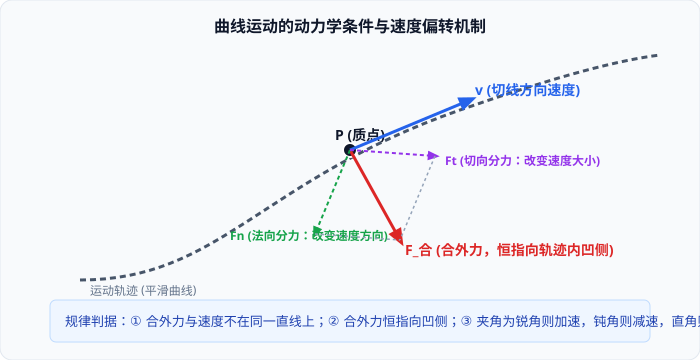

# 01 · 曲线运动的特征与条件

## 曲线运动的运动学特征

质点运动轨迹是曲线的运动叫作**曲线运动**。在高中物理中，曲线运动是研究二维及复杂多维运动的基石。

### 1. 速度的方向：轨迹的切线方向
- **定义与规律**：质点在某一位置（或某一时刻）的**瞬时速度方向，就是质点经过该位置的曲线轨迹的切线方向**，且指向质点运动前进的一侧。
- **实验与生活证据**：
  - 在砂轮上磨刀具时，火星从砂轮与刀具接触点沿圆周切线方向飞出；
  - 下雨天撑伞快速旋转伞柄，水滴从伞边缘沿圆周的切线方向甩出。

### 2. 曲线运动的运动学本质：必为变速运动
- **逻辑推导**：速度 $\vec{v}$ 是矢量，既有大小又有方向。做曲线运动的物体，其速度方向**时刻在改变**。
- **结论**：
  $$\frac{d\vec{v}}{dt} = \vec{a} \neq \mathbf{0}$$
  做曲线运动的物体的**加速度必不为零**，因此**曲线运动必定是变速运动**。即使物体速率大小恒定不变（如匀速圆周运动），由于速度方向在变，也依然是变速运动。

---

## 物体做曲线运动的动力学条件

由牛顿第二定律 $\vec{F}_{\text{合}} = m\vec{a}$ 可知，既然做曲线运动的物体加速度必不为零，则其受力必满足特定的动力学约束。

### 1. 充要条件
**当物体所受合外力 $\vec{F}_{\text{合}}$（或加速度 $\vec{a}$）的方向与它的速度 $\vec{v}$ 的方向不在同一直线上时，物体做曲线运动。**

| 力与速度方向关系 | 运动轨迹与性质 | 实例 |
| :--- | :--- | :--- |
| $\vec{F}_{\text{合}}$ 与 $\vec{v}$ **同向**（夹角 $0^\circ$） | 匀加速直线运动（$F$ 为恒力）或变加速直线运动 | 自由落体、水平推车 |
| $\vec{F}_{\text{合}}$ 与 $\vec{v}$ **反向**（夹角 $180^\circ$） | 匀减速直线运动（$F$ 为恒力）或变减速直线运动 | 竖直上抛、刹车滑行 |
| $\vec{F}_{\text{合}}$ 与 $\vec{v}$ **不在同一直线上** | **曲线运动**（轨迹向合力一侧弯曲） | 平抛运动、圆周运动、行星公转 |

### 2. 轨迹的内凹法则（合外力恒指向凹侧）
- **核心规律**：物体做曲线运动时，运动轨迹必然向合外力所指的方向弯曲。
- **空间相对位置三要素**：
  $$\vec{F}_{\text{合}} \text{ 恒在内侧（凹侧）} \quad \longleftarrow \quad \text{轨迹弯曲夹在中间} \quad \longrightarrow \quad \vec{v} \text{ 恒在外侧（切线）}$$
  即：**合外力在内、轨迹在中、速度在外**，合外力永远指向轨迹内凹的一侧！

---

## 速度大小与方向改变的解耦（切向力与法向力）

> [!TIP]
> **可汗学院微积分视角：矢量的正交分解**  
> 设合外力 $\vec{F}_{\text{合}}$ 与速度 $\vec{v}$ 的夹角为 $\theta$。我们将合外力正交分解为沿速度方向的**切向力 $F_t$** 与垂直于速度方向的**法向力 $F_n$**：
> 1. **法向分力 $F_n = F_{\text{合}}\sin\theta$**：垂直于速度方向，永远不做功（$W = 0$），**只负责改变速度的方向，使轨迹发生弯曲**。其产生的法向加速度为 $a_n = \frac{v^2}{\rho}$（$\rho$ 为轨迹在该点的曲率半径）；
> 2. **切向分力 $F_t = F_{\text{合}}\cos\theta$**：沿速度切线方向，做功改变物体的动能，**只负责改变速度的大小（速率）**，满足 $a_t = \frac{dv}{dt}$。

根据夹角 $\theta$ 的范围，可以精准预测速度大小的变化：
1. **$\theta < 90^\circ$（锐角）**：$F_t > 0$，合力做正功，物体做**速率增大的加速曲线运动**；
2. **$\theta > 90^\circ$（钝角）**：$F_t < 0$，合力做负功，物体做**速率减小的减速曲线运动**；
3. **$\theta = 90^\circ$（直角）**：$F_t = 0$，合力不做功，物体做**速率不变的曲线运动**（如匀速圆周运动）。

---

## 轨迹与合外力关系的高考常考判据

> [!WARNING]
> **高考常考认知误区与辨析**
> - [×] “物体做曲线运动，其速度大小一定发生改变。”（错！匀速圆周运动速度大小不变，改变的只是速度的方向）
> - [×] “做曲线运动的物体，加速度一定是变化的。”（错！平抛运动的加速度为恒定重力加速度 $\vec{g}$，大小和方向均恒定不变，属于匀变速曲线运动）
> - [×] “合外力为零时，物体也可以做曲线运动。”（错！合外力为零时，由牛顿第一定律，物体必做匀速直线运动或保持静止，绝不可能做曲线运动）
> - [√] 只要合外力大小或方向发生突变，轨迹的曲率半径将发生突变；若合外力瞬间变为零，物体将沿着该时刻的切线方向做匀速直线运动飞出。

