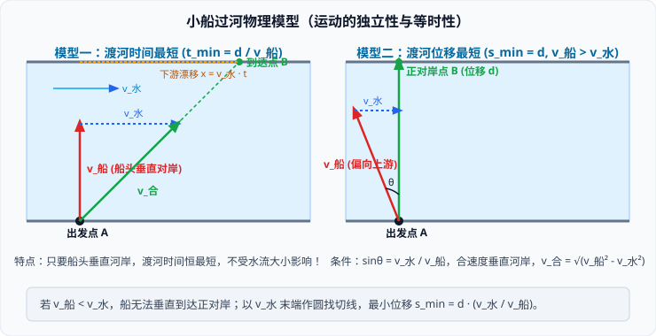

# 02 · 运动的合成与分解

## 合运动与分运动的三大物理特性

如果一个物体同时参与了几个方向的运动，那么物体实际发生的运动叫作**合运动**，各个方向同时进行的运动叫作**分运动**。

### 1. 独立性原理（Independence Principle）
- 一个物体同时参与几个分运动时，各分运动各自独立进行，**按照各自的动力学规律演化，互不影响、互不干扰**。
- 例如：平抛运动在水平方向的匀速直线运动与竖直方向的自由落体运动完全互不干扰。

### 2. 等时性原理（Isochronism）
- 合运动与各个分运动经历的时间**严格相等**。
- 物体从起点运动到终点所耗费的时间，既是合运动的时间，也是任意一个分运动的时间：
$$t_{\text{合}} = t_{x} = t_{y}$$

### 3. 等效替代性
- 各分运动的位移、速度、加速度的矢量叠加效果，与合运动的实际位移、速度、加速度**完全等效**。

---

## 运动合成的性质判定法则

根据分运动的合初速度 $\vec{v}_0 = \vec{v}_{x0} + \vec{v}_{y0}$ 与合加速度 $\vec{a} = \vec{a}_x + \vec{a}_y$ 的矢量叠加，可判定合运动的轨迹与性质：

| 分运动一性质 | 分运动二性质 | 夹角条件 | 合运动性质与轨迹 |
| :--- | :--- | :--- | :--- |
| 匀速直线运动 | 匀速直线运动 | 互成夹角 | **匀速直线运动**（合速度恒定） |
| 匀速直线运动 | 匀变速直线运动 | 互成夹角 | **匀变速曲线运动**（如平抛运动） |
| 初速为零匀加速 | 初速为零匀加速 | 互成夹角 | **匀加速直线运动**（合初速度为零） |
| 匀变速直线运动 | 匀变速直线运动 | 互成夹角 | 若 $\vec{a}_{\text{合}}$ 与 $\vec{v}_{0\text{合}}$ **共线**，为**匀变速直线运动**； 若 $\vec{a}_{\text{合}}$ 与 $\vec{v}_{0\text{合}}$ **不共线**，为**匀变速曲线运动**。 |

---

## 经典模型一：小船过河问题

设河宽为 $d$，水流速度为 $v_{\text{水}}$（恒定），小船在静水中的划行速度为 $v_{\text{船}}$（恒定）。小船的实际运动是 $v_{\text{船}}$ 与 $v_{\text{水}}$ 的合运动。

### 1. 最短时间渡河模型
- **核心策略**：要使渡河时间最短，必须使**垂直河岸方向的分速度达到最大值**。
- **操作准则**：将船头**始终垂直指向正对岸**（即 $v_{\text{船}}$ 垂直于河岸），此时垂直岸方向分速度 $v_y = v_{\text{船}}$。
- **最短时间公式**：
  $$t_{\min} = \frac{d}{v_{\text{船}}}$$
- **下游漂移距离**：
  $$x = v_{\text{水}} \cdot t_{\min} = \frac{v_{\text{水}}}{v_{\text{船}}} d$$
> [!NOTE]
> 渡河时间 $t_{\min}$ **完全独立于水流速度 $v_{\text{水}}$**！即使水流湍急或汛期涨水，只要船在静水中的航速不变且船头垂直指向对岸，渡河时间分秒不差保持恒定。

### 2. 最短位移渡河模型
根据 $v_{\text{船}}$ 与 $v_{\text{水}}$ 的相对大小，分为两种物理情形：

#### 情形一：$v_{\text{船}} > v_{\text{水}}$（船速大于水速）
- **最短位移**：小船可以垂直河岸航行，实际位移恰好等于河宽，即 **$s_{\min} = d$**。
- **船头朝向**：船头必须偏向上游，与河岸成 $\theta$ 角，使静水船速在沿水流方向的分量恰好抵消水流速度：
  $$v_{\text{船}}\cos\theta = v_{\text{水}} \implies \cos\theta = \frac{v_{\text{水}}}{v_{\text{船}}} \quad (\text{或 } \sin\alpha = \frac{v_{\text{水}}}{v_{\text{船}}}，\alpha \text{ 为与垂线夹角})$$
- **渡河合速度与渡河时间**：
  $$v_{\text{合}} = \sqrt{v_{\text{船}}^2 - v_{\text{水}}^2}, \quad t = \frac{d}{v_{\text{合}}} = \frac{d}{\sqrt{v_{\text{船}}^2 - v_{\text{水}}^2}}$$

#### 情形二：$v_{\text{船}} < v_{\text{水}}$（船速小于水速）
- **物理现实**：无论船头指向何方，水流速度都无法被完全抵消，合速度不可能垂直指向正对岸，小船必然被冲向下游。
- **几何极值法（矢量圆法）**：
  - 以水流速度 $\vec{v}_{\text{水}}$ 的末端为圆心，以 $v_{\text{船}}$ 为半径作圆；
  - 从坐标原点向该圆引切线，切线方向即为**最小偏转角对应合速度 $\vec{v}_{\text{合}}$ 的方向**；
  - 此时合速度与 $\vec{v}_{\text{船}}$ 严格垂直：$\sin\beta = \frac{v_{\text{船}}}{v_{\text{水}}}$；
- **最短位移公式**：
  $$s_{\min} = \frac{d}{\cos\beta} = d \cdot \frac{v_{\text{水}}}{v_{\text{船}}}$$
- **航向角**：船头与上游河岸夹角 $\theta = \arccos(\frac{v_{\text{船}}}{v_{\text{水}}})$。

---

## 经典模型二：关联速度问题（绳、杆连接体）

高中物理中，用不可伸长的轻绳或轻杆连接的物体，各物体的速度往往不相等，但它们之间存在确定的几何关联约束。

### 1. 核心约束定理：沿绳（杆）方向的分速度相等
由于轻绳或轻杆**不可伸长亦不可压缩**，沿绳（杆）轴线方向上各点的位移在任意微元时间内必须严格守恒：
$$\text{物体实际运动在沿绳（杆）轴线方向的分速度} = \text{绳（杆）伸长或缩短的速度}$$

### 2. 绳端速度分解标准步骤
1. **明确合速度**：**物体的实际运动方向就是合速度 $\vec{v}_{\text{实际}}$ 的方向**；
2. **正交分解分速度**：将实际速度分解为：
   - **沿绳（杆）方向的分速度 $v_{\parallel}$**：负责使绳子收拢或拉长；
   - **垂直于绳（杆）方向的分速度 $v_{\perp}$**：负责使绳子绕转轴发生角偏转；
3. **建立等式**：两连接物体沿同一根绳的轴向分速度大小严格相等：
$$v_{1\parallel} = v_{2\parallel}$$

> [!TIP]
> **典例：汽车在水平地面上以恒定速度 $v$ 拉绳提升井中重物**  
> 设绳与水平地面夹角为 $\theta$，重物竖直上升速度为 $v_{\text{物}}$：  
> - 汽车的实际速度为水平方向 $v$，将其分解为沿绳方向分速度 $v_{\parallel} = v\cos\theta$ 与垂直绳方向分速度 $v_{\perp} = v\sin\theta$；  
> - 重物沿绳方向运动，故 $v_{\text{物}} = v_{\parallel} = v\cos\theta$；  
> - 当汽车向右行驶时，夹角 $\theta$ 逐渐减小，$\cos\theta$ 增大，重物做**加速上升运动**！
