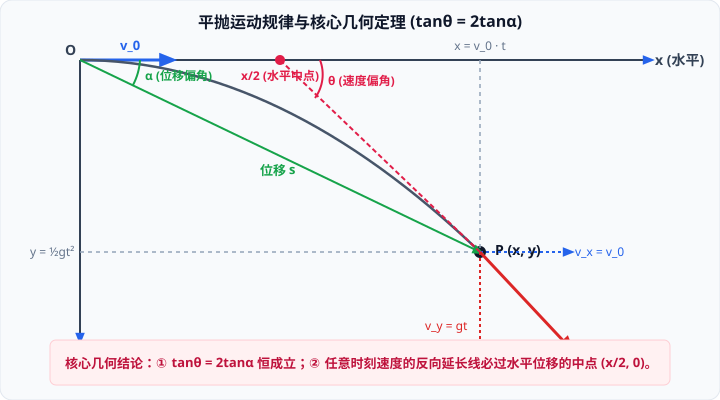

# 03 · 平抛运动的规律

## 平抛运动的定义与物理性质

### 1. 定义
将物体以一定的初速度 $v_0$ 沿**水平方向**抛出，若物体**仅在重力作用下**运动，这种运动叫作**平抛运动**。

### 2. 运动性质
- **受力特征**：在运动全过程中，物体只受恒定的竖直向下重力 $G = mg$；
- **加速度特征**：由牛顿第二定律，物体的加速度恒为重力加速度 $\vec{a} = \vec{g}$，大小和方向（竖直向下）**恒定不变**；
- **结论**：平抛运动是**加速度恒为 $g$ 的匀变速曲线运动**。

---

## 平抛运动的正交分解研究法

研究平抛运动的最佳范式是将其解耦为水平与竖直两个独立的分运动：

### 1. 分运动状态方程矩阵

| 运动维度 | 受力情况 | 初速度 | 加速度 | $t$ 时刻速度 | $t$ 时刻位移 |
| :--- | :--- | :--- | :--- | :--- | :--- |
| **水平方向 ($x$)** | 不受力 ($F_x = 0$) | $v_{x0} = v_0$ | $a_x = 0$ | $v_x = v_0$（匀速） | $x = v_0 t$ |
| **竖直方向 ($y$)** | 重力 ($F_y = mg$) | $v_{y0} = 0$ | $a_y = g$ | $v_y = gt$（自由落体） | $y = \frac{1}{2}gt^2$ |

### 2. 轨迹方程推导
由水平位移公式解出时间：$t = \frac{x}{v_0}$，代入竖直位移公式：
$$y = \frac{1}{2} g \left(\frac{x}{v_0}\right)^2 = \frac{g}{2v_0^2} x^2$$
- 由于 $g$ 与 $v_0$ 为恒定常量，上式为 $y = k x^2$ 的标准形式；
- **几何结论**：**平抛运动的轨迹是一条顶点在抛出点、开口向下的抛物线**。

### 3. 合速度与合位移
- **$t$ 时刻的合速度大小**：
  $$v = \sqrt{v_x^2 + v_y^2} = \sqrt{v_0^2 + (gt)^2}$$
- **$t$ 时刻的合位移大小**：
  $$s = \sqrt{x^2 + y^2} = \sqrt{(v_0 t)^2 + \left(\frac{1}{2}gt^2\right)^2}$$

---

## 两大核心几何定理推导

设质点在 $t$ 时刻到达点 $P(x, y)$，合位移与水平方向夹角为 $\alpha$（位移偏角），合速度与水平方向夹角为 $\theta$（速度偏角）：

### 1. 定理一：正切双倍定理 ($\tan\theta = 2\tan\alpha$)
- **位移偏角正切**：
  $$\tan\alpha = \frac{y}{x} = \frac{\frac{1}{2}gt^2}{v_0 t} = \frac{gt}{2v_0}$$
- **速度偏角正切**：
  $$\tan\theta = \frac{v_y}{v_x} = \frac{gt}{v_0}$$
- **推导结论**：
  $$\tan\theta = 2\tan\alpha$$
> [!IMPORTANT]
> 无论初速度 $v_0$ 多大、运动经历了多长时间，在平抛运动轨迹上的任意一点，**速度偏角的正切值恒为位移偏角正切值的 2 倍**！

### 2. 定理二：速度反向延长线必过水平位移中点
- 设质点在 $P(x, y)$ 处的切线（即速度方向）反向延长，交水平坐标轴（$x$ 轴）于点 $A(x_A, 0)$；
- 在直角三角形中，速度偏角满足：
  $$\tan\theta = \frac{y}{x - x_A}$$
- 代入 $\tan\theta = 2\tan\alpha = 2\frac{y}{x}$：
  $$\frac{y}{x - x_A} = 2\frac{y}{x} \implies x - x_A = \frac{x}{2} \implies x_A = \frac{x}{2}$$
- **几何结论**：
  **平抛运动任意时刻速度的反向延长线，必交于该时刻质点水平位移的中点 $( \frac{x}{2}, 0 )$**。该定理是求解平抛斜面碰撞、瞄准射击问题的秒杀神器。

---

## 飞行时间、射程与落速的决定因素

1. **运动时间 $t$ 仅由下落高度 $h$ 决定**：
   $$y = h = \frac{1}{2}gt^2 \implies t = \sqrt{\frac{2h}{g}}$$
   - **结论**：只要抛出点高度相同，无论水平初速度 $v_0$ 多大（哪怕由子弹射出还是轻推滚落），物体在空中滞空的时间完全相同。
2. **水平射程 $x$ 由初速度 $v_0$ 与下落高度 $h$ 共同决定**：
   $$x = v_0 t = v_0 \sqrt{\frac{2h}{g}}$$
3. **落地速度 $v_t$ 由初速度 $v_0$ 与下落高度 $h$ 共同决定**：
   $$v_t = \sqrt{v_0^2 + v_y^2} = \sqrt{v_0^2 + 2gh}$$
   由动能定理同样可直接验证：$\frac{1}{2}m v_t^2 - \frac{1}{2}m v_0^2 = mgh$。
