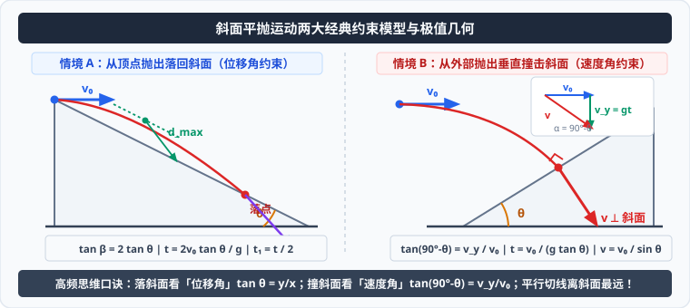

# 考点 · 平抛运动三大经典解题模型

## 模型一：斜面平抛模型

斜面平抛是高考最高频考查的抛体模型。核心在于**利用斜面倾角的几何约束建立运动学方程**。

### 1. 情境 A：从斜面顶点抛出并落回斜面上
从倾角为 $\theta$ 的斜面顶端以初速度 $v_0$ 水平抛出小球，最终落在斜面上：

  

#### (1) 位移角约束法
- **几何约束**：落在斜面上意味着**合位移的方向与水平方向夹角恰好等于斜面倾角 $\theta$**：
  $$\tan\theta = \frac{y}{x} = \frac{\frac{1}{2}gt^2}{v_0 t} = \frac{gt}{2v_0}$$
- **飞行时间公式**：
  $$t = \frac{2v_0 \tan\theta}{g}$$
- **沿斜面位移（射程）**：
  $$s = \frac{x}{\cos\theta} = \frac{v_0 t}{\cos\theta} = \frac{2v_0^2 \tan\theta}{g\cos\theta} = \frac{2v_0^2 \sin\theta}{g\cos^2\theta}$$
- **落到斜面上的速度偏角 $\beta$**：
  由定理 $\tan\beta = 2\tan\theta$，由于 $\theta$ 为斜面定值，**落到斜面上的速度方向与斜面的夹角与初速度 $v_0$ 大小完全无关**！

#### (2) 离斜面最大距离 $d_{\max}$（对称性与最值）
- **物理判据**：当小球的**瞬时速度方向与斜面平行**时，小球距离斜面最远；
- 此时速度偏角为 $\theta$：
  $$\tan\theta = \frac{v_y}{v_0} = \frac{gt_1}{v_0} \implies t_1 = \frac{v_0 \tan\theta}{g} = \frac{1}{2} t$$
  > [!TIP]
  > 到达最大距离的时间 $t_1$ 恰好是整个飞行时间 $t$ 的**一半**！体现了抛体运动的时间对称性。
- **斜面分解法（沿斜面与垂直斜面正交分解）**：
  - 垂直斜面方向：初速度 $v_{0\perp} = v_0\sin\theta$，加速度 $a_{\perp} = g\cos\theta$（垂直斜面向下）；
  - 最大距离即为垂直方向的“竖直上抛”最大位移：
    $$d_{\max} = \frac{v_{0\perp}^2}{2 a_{\perp}} = \frac{(v_0\sin\theta)^2}{2g\cos\theta} = \frac{v_0^2\sin^2\theta}{2g\cos\theta}$$

---

### 2. 情境 B：从斜面外水平抛出，垂直打在斜面上
小球以初速度 $v_0$ 水平抛出，恰好**垂直撞击**倾角为 $\theta$ 的斜面：
- **速度角约束**：合速度垂直于斜面，则合速度与水平方向的夹角为 $90^\circ - \theta$；
- 速度正切关系：
  $$\tan(90^\circ - \theta) = \cot\theta = \frac{v_y}{v_0} = \frac{gt}{v_0}$$
- **飞行时间**：
  $$t = \frac{v_0}{g\tan\theta}$$
- **撞击速度大小**：
  $$v = \frac{v_0}{\sin\theta}$$

---

## 模型二：平抛与竖直圆弧轨道切向对接模型

在过山车、滑雪跳台等力电综合题目中，常要求平抛质点“**无碰撞地沿切线滑入竖直圆弧轨道**”。

### 1. 物理条件解构
- “无碰撞切入”意味着质点到达圆弧入口点 $A$ 时的**合速度方向，严格重合于圆弧在该点的切线方向**。
- 设圆弧入口处半径与竖直方向夹角为 $\alpha$（则切线与水平方向夹角为 $\alpha$）：
  $$\tan\alpha = \frac{v_y}{v_0} = \frac{\sqrt{2gh}}{v_0}$$

### 2. 几何与动力学联立求解范式
1. **由高度求竖直分速度**：设抛出点与入口高度差为 $h$，则 $v_y = \sqrt{2gh}$；
2. **由切角求合速度与初速度**：
   $$v_0 = \frac{v_y}{\tan\alpha} = \frac{\sqrt{2gh}}{\tan\alpha}, \quad v_A = \frac{v_0}{\cos\alpha} = \frac{v_y}{\sin\alpha} = \frac{\sqrt{2gh}}{\sin\alpha}$$
3. **进入圆弧后的轨道支持力计算（向心力方程）**：
   $$F_N - mg\cos\alpha = m\frac{v_A^2}{R} \implies F_N = mg\cos\alpha + m\frac{v_A^2}{R}$$

---

## 模型三：网球 / 排球越网不出界边界极值窗口

发球人在距地面高 $H$、距球网水平距离 $x_1$ 处将球水平击出。球网高度为 $h$，球场底线距发球处水平距离为 $x_2$。求击球速度 $v_0$ 能够使球既越过球网又不越出底线的取值区间 $[v_{\min}, v_{\max}]$。

### 1. 临界状态一：恰好越过球网（决定初速度下限 $v_{\min}$）
- 球运动到球网上方时，水平位移为 $x_1$，经历时间 $t_1 = \frac{x_1}{v_0}$；
- 此时球下落的竖直位移必须小于发球点与网顶的高度差：
  $$y_1 = \frac{1}{2}g t_1^2 = \frac{g x_1^2}{2 v_0^2} \le H - h$$
- 解得越网最小初速度：
  $$v_0 \ge x_1 \sqrt{\frac{g}{2(H - h)}} \implies v_{\min} = x_1 \sqrt{\frac{g}{2(H - h)}}$$

### 2. 临界状态二：恰好落在底线内（决定初速度上限 $v_{\max}$）
- 球从抛出到落地，总下落高度为 $H$，总飞行时间：
  $$t_2 = \sqrt{\frac{2H}{g}}$$
- 落地时的水平射程必须不超过球场底线距离 $x_2$：
  $$x = v_0 t_2 = v_0 \sqrt{\frac{2H}{g}} \le x_2$$
- 解得不出界最大初速度：
  $$v_0 \le x_2 \sqrt{\frac{g}{2H}} \implies v_{\max} = x_2 \sqrt{\frac{g}{2H}}$$

### 3. 有解充要条件
为使合法的发球速度区间存在（即 $v_{\min} < v_{\max}$），球网高度与发球高度必须满足相容几何条件：
$$x_1 \sqrt{\frac{g}{2(H-h)}} < x_2 \sqrt{\frac{g}{2H}} \implies \frac{x_1^2}{H-h} < \frac{x_2^2}{H}$$
若该不等式不满足，则无论发球速度多大，球要么被网拦截，要么直接飞出底线。
