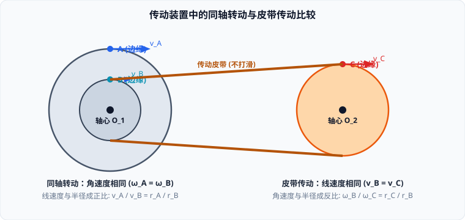

# 01 · 描述圆周运动的物理量

## 匀速圆周运动的定义与运动学本质

### 1. 定义
质点沿圆周运动，如果在任意相等的时间里通过的圆弧长度都相等，这种运动就叫作**匀速圆周运动**。

### 2. 运动学本质：变加速运动
- **速度标量属性**：质点沿圆周运动的**速率**（速度的大小）恒定不变；
- **速度矢量属性**：质点在任意时刻的速度方向沿该点的圆周切线方向，**速度方向时刻在改变**；
- **加速度判定**：由于速度矢量在时刻改变，必具有加速度（$\vec{a} = \frac{d\vec{v}}{dt} \neq \mathbf{0}$）。此外，加速度的方向也时刻指向圆心不断旋转。
- **结论**：**匀速圆周运动绝不是匀速运动，而是加速度大小恒定、方向时刻变化的变加速曲线运动！**

---

## 描述圆周运动的物理量矩阵

为了从“空间快慢”与“转动快慢”两个维度全面刻画圆周运动，物理学引入了一组相互关联的物理量：

| 物理量 | 符号与国际单位 | 物理定义与微分表达式 | 物理意义 |
| :--- | :--- | :--- | :--- |
| **线速度 (Linear Velocity)** | $v \quad (\text{m/s})$ | $v = \lim\limits_{\Delta t \to 0} \frac{\Delta s}{\Delta t}$ | 描述质点沿圆弧轨迹运动的**瞬时位置变化快慢**（方向为切线方向） |
| **角速度 (Angular Velocity)** | $\omega \quad (\text{rad/s})$ | $\omega = \lim\limits_{\Delta t \to 0} \frac{\Delta \theta}{\Delta t}$ | 描述质点绕圆心转动的**角度扫过快慢** |
| **周期 (Period)** | $T \quad (\text{s})$ | 转过一周（$2\pi\ \text{rad}$）所耗费的时间 | 描述转动重复周期的长短 |
| **频率 (Frequency)** | $f \quad (\text{Hz})$ | $f = \frac{1}{T}$，单位时间内完成全周运动的次数 | 描述转动快慢 |
| **转速 (Rotational Speed)** | $n \quad (\text{r/s 或 r/min})$ | 单位时间内转过的圈数（当以 $\text{r/s}$ 为单位时，数值上 $n = f$） | 工程中常用转动速度指标 |

---

## 物理量之间的定量推导与互化公式

设质点做半径为 $r$ 的匀速圆周运动，运动一周所用时间为 $T$：
1. **线速度与周期的关系**：
   一周的圆周周长为 $2\pi r$，经历时间为 $T$，故：
   $$v = \frac{2\pi r}{T} = 2\pi r f = 2\pi r n$$
2. **角速度与周期的关系**：
   一周转过的弧度为 $2\pi\ \text{rad}$，经历时间为 $T$，故：
   $$\omega = \frac{2\pi}{T} = 2\pi f = 2\pi n$$
3. **线速度与角速度的桥梁公式（弧长微分关系）**：
   由平面几何弧长定义 $\Delta s = r \Delta \theta$，两边同除以 $\Delta t$：
   $$\frac{\Delta s}{\Delta t} = r \frac{\Delta \theta}{\Delta t} \implies v = \omega r$$

> [!NOTE]
> **公式中 $r$ 的物理双重性**：
> - 当角速度 $\omega$ 一定时，线速度 $v$ 与半径 $r$ 成**正比**（$v \propto r$）；
> - 当线速度 $v$ 一定时，角速度 $\omega$ 与半径 $r$ 成**反比**（$\omega \propto \frac{1}{r}$）。

---

## 经典传动装置模型：同轴转动 vs 接触/皮带传动

在机械传动与高考模型中，传动系统是考查圆周物理量比例关系的核心工具：

### 1. 同轴转动模型（Coaxial Rotation）
- **物理构型**：绕同一转轴固连旋转的所有轮子（如轮轴、地球自转模型、钟表指针）；
- **核心约束**：轮上各点在相等时间内转过的角度严格相等，**角速度恒相等**：
  $$\omega_A = \omega_B, \quad T_A = T_B$$
- **衍生比例**：线速度与旋转半径成正比：
  $$\frac{v_A}{v_B} = \frac{r_A}{r_B}$$

### 2. 皮带 / 链条 / 齿轮啮合传动模型（Tangential Transmission）
- **物理构型**：通过不打滑的皮带、链条连接的轮子，或相互咬合的齿轮、摩擦轮边缘接触点；
- **核心约束**：由于皮带不打滑或轮缘无相对滑动，连接处各点的位移在相等时间内严格相等，**轮缘线速度大小恒相等**：
  $$v_B = v_C$$
- **衍生比例**：角速度与半径成反比，周期与半径成正比：
  $$\frac{\omega_B}{\omega_C} = \frac{r_C}{r_B}, \quad \frac{T_B}{T_C} = \frac{r_B}{r_C}$$

### 3. 经典综合应用：自行车齿轮传动比
自行车传动系统由大齿盘（踏板轮，半径 $r_1$）、飞轮（后齿轮，半径 $r_2$）和后车轮（半径 $R$）构成：
1. **大齿盘与飞轮通过链条连接**：属于皮带传动，边缘线速度相等：
   $$v_1 = v_2 \implies \omega_1 r_1 = \omega_2 r_2 \implies \omega_2 = \frac{r_1}{r_2}\omega_1$$
2. **飞轮与后车轮同轴旋转**：属于同轴转动，角速度相等：
   $$\omega_{\text{后}} = \omega_2 = \frac{r_1}{r_2}\omega_1$$
3. **自行车的行驶速度（即后轮边缘的地面线速度）**：
   $$v_{\text{车}} = \omega_{\text{后}} R = \frac{r_1}{r_2} R \omega_1$$
由此可见，增大前齿盘半径 $r_1$、减小后飞轮半径 $r_2$ 或增大车轮半径 $R$，均能使脚蹬相同角速度 $\omega_1$ 时获得更高的行车速度。
