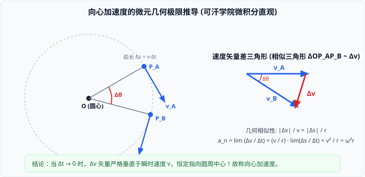

# 02 · 向心加速度与向心力

## 向心加速度的定义与物理本质

做圆周运动的质点，即使其速率恒定，由于速度方向时刻在改变，质点依然具备加速度。

### 1. 定义与方向
- **定义**：做圆周运动的物体，其加速度中指向圆心的分量，叫作**向心加速度**（Centripetal Acceleration），记作 $a_n$。
- **方向**：**始终沿半径方向指向圆周的圆心**。
- **物理效应**：因为向心加速度的方向与质点的瞬时线速度方向**严格正交（垂直）**，所以向心加速度**绝不改变速度的大小，只负责改变速度的方向**。
- **变矢量属性**：向心加速度的方向时刻随物体的旋转而指向不断变动的圆心方向，因此向心加速度是**方向时刻改变的矢量**。

---

## 向心加速度公式的微分几何极限推导

> [!TIP]
> **可汗学院直观微积分：矢量差极限法**  
> 设质点沿半径为 $r$ 的圆周做匀速圆周运动，速率为 $v$。在微元时间 $\Delta t$ 内，质点由位置 $A$ 运动到位置 $B$，半径转过角度 $\Delta\theta$，线速度矢量由 $\vec{v}_A$ 变为 $\vec{v}_B$（$|\vec{v}_A| = |\vec{v}_B| = v$）。



### 1. 相似三角形几何关系
- 如图，将速度矢量 $\vec{v}_A$ 和 $\vec{v}_B$ 平移到同一起点，其矢量差为：
  $$\Delta\vec{v} = \vec{v}_B - \vec{v}_A$$
- 速度矢量三角形是由两条长为 $v$ 的矢量与其夹角 $\Delta\theta$ 构成的等腰三角形；
- 空间位移三角形 $\triangle OAB$ 是由两条长为 $r$ 的半径与夹角 $\Delta\theta$ 构成的等腰三角形；
- 两个三角形顶角均为 $\Delta\theta$，故两三角形相似：
  $$\frac{|\Delta\vec{v}|}{v} = \frac{|\Delta\vec{s}|}{r} \implies |\Delta\vec{v}| = \frac{v}{r} |\Delta\vec{s}|$$

### 2. 极限运算与公式导出
由加速度的微分定义，两边同除以 $\Delta t$ 并取 $\Delta t \to 0$ 的极限：
$$a_n = \lim_{\Delta t \to 0} \frac{|\Delta\vec{v}|}{\Delta t} = \frac{v}{r} \lim_{\Delta t \to 0} \frac{|\Delta\vec{s}|}{\Delta t} = \frac{v}{r} \cdot v = \frac{v^2}{r}$$
- 当 $\Delta t \to 0$ 时，$\Delta\theta \to 0$，速度矢量差 $\Delta\vec{v}$ 与 $\vec{v}_A$ 的夹角趋近于 $90^\circ$，**严格垂直于切线并指向圆心**！
- 结合圆周物理量关系 $v = \omega r = \frac{2\pi r}{T}$，得到**向心加速度的五大等价表达式**：
$$a_n = \frac{v^2}{r} = \omega^2 r = \omega v = \left(\frac{2\pi}{T}\right)^2 r = 4\pi^2 f^2 r$$

---

## 向心力的本质与来源分析

### 1. 向心力的公式表述
根据牛顿第二定律 $\vec{F} = m\vec{a}$，做圆周运动的物体必受到一个指向圆心的合力，这个力叫作**向心力**（Centripetal Force）：
$$F_n = m a_n = m \frac{v^2}{r} = m \omega^2 r = m \left(\frac{2\pi}{T}\right)^2 r$$

### 2. 核心内涵：向心力是“效果力”而非“性质力”
- **高中物理最重要认知守则**：
  > [!IMPORTANT]
  > **向心力绝不是一种具有独立物质起源的性质力**！在自然界中，根本不存在一种由施力物体发出的、名为“向心力”的物理作用。
- **向心力的真实身份**：它是物体做圆周运动时，沿着半径指向圆心方向的**合力效果**。
  - 它可以是重力（如近地卫星公转）；
  - 它可以是弹力（如细绳拉小球、轨道支持力）；
  - 它可以是摩擦力（如汽车在水平路面上转弯）；
  - 它可以是电场力或洛伦兹力（如带电粒子在磁场中回旋）；
  - 它可以是若干个外力的合力，或者是某个力的分力。
- **受力分析铁律**：**在任何物体的受力分析图上，严禁画出所谓的“向心力”！**

---

## 离心现象与近心现象：动力学“供需关系”模型

分析圆周运动是否能稳定维持，本质是考察合外力能提供的**提供向心力（$F_{\text{供}}$）**与轨道维持所需**所需向心力（$F_{\text{需}} = m\frac{v^2}{r}$）**之间的动态平衡：

```
                ┌─── F_供 = m v²/r ───> 质点沿稳定半径 r 做圆周运动
                │
合力供需对比 ───┼─── F_供 < m v²/r ───> 离心现象 (远离圆心，半径变大或沿切线甩出)
                │
                └─── F_供 > m v²/r ───> 近心运动 (靠近圆心，半径变小螺旋向内)
```

1. **离心现象的成因与应用**：
   - **成因**：当物体所受合外力瞬间消失（$F_{\text{供}} = 0$）或不足以提供维持圆周所需的向心力时，物体由于自身的**惯性**，将沿切线方向飞出或逐渐远离圆心；
   - **日常与工程应用**：洗衣机脱水桶、离心分馏机、离心式水泵；
   - **危害与防护**：雨天路滑时，地面最大静摩擦力不足，汽车拐弯过快容易导致打滑失控翻车，因此转弯处需严格限速。
