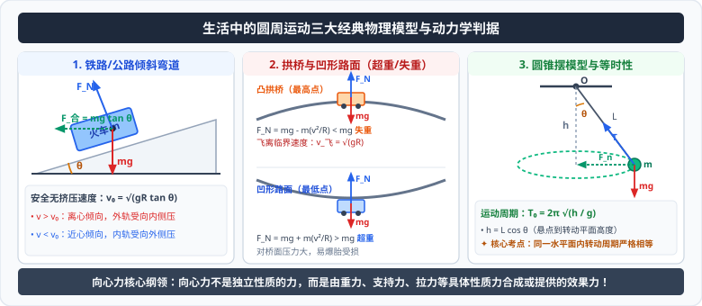

# 03 · 生活中的圆周运动

  

## 铁路与高速公路弯道设计

火车和汽车在水平路面上转弯时，如果路面完全水平，所需的向心力必须完全由车轮与轨道（或路面）之间的侧向静摩擦力或轮缘挤压力提供。这极易造成轨道侧向磨损严重或汽车侧滑失控。

### 1. 倾斜路面的向心力补偿机制
- **工程设计方案**：让弯道处外轨高于内轨（或高速公路弯道外侧高、内侧低，路面与水平面成倾角 $\theta$）；
- **向心力来源**：在此倾斜路面上，物体的**重力 $mg$** 与倾斜轨道垂直向上的**支持力 $F_N$** 的合力水平指向转弯的圆心。

### 2. 设计速度（安全无挤压速度）计算
当车辆以某一特定速度 $v_0$ 转弯时，重力与法向支持力的合力恰好等于所需向心力：
- 竖直方向受力平衡：$F_N\cos\theta = mg \implies F_N = \frac{mg}{\cos\theta}$
- 水平方向合力提供向心力：
  $$F_{\text{合}} = mg\tan\theta = m\frac{v_0^2}{R}$$
- **设计速度公式**：
  $$v_0 = \sqrt{gR\tan\theta}$$

### 3. 火车运行速度偏离设计速度时的轨道受力对比

| 运行速度对比 | 合外力与所需向心力关系 | 轮缘与轨道挤压情况 | 安全隐患与维护要求 |
| :--- | :--- | :--- | :--- |
| **$v = v_0$** | $mg\tan\theta = m\frac{v^2}{R}$ | **内、外轨轮缘均无侧向挤压** | 最佳运行状态，轨道磨损最小 |
| **$v > v_0$** | $mg\tan\theta < m\frac{v^2}{R}$（向心力不足） | 火车有离心倾向，**外轨对外侧轮缘产生向内的侧压力** | 长期超速会导致外轨磨损变薄，有脱轨风险 |
| **$v < v_0$** | $mg\tan\theta > m\frac{v^2}{R}$（向心力过剩） | 火车有近心倾向，**内轨对内侧轮缘产生向外的侧压力** | 长期过慢会导致内轨压损，极端情况下甚至翻向内侧 |

---

## 汽车过拱形桥与凹形路面（超重与失重）

设拱形桥和凹形路面在最高点或最低点附近的曲率半径均为 $R$，汽车质量为 $m$，通过该点的瞬时速率为 $v$。

### 1. 凸形拱桥（最高点分析）
汽车在拱桥最高点时，受竖直向下的重力 $mg$ 和桥面竖直向上的支持力 $F_N$：
- 动力学方程：
  $$mg - F_N = m\frac{v^2}{R} \implies F_N = mg - m\frac{v^2}{R}$$
- **物理现象**：$F_N < mg$，汽车处于**失重**状态；
- **临界飞离速度**：
  当速度增大到使 $F_N = 0$ 时，汽车恰好对桥面无压力：
  $$mg - 0 = m\frac{v_{\text{飞}}^2}{R} \implies v_{\text{飞}} = \sqrt{gR}$$
  - 当 $v \ge \sqrt{gR}$ 时，汽车将直接脱离桥面，在空中做**平抛运动**飞出，失去操控转向能力，极其危险！

### 2. 凹形路面（最低点分析）
汽车在凹形路面最低点时，加速度竖直向上指向曲率中心：
- 动力学方程：
  $$F_N - mg = m\frac{v^2}{R} \implies F_N = mg + m\frac{v^2}{R}$$
- **物理现象**：$F_N > mg$，汽车处于**超重**状态；
- **工程启示**：由于桥面受到远大于自重的压力（且速度越大压力剧增），汽车在凹形路段容易爆胎，凹形桥梁受压应力极大容易坍塌，故实际桥梁工程中极少采用凹形主桥面。

---

## 经典水平面圆周模型：圆锥摆模型

用一根长为 $L$ 的细线悬挂一质量为 $m$ 的小球，让小球在水平面内做匀速圆周运动，细线扫过的轨迹为一个圆锥面，称为**圆锥摆**。

### 1. 受力分析与几何参数
- 设细线与竖直方向的夹角为 $\theta$，悬点到小球运动平面的竖直高度为 $h = L\cos\theta$；
- 小球的圆周运动半径：$R = L\sin\theta$；
- 小球受竖直向下的重力 $mg$ 与沿绳斜向上的拉力 $T$。

### 2. 方程联立推导
- 竖直方向受力平衡：
  $$T\cos\theta = mg \implies T = \frac{mg}{\cos\theta}$$
- 水平方向合力提供向心力：
  $$F_n = T\sin\theta = mg\tan\theta$$
- 将向心力方程 $F_n = m\omega^2 R = m\left(\frac{2\pi}{T_0}\right)^2 R$ 代入：
  $$mg\tan\theta = m\omega^2 (L\sin\theta) \implies g\frac{\sin\theta}{\cos\theta} = \omega^2 L\sin\theta$$
- **解得角速度与周期**：
  $$\omega = \sqrt{\frac{g}{L\cos\theta}} = \sqrt{\frac{g}{h}}$$
  $$T_0 = \frac{2\pi}{\omega} = 2\pi\sqrt{\frac{L\cos\theta}{g}} = 2\pi\sqrt{\frac{h}{g}}$$

> [!TIP]
> **可汗学院直观思考：圆锥摆的高度等时性**  
> 周期公式表明，圆锥摆的运动周期 $T_0$ **只与悬点到转动平面的竖直距离 $h$ 有关**！如果用不同长度的绳子悬挂不同质量的小球，只要调节角度使它们在**同一个水平面**内转动（即具有相同的 $h$），则所有小球的转动周期和角速度严格相同！
