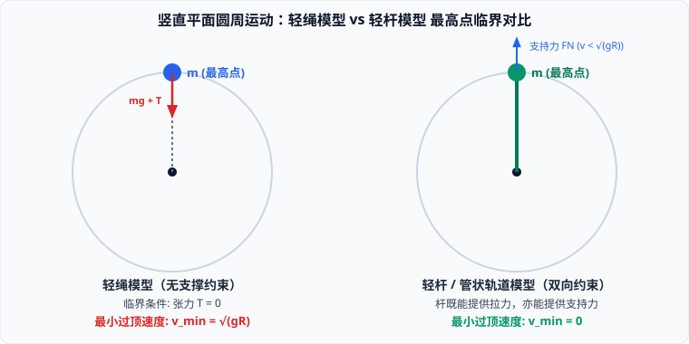

# 考点 · 竖直面圆周运动轻绳与轻杆临界模型

## 竖直平面圆周运动的两大基本模型

竖直平面内的圆周运动是高考力学与能量守恒的必考压轴载体。其核心难点在于：**物体在最高点的受力性质与临界极值条件截然不同**。

---

## 模型一：轻绳模型（单向约束模型）

### 1. 物理构型与约束特性
- **典型载体**：轻绳系小球、光滑球壳内侧运动、光滑凸形圆弧轨道外侧运动；
- **力的约束特性**：**单向约束**。轻绳只能产生拉力（$T \ge 0$），绝不能支撑；圆轨道内壁只能产生向内的支持力（$F_N \ge 0$），绝不能拉住小球。

### 2. 最高点的临界速度推导
在轨道最高点，小球受竖直向下的重力 $mg$ 和轻绳竖直向下的拉力 $T$：
$$mg + T = m\frac{v^2}{R}$$
- 要使小球能沿圆轨道越过最高点，绳子必须处于张紧状态，临界条件为 **$T = 0$**（即仅靠重力恰好提供向心力）：
  $$mg = m\frac{v_{\min}^2}{R} \implies v_{\min} = \sqrt{gR}$$
- **最高点运动状态判据**：
  - **$v > \sqrt{gR}$**：小球顺利通过最高点，且绳子受到拉力 $T = m\frac{v^2}{R} - mg > 0$；
  - **$v = \sqrt{gR}$**：小球恰好通过最高点，绳子张力刚好为零；
  - **$v < \sqrt{gR}$**：小球**根本无法到达最高点**！在到达最高点之前的某一位置（$\sqrt{gR} < v < \sqrt{2gR}$ 区间），绳子便提前松弛（$T=0$），小球脱离圆轨道做**斜上抛运动**。

### 3. 黄金结论：最低点与最高点拉力差恒为 $6mg$
设小球顺利通过最高点速度为 $v_1$，最低点速度为 $v_2$：
1. **最高点方程**：$T_1 + mg = m\frac{v_1^2}{R} \implies T_1 = m\frac{v_1^2}{R} - mg$
2. **最低点方程**：$T_2 - mg = m\frac{v_2^2}{R} \implies T_2 = m\frac{v_2^2}{R} + mg$
3. **两点机械能守恒**：
   $$\frac{1}{2}mv_2^2 - \frac{1}{2}mv_1^2 = mg(2R) \implies \frac{m v_2^2}{R} - \frac{m v_1^2}{R} = 4mg$$
4. **拉力之差**：
   $$\Delta T = T_2 - T_1 = \left(m\frac{v_2^2}{R} + mg\right) - \left(m\frac{v_1^2}{R} - mg\right) = 4mg + 2mg = 6mg$$
> [!IMPORTANT]
> **顶底拉力差恒为 $6mg$ 定理**：无论小球以多大初速度在竖直圆周内运动，只要能完成完整圆周，**最低点轻绳拉力与最高点拉力之差恒等于 $6mg$**，与小球的速度大小和轨道半径 $R$ 完全无关！
> 特别地，当小球恰好以临界速度 $v_1 = \sqrt{gR}$ 过顶时，$T_1 = 0$，最低点拉力恰好为 $T_2 = 6mg$，最低点速度为 $v_2 = \sqrt{5gR}$。

---

## 模型二：轻杆模型（双向约束模型）

### 1. 物理构型与约束特性
- **典型载体**：轻质硬杆连小球、小球在光滑圆形细管道内运动、小球套在光滑圆环导轨上；
- **力的约束特性**：**双向约束**。轻杆或双侧管壁既可以提供指向圆心的**拉力**，也可以提供背离圆心的**支撑力**。

### 2. 最高点的临界速度
由于轻杆能够提供向上支撑，小球只要到达最高点时速度不为零，就不会掉下来：
$$v_{\min} = 0$$
只要最高点速度 $v \ge 0$，小球就能顺利通过最高点。

### 3. 最高点受力方向的“转折分界点”（$v = \sqrt{gR}$）
在最高点，设杆对球的作用力为 $F$（规定竖直向上为正）：
$$mg - F = m\frac{v^2}{R} \implies F = mg - m\frac{v^2}{R}$$
根据最高点速度 $v$ 的不同，受力呈现三大阶段：
1. **当 $v = \sqrt{gR}$ 时**：$F = 0$，杆对球**无任何弹力**，完全由小球自重提供向心力；
2. **当 $0 \le v < \sqrt{gR}$ 时**：$F > 0$，**杆对小球表现为竖直向上的支持力**。速度越小，所需支持力越大；当 $v = 0$ 时，支持力达到最大值 $F = mg$；
3. **当 $v > \sqrt{gR}$ 时**：$F < 0$，**杆对小球表现为竖直向下的拉力**。其大小为 $T = m\frac{v^2}{R} - mg$，速度越大，拉力越大。

---

## 轻绳模型与轻杆模型全景对比矩阵

| 物理维度 | 轻绳模型（外轨 / 球壳内侧） | 轻杆模型（管道 / 圆环套球） |
| :--- | :--- | :--- |
| **受力约束本质** | 单向约束（仅能拉 / 仅能向内压） | 双向约束（既能拉又能推） |
| **最高点临界速度** | $v_{\min} = \sqrt{gR}$ | $v_{\min} = 0$ |
| **最高点受力性质** | 必定是竖直向下的拉力或压紧力 | $v < \sqrt{gR}$ 时为支持力；$v = \sqrt{gR}$ 时为 $0$；$v > \sqrt{gR}$ 时为拉力 |
| **$v < v_{\min}$ 运动结局** | 在到达最高点前脱离轨道做斜上抛 | 只要速度不反向即可通过；若速度减为零则发生反向摆动 |
| **恰好过顶最低点速度** | $v_{\text{底}} = \sqrt{5gR}$ | $v_{\text{底}} = 2\sqrt{gR}$ |
| **最低点与最高点力之差** | $T_{\text{底}} - T_{\text{顶}} = 6mg$ | 若最高点为拉力：$F_{\text{底}} - F_{\text{顶}} = 6mg$；若最高点为支持力：$F_{\text{底}} + F_{\text{顶}} = 6mg$ |
