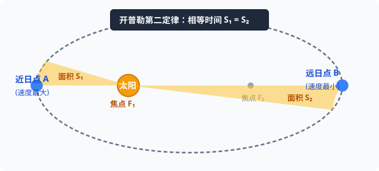

# 01 · 行星的运动与开普勒定律

## 从地心说到日心说的历史演进

探索天体运动规律是近代科学革命的起点：
1. **地心说（Geocentric Model）**：
   - 代表人物：古希腊学者托勒密（Ptolemy）。
   - 核心观点：地球是宇宙的中心，是静止不动的，太阳、月球及其他行星都在绕地球做复杂的圆周运动（本轮与均轮系统）。统治欧洲长达一千多年。
2. **日心说（Heliocentric Model）**：
   - 代表人物：波兰天文学家哥白尼（Copernicus）。
   - 核心观点：太阳是宇宙的中心，行星都在围绕太阳运动，地球也是一颗普通的行星，在自转的同时围绕太阳公转。
3. **第谷的二十年精密天文观测**：
   - 丹麦天文学家第谷·布拉赫（Tycho Brahe）在望远镜发明前，用肉眼对行星位置进行了长达二十年极其精密的系统观测，记录了大量一手观测数据。

---

## 开普勒行星运动三大定律

德国天文学家开普勒（Johannes Kepler）继承了第谷的全部观测数据，在潜心计算火星轨道长达数年并经历多次失败后，毅然放弃了千百年来“天体必须做匀速圆周运动”的哲学偏见，于 1609 年和 1619 年相继发表了开普勒三大定律：

### 1. 第一定律（轨道定律 / Law of Orbits）
**所有行星绕太阳运动的轨道都是椭圆，太阳处在椭圆的一个焦点上。**

  
   
  <em>图 6.1-1 行星绕日椭圆轨道：近日点 A 速度最大，远日点 B 速度最小；相等时间扫过面积相等</em>

- **几何特征**：
  - 行星距离太阳最近的位置称为**近日点**（Perihelion）；
  - 行星距离太阳最远的位置称为**远日点**（Aphelion）。
- **高中近似处理**：太阳系大多数行星轨道的偏心率都很小（如地球公转轨道偏心率仅为 $0.0167$），在通常的高考计算中，常将行星公转轨道**近似处理为圆轨道**，太阳位于圆心。

### 2. 第二定律（面积定律 / Law of Areas）
**对任意一个行星来说，它与太阳的连线（矢径）在相等的时间内扫过的面积相等。**

- **推论**：
  - 当行星离太阳较近（近日点）时，矢径较短，为了在相同时间内扫过相同的面积，行星运动的线速度较**大**；
  - 当行星离太阳较远（远日点）时，矢径较长，行星运动的线速度较**小**。
  - 近日点速率 $v_{近} >$ 远日点速率 $v_{远}$。

> [!TIP]
> **可汗学院与现代力学深层本质：角动量守恒（Conservation of Angular Momentum）**
> 为什么相等时间扫过面积相等？因为太阳对行星的万有引力方向恒指向日心（引力是**中心力**），引力对日心的力矩恒为零：
> $$ \vec{\tau} = \vec{r} \times \vec{F} = \vec{0} $$
> 根据角动量定理，行星对太阳的角动量守恒：$L = m r v \sin\theta = \text{常数}$。
> 微元时间内扫过的扇形面积 $\mathrm{d}S = \frac{1}{2} r^2 \mathrm{d}\theta = \frac{1}{2} r (v_\perp \mathrm{d}t) = \frac{L}{2m} \mathrm{d}t$。因此面积速率 $\frac{\mathrm{d}S}{\mathrm{d}t} = \frac{L}{2m}$ 恒为常数！

### 3. 第三定律（周期定律 / Law of Periods）
**所有行星轨道的半长轴 $a$ 的三次方跟它的公转周期 $T$ 的二次方的比值都相等。**

$$
\frac{a^3}{T^2} = k
$$

- **比值 $k$ 的决定因素**：
  - 常数 $k$ 的大小**只与中心天体（太阳）的质量有关**，与环绕天体（行星）的质量大小无关。
  - 对于绕同一中心天体运动的所有卫星或行星，其 $\frac{r^3}{T^2}$ 均等于同一个常数 $k$。

---

## 典型考点与辨析

> [!WARNING]
> **解题陷阱与常见误区**
> - [×] “由于 $\frac{a^3}{T^2} = k$，所以围绕地球运行的人造卫星和围绕太阳运行的地球，其 $k$ 值相同。”
>   - **纠正**：错！$k$ 由**中心天体质量**唯一决定。围绕太阳公转的各行星 $k$ 值相同；围绕地球运转的各个卫星 $k$ 值相同，但二者的 $k$ 绝不相等（$k_{日} \gg k_{地}$）。
> - [×] “行星在椭圆轨道上运行，由于速率不断变化，所以加速度也是大小不变的。”
>   - **纠正**：错！行星距离太阳越近，万有引力越大，根据牛顿第二定律，加速度也越大；近日点加速度最大，远日点加速度最小。
