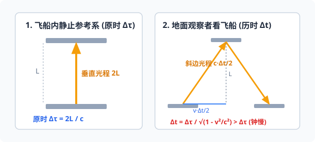

# 04 · 相对论时空观与牛顿力学局限

## 经典力学的绝对时空观

在爱因斯坦提出相对论之前，以牛顿力学为代表的经典物理学统治了物理学界两百余年。其基石之一是**绝对时空观**：
- **绝对时间**：时间如同一条看不见、均匀流逝的“绝对长河”，在任何参考系中都是同步进行的，与物质的运动状态无关（$\Delta t = \Delta t'$）。
- **绝对空间**：空间是一个固定、空旷的绝对容器，物体的长度测量不随观察者的运动而改变（$l = l'$）。
- **伽利略速度变换**：若小船对水流速度为 $v_{船水}$，水流对岸速度为 $v_{水岸}$，则小船对岸速度为 $v_{船岸} = v_{船水} + v_{水岸}$。

> [!NOTE]
> 19 世纪中叶，麦克斯韦建立了经典电磁学理论，指出真空中的光速是一个常数 $c \approx 3.0 \times 10^8\ \text{m/s}$。如果按照经典力学的速度叠加法则，不同速度运动的观察者测得的光速应该不同（如沿光束飞行应测得 $c - v$），但著名的**迈克耳孙-莫雷实验**证明：**在各个方向上测得的真空光速完全相同！**经典时空观面临深刻的逻辑危机。

---

## 狭义相对论的两大基本假设

1905 年，26 岁的阿尔伯特·爱因斯坦（Albert Einstein）发表了《论动体的电动力学》，提出了狭义相对论的两条基本公设：

1. **相对性原理（Principle of Relativity）**：
   在所有**惯性参考系**中，物理规律（包括力学规律和电磁学规律）都具有相同的数学形式。不存在任何绝对静止的“优越参考系”。
2. **光速不变原理（Constancy of the Speed of Light）**：
   在所有**惯性参考系**中，真空中光传播的速度都是 $c$，它与光源的运动状态及观察者的运动状态均无关。

---

## 相对论时空效应（推导与直观图景）

### 1. 时间延缓效应（钟慢效应 / Time Dilation）

  
   
  <em>图 6.4-1 爱因斯坦“光钟”思想实验：运动参考系中光走斜边，光速恒为 c 导致历时变长</em>

设想一具“光钟”，光信号在相距为 $L$ 的两块平行反射镜之间上下往返一次记为一个单位时间：
- **在与光钟相对静止的参考系中（飞船内）**：光垂直上下往返，所用时间称为**固有时间（原时，$\Delta \tau$）**：
  $$
  \Delta \tau = \frac{2L}{c} \implies L = \frac{c \Delta \tau}{2}
  $$
- **在地面观察者参考系中（飞船以速度 $v$ 水平高速飞过）**：
  在光从底镜射到顶镜的半周期 $\frac{\Delta t}{2}$ 内，飞船水平前进了 $v \frac{\Delta t}{2}$。由于光速恒为 $c$，光在空间中走的是直角三角形的斜边，光程为 $c \frac{\Delta t}{2}$。
  
根据勾股定理：
$$
\left( c \frac{\Delta t}{2} \right)^2 = L^2 + \left( v \frac{\Delta t}{2} \right)^2
$$
将 $L = \frac{c \Delta \tau}{2}$ 代入，两边整理得：
$$
c^2 (\Delta t)^2 = c^2 (\Delta \tau)^2 + v^2 (\Delta t)^2 \implies (c^2 - v^2) (\Delta t)^2 = c^2 (\Delta \tau)^2
$$
最终推导得出**时间延缓公式**：
$$
\Delta t = \frac{\Delta \tau}{\sqrt{1 - \frac{v^2}{c^2}}}
$$

> [!IMPORTANT]
> **结论与物理本质**：
> 因为对于任何宏观物体 $v < c$，恒有 $\sqrt{1 - \frac{v^2}{c^2}} < 1$，所以：
> $$
> \Delta t > \Delta \tau
> $$
> 这表明：**运动的钟走得慢！** 处于运动参考系中的所有物理过程、化学反应、生物新陈代谢进程，在外部静止观察者看来都变慢了。
> - **实验实证 1（$\mu$ 子寿命实验）**：高空宇宙射线产生的 $\mu$ 子在静止系寿命仅为 $2.2\ \mu\text{s}$，即使以光速飞行也只能穿行约 $660\ \text{m}$，但地面探测器却大量检测到了 $\mu$ 子。原因正是 $\mu$ 子以 $0.99c$ 高速运动，在地面参考系中其寿命延缓了数十倍！
> - **实验实证 2（GPS 卫星相对论修正）**：运行在太空中的北斗和 GPS 卫星时钟，每天必须扣除约 $38\ \mu\text{s}$ 的狭义与广义相对论时差，否则一天内的定位误差将超过 10 公里。

---

### 2. 长度收缩效应（尺缩效应 / Length Contraction）

如果与被测直杆相对静止的观察者测得直杆固有长度（原长）为 $l_0$，当直杆沿着自身轴线方向以速度 $v$ 高速运动时，静止观察者测得的运动直杆长度 $l$ 为：
$$
l = l_0 \sqrt{1 - \frac{v^2}{c^2}}
$$

> [!NOTE]
> - **沿运动方向收缩**：长度收缩只发生在**平行于相对运动方向**上；在垂直于运动方向的维度上，物体的尺寸保持不变。
> - **同时性的相对性**：尺缩效应本质上是由于在不同参考系中，“同时测量杆的两端位置”这一动作在时间上不再绝对同时（“同时”也是相对的）。

---

### 3. 相对论质速关系与质能方程

#### 质速关系（动态质量）
在牛顿力学中，物体的质量 $m$ 是与速度无关的恒量。在狭义相对论中，当物体以速度 $v$ 运动时，其相对论质量 $m$ 随速度增加而增大：
$$
m = \frac{m_0}{\sqrt{1 - \frac{v^2}{c^2}}}
$$
（式中 $m_0$ 为物体在静止参考系中的**静质量**）。

> [!TIP]
> **为什么有质量的物体无法达到光速？**
> 当物体的运动速度 $v \to c$ 时，分母 $\sqrt{1 - v^2/c^2} \to 0$，导致物体的动态质量 $m \to \infty$。这意味着要让物体进一步加速，需要施加无穷大的外力和能量做功。因此，**真空中的光速 $c$ 是宇宙中所有物质和信息传递速度的极限上限**。

#### 爱因斯坦质能方程
爱因斯坦揭示了质量与能量的内在统一性：
$$
E = mc^2
$$
物体的能量变化量与质量变化量满足：
$$
\Delta E = \Delta m \cdot c^2
$$
- **物理意义**：微小的质量亏损（$\Delta m$）伴随着巨大的能量释放（乘上光速的平方 $c^2 \approx 9 \times 10^{16}\ \text{m}^2/\text{s}^2$）。这是太阳持续核聚变发光发热、核电站发电与原子弹爆炸释放巨大能量的根本理论来源。

---

## 牛顿力学的伟大成就与历史局限性

牛顿运动定律与万有引力定律构成了经典力学的宏伟大厦。在长达数百年时间里，从地面物体的落体抛体，到桥梁大坝工程设计，从炮弹发射到海王星的轨道预言，牛顿力学均取得了无与伦比的成功。

然而，20 世纪现代物理学揭示了**牛顿力学并非放之四海而皆准的终极真理，而是具有严格的适用边界**：

| 物理领域 | 经典牛顿力学 | 现代物理理论 | 适用边界与对应原理 |
| :--- | :--- | :--- | :--- |
| **速度维度** | 适用于**低速运动**（$v \ll c$） | **狭义相对论**（高速、近光速领域） | 当 $v \ll c$ 时，$\frac{v}{c} \to 0$，$\sqrt{1 - v^2/c^2} \to 1$，相对论公式完全退化为牛顿力学公式 |
| **空间尺度** | 适用于**宏观物体**（米、千米、天文尺度） | **量子力学**（微观原子、电子尺度） | 微观粒子具有波粒二象性，不能用确定的轨道描述，遵从薛定谔方程与测不准原理 |
| **引力强弱** | 适用于**弱引力场**（如太阳系常规行星公转） | **广义相对论**（强引力场、大质量致密天体） | 强引力场导致时空弯曲（如黑洞、中子星、光线引力偏折、引力红移） |

---

## 高考常考点与典型易错辨析

> [!WARNING]
> **易错辨析与解题陷阱**
> - [×] **误区 1**：“爱因斯坦相对论证明牛顿力学完全错了，应该被淘汰。”
>   - **纠正**：科学理论具有继承性与包含性。牛顿力学作为相对论在低速宏观条件下的**一级近似**，在其适用范围内依然保持高度精确和实用价值。
> - [×] **误区 2**：“飞船里的宇航员会觉得自己的手表走慢了，身体变扁了。”
>   - **纠正**：在飞船自身的参考系中，宇航员与飞船相对静止，一切物理生理进程完全正常（测得的是自身原时和原长）；时间变慢和尺缩是**外部相对飞船高速运动的观察者**测量得出的相对论效应。
> - [√] **正确理解**：光速在真空中恒定不变，光在任何惯性系中的传播速度均为 $c$，不会因光源迎面飞来而变成 $c+v$。
