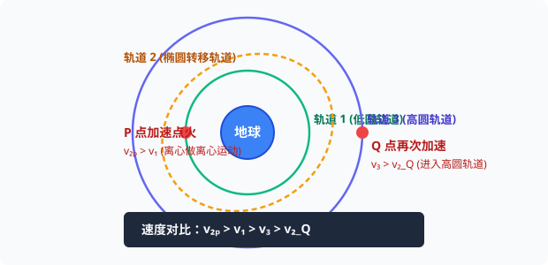

# 考点 · 卫星变轨追及相遇与双星模型

## 考点一 卫星变轨过程与动力学分析（霍曼转移模型）

航天器在空间轨道之间转移通常采用**霍曼转移轨道（Hohmann Transfer Orbit）**，由低圆轨道经过椭圆轨道过渡到高圆轨道：

  
   
  <em>图 K6-1 航天器霍曼变轨全过程：P 点点火加速离心入椭圆轨道；Q 点远地点再次加速入高圆轨道</em>

### 1. 变轨全流程动力学演化

1. **从轨道 1（低圆轨道，半径 $r_1$）到轨道 2（椭圆转移轨道）**：
   - 在 $P$ 点向前喷气（开启火箭引擎加速），使瞬时速度由 $v_1$ 激增为 $v_{2P}$；
   - 此时满足：$G \frac{Mm}{r_1^2} < m \frac{v_{2P}^2}{r_1}$，即**万有引力不足以提供向心力**，航天器开始做**离心运动**，脱离轨道 1，沿椭圆轨道 2 飞向远地点 $Q$。
2. **从轨道 2 到轨道 3（高圆轨道，半径 $r_3$）**：
   - 航天器在椭圆轨道 2 上从近地点 $P$ 飞往远地点 $Q$ 的过程中，引力做负功，动能转化为引力势能，速度不断减小，到达 $Q$ 点时速度为 $v_{2Q}$；
   - 此时满足：$G \frac{Mm}{r_3^2} > m \frac{v_{2Q}^2}{r_3}$，若不点火，航天器将做向心运动沿椭圆飞回 $P$；
   - 因此必须在 $Q$ 点**再次向前点火加速**，使速度由 $v_{2Q}$ 提升到 $v_3$，恰好满足 $G \frac{Mm}{r_3^2} = m \frac{v_3^2}{r_3}$，顺利进入轨道 3 做稳定的高圆圆周运动。

### 2. 关键参量对比判定法则

#### ① 速度大小关系排序（黄金链条）
$$
v_{2P} > v_1 > v_3 > v_{2Q}
$$
- **物理推演**：
  - 在 $P$ 点加速，故 $v_{2P} > v_1$；
  - 根据“高轨低速”，轨道 1 线速度大于轨道 3 线速度，故 $v_1 > v_3$；
  - 在 $Q$ 点加速才入轨 3，故 $v_3 > v_{2Q}$。

#### ② 加速度大小比较（同点必等）
$$
a_{1P} = a_{2P} = \frac{GM}{r_1^2}, \quad a_{2Q} = a_{3Q} = \frac{GM}{r_3^2}
$$
> [!IMPORTANT]
> **高考高频陷阱**：在同一点（如 $P$ 点），无论卫星处于圆轨道还是椭圆轨道，无论瞬时速度有多大，它所受的万有引力只取决于它距离地心的距离 $r$！由 $F_{引} = ma$ 可知，**在同一空间点上，航天器的加速度严格相等！**

#### ③ 机械能大小关系
整个变轨过程中发动机经历了两次正功点火注入能量：
$$
E_{机3} > E_{机2} > E_{机1}
$$

---

## 考点二 同轨追及相遇与空间对接悖论

在太空轨道上，航天员如果想要追赶前方同轨道的空间站，**绝对不能直接向前开火加速！**

> [!WARNING]
> **航天动力学直观悖论**：
> - 若后方飞船直接向前加速，由离心运动可知，飞船将自动**抬升轨道**进入外侧较高轨道；
> - 根据“高轨低速大周期”规律，外侧高轨道的公转速度更小、周期更大，飞船反而会被空间站**越甩越远**！
> - **正确对接操作**：后方飞船必须**先减速**，做向心运动跌入内侧低轨道；利用低轨道速度大、周期短的优势“抄近道”超车；当与空间站达到合适相对相位时，再适时点火加速升轨，精准实现空间交会对接（天舟货运飞船与中国空间站天和核心舱对接即采用此原理）。

---

## 考点三 双星系统模型（Binary Star System）

宇宙中许多恒星不是孤立存在的，而是由两颗互相吸引的恒星组成双星系统：

  
   
  <em>图 K6-2 围绕共同质心 O 做匀速圆周运动的双星系统：周期与角速度严格相等</em>

### 1. 双星系统的四大基本特征
1. **同周期、同角速度**：两星体绕其连线上某一固定公共质心 $O$ 旋转，周期和角速度严格相等：
   $$ T_1 = T_2 = T, \quad \omega_1 = \omega_2 = \omega $$
2. **互为向心力**：两星体之间的相互万有引力提供各自做圆周运动的向心力：
   $$ F_1 = F_2 = G \frac{m_1 m_2}{L^2} $$
   （**致命提醒**：引力公式分母中的 $L = r_1 + r_2$ 是**两星体之间的真实距离**，绝不能写成各自的旋转轨道半径 $r_1$ 或 $r_2$！）
3. **质量与轨道半径成反比**：
   $$
   G \frac{m_1 m_2}{L^2} = m_1 \omega^2 r_1 = m_2 \omega^2 r_2 \implies m_1 r_1 = m_2 r_2 \implies \frac{m_1}{m_2} = \frac{r_2}{r_1}
   $$
   （质量越大的恒星，转动轨道半径越小，离质心越近）。

### 2. 双星总质量定理推导
将 $r_1 = \frac{m_2}{m_1 + m_2} L$ 代入动力学方程：
$$
G \frac{m_1 m_2}{L^2} = m_1 \left( \frac{2\pi}{T} \right)^2 \left( \frac{m_2}{m_1 + m_2} L \right)
$$
两边约去 $m_1 m_2$，移项整理得到**双星总质量公式**：
$$
M_{总} = m_1 + m_2 = \frac{4\pi^2 L^3}{G T^2}
$$
天文学家只需测出双星之间的角间距及运动周期，即可精确计算出双星系统的总质量。
