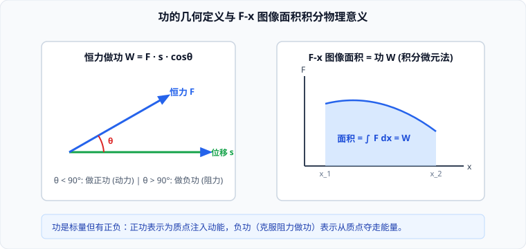
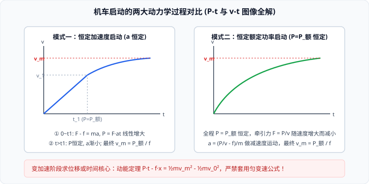

# 01 · 功与功率

## 功的定义与数学表达

在物理学中，做功是能量转化的量度。如果一个物体受到力的作用，并且在力的方向上发生了一段位移，我们就说这个力对物体做了功（Work）。

### 1. 恒力做功的基本公式
设作用在物体上的恒力大小为 $F$，物体发生的位移大小为 $s$，力与位移方向的夹角为 $\theta$：
$$W = F s \cos\theta$$
- **物理量属性**：功是**标量**，只有大小与正负，没有方向。功的运算遵循代数代数加减法，而不是平行四边形定则。
- **国际单位**：焦耳（Joule，符号 $\text{J}$），$1\ \text{J} = 1\ \text{N} \cdot \text{m} = 1\ \text{kg} \cdot \text{m}^2/\text{s}^2$。

### 2. 正功、负功与零功的物理内涵
功的正负不代表方向，而是代表能量传输的流向：

| 夹角范围 | 余弦值 | 功的符号 | 物理含义与能源流向 | 典型实例 |
| :--- | :--- | :--- | :--- | :--- |
| **$\theta = 90^\circ$** | $\cos\theta = 0$ | **$W = 0$** | 力对物体**不做功**，力不改变物体的动能 | 匀速圆周运动中的向心力、水平地面支持力 |
| **$0^\circ \le \theta < 90^\circ$** | $\cos\theta > 0$ | **$W > 0$** | 力对物体**做正功**，该力充当**动力**，为物体注入动能 | 牵引力、重力在下落过程中做功 |
| **$90^\circ < \theta \le 180^\circ$** | $\cos\theta < 0$ | **$W < 0$** | 力对物体**做负功**，该力充当**阻力**，从物体夺走能量 | 刹车阻力、重力在上升过程中做功 |

> [!NOTE]
> **高考语言规范**：“力 $F$ 对物体做了 $-50\ \text{J}$ 的功”，等价于“物体**克服**力 $F$ 做了 $50\ \text{J}$ 的功”。说“克服”时，功的大小必须取正值。

---

## 功率的定义与瞬时量度

功率（Power）是描述力对物体做功快慢的物理量。

### 1. 平均功率与瞬时功率
- **平均功率（一段时间内的做功快慢）**：
  $$\bar{P} = \frac{W}{t} = \frac{F s \cos\theta}{t} = F \bar{v} \cos\theta$$
- **瞬时功率（某一特定时刻的做功快慢）**：
  $$P = \lim_{\Delta t \to 0} \frac{\Delta W}{\Delta t} = F v \cos\theta$$
  当力的方向与瞬时速度方向共线（$\theta = 0$）时：
  $$P = F v$$
- **单位**：瓦特（Watt，符号 $\text{W}$），$1\ \text{W} = 1\ \text{J/s}$。工程中常用千瓦（$\text{kW}$）或马力（$\text{hp}$）。

### 2. 额定功率与实际功率
- **额定功率（$P_{\text{额}}$）**：发动机或电动机在正常工作条件下能够长时间安全运转的最大输出功率；
- **实际功率（$P$）**：机械运转过程中任一瞬时的实际输出功率。实际功率满足 $P \le P_{\text{额}}$，一般不允许长时间超载运行。

---

## 典型综合模型：机车启动的两大动力学全解

汽车、高铁等机车在水平平直路面上的启动，受恒定阻力 $f$ 作用，存在两种理想启动模式：

### 模式一：以恒定牵引力（恒定加速度 $a$）启动

机车在恒定合外力作用下先做匀加速直线运动，达到额定功率后再做变加速运动，最终达到最大速度：

1. **第一阶段：匀加速运动阶段（$0 \le t \le t_1$）**
   - 牛顿第二定律：$F - f = ma \implies F = f + ma$（牵引力 $F$ 恒定）；
   - 速度线性增加：$v(t) = at$；
   - 输出功率线性增大：$P(t) = F v = (f + ma) at$；
   - **转折点（$t = t_1$）**：当功率增大到额定功率 $P_{\text{额}}$ 瞬间，匀加速阶段结束：
     $$v_1 = \frac{P_{\text{额}}}{F} = \frac{P_{\text{额}}}{f + ma}, \quad t_1 = \frac{v_1}{a} = \frac{P_{\text{额}}}{a(f + ma)}$$
2. **第二阶段：恒功率变加速阶段（$t_1 < t \le t_2$）**
   - 保持 $P = P_{\text{额}}$ 恒定，机车速度继续增大：
   - 牵引力逐渐减小：$F = \frac{P_{\text{额}}}{v}$；
   - 加速度逐渐减小：$a = \frac{F - f}{m} = \frac{\frac{P_{\text{额}}}{v} - f}{m}$；
   - 机车做加速度不断减小的变加速直线运动。
3. **第三阶段：最大速度匀速阶段（$t > t_2$）**
   - 当加速度减小到 $a = 0$ 时，牵引力减小到等于阻力：$F = f$；
   - **达到最大速度**：
     $$v_m = \frac{P_{\text{额}}}{f}$$

---

### 模式二：以恒定额定功率（$P = P_{\text{额}}$）启动

机车一启动立即以额定功率工作：
1. **启动瞬间（$v \to 0$）**：理论上牵引力 $F = \frac{P_{\text{额}}}{v} \to \infty$（实际中受驱动轮最大静摩擦力打滑限制）；
2. **变加速过程**：
   $$a = \frac{F - f}{m} = \frac{\frac{P_{\text{额}}}{v} - f}{m}$$
   随着速度 $v$ 增加，牵引力 $F$ 减小，加速度 $a$ 单调减小，速度曲线斜率越来越平缓；
3. **达到最大速度**：
   当 $a = 0$ 时，牵引力 $F = f$，速度达到最大值：
   $$v_m = \frac{P_{\text{额}}}{f}$$

> [!IMPORTANT]
> **变加速阶段位移与时间求解核心法则**：  
> 在恒功率变加速阶段，由于加速度是非线性的，**严禁套用任何匀变速运动学公式（如 $x = \frac{1}{2}at^2$ 或 $v^2 - v_0^2 = 2ax$）**！  
> 必须使用**动能定理**求解运动位移 $x$ 或所耗时间 $t$：
> $$P_{\text{额}} t - f x = \frac{1}{2}mv_m^2 - \frac{1}{2}mv_0^2$$
