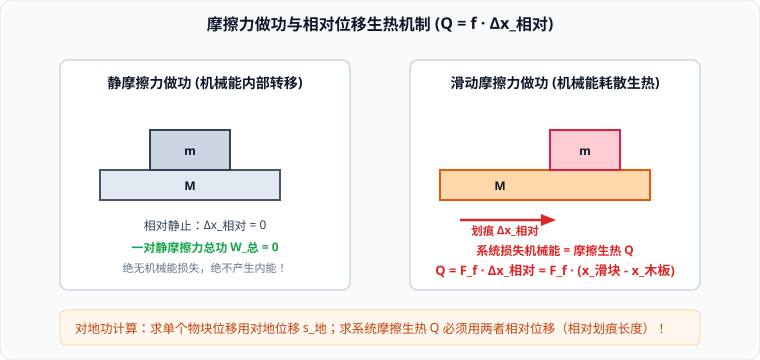

# 考点 · 变力做功计算法与功能关系综合

## 变力做功的五大求解方法

在高中物理中，恒力做功可直接应用公式 $W = F s \cos\theta$，而对于大小或方向改变的变力做功，必须采用微元、等效、图象或能量转换等思想方法：

### 1. 微元累加法（重心法）
- **适用场景**：链条、粗绳从桌边缘滑落或缠绕上升等不可视为质点的**连续分布物体（柔体）**。
- **解题规律**：将物体分割为无数微元 $dm$，各个微元移动位移不同，但总重力做功等效于**整个物体的全部质量集中在重心处所移动的垂直高度差**：
  $$W_G = m g \Delta h_{\text{重心}} = m g (h_{\text{重心初}} - h_{\text{重心末}})$$

### 2. 平均力法
- **适用场景**：力的大小与位移 $x$ 呈**线性函数关系**（如胡克定律弹力 $F = kx$、浮力随浸入深度均匀变化、液体压力）。
- **计算公式**：取始末状态力的算术平均值作为恒定平均力：
  $$\bar{F} = \frac{F_{\text{初}} + F_{\text{末}}}{2}, \quad W = \bar{F} s \cos\theta$$

### 3. $F-x$ 图象面积法
- **适用场景**：已知力随位置坐标 $x$ 变化的关系曲线（如题目给出 $F-x$ 实验图象或推力传感器读数）。
- **几何物理法则**：**$F-x$ 曲线与位移横轴所围成的面积，在数值上严格等于力 $F$ 在该段位移内所做的功**：
  $$W = \int_{x_1}^{x_2} F(x) dx = \text{Area}(F-x)$$
  - 横轴上方的面积表示力做**正功**；横轴下方的面积表示力做**负功**。

### 4. 转换研究对象法（等效代换法）
- **适用场景**：通过不可伸长的轻绳跨过定滑轮拉动另一物体。绳对物块施加的拉力方向时刻在变，但人拉绳另一端的力是恒力。
- **转化原理**：由于轻绳不可伸长且质量不计，人拉绳所做的功与绳对物块所做的功严格相等：
  $$W_{\text{绳对物}} = W_{\text{人拉绳}} = F_{\text{恒}} \Delta L_{\text{收绳}}$$
  将原本复杂的二维变力做功，巧妙转化为一维恒力做功！

### 5. 动能定理逆向反求法（最通用终极武器）
- **适用场景**：曲线运动中的阻力（如空气阻力、曲面滑动摩擦力）、机车变加速启动中的牵引力做功。
- **列式法则**：直接对全过程列动能定理，将未知的变力功 $W_{\text{变}}$ 设为独立代数未知量：
  $$W_{\text{变}} + \sum W_{\text{已知恒力}} = \Delta E_k \implies W_{\text{变}} = \Delta E_k - \sum W_{\text{已知恒力}}$$

---

## 高考功能关系全景对应矩阵

“功是能量转化的量度”。做功的过程就是能量从一种形式转化为另一种形式（或从一个物体转移到另一个物体）的过程。不同的力做功，严格对应着不同形式能量的转化：

| 做功的形式 | 对应的能量转化量度 | 定量数学方程 | 物理内涵与易错警示 |
| :--- | :--- | :--- | :--- |
| **合外力所做的总功** | **动能的变化量** | $W_{\text{合}} = \Delta E_k$ | 动能定理。改变物体运动状态（速率）的唯一量度。 |
| **重力所做的功** | **重力势能的变化量** | $W_G = -\Delta E_p$ | 重力做正功势能减小，重力做负功势能增加。只与初末高度有关。 |
| **弹簧弹力所做的功** | **弹性势能的变化量** | $W_{\text{弹}} = -\Delta E_{p\text{弹}}$ | 弹力做正功弹性势能释放，克服弹力做功弹性势能储存。 |
| **除重力和弹力外的其他力总功** | **机械能的变化量** | $W_{\text{其}} = \Delta E_{\text{机}}$ | **功能原理**。其他力做正功机械能增大，做负功机械能减小。 |
| **一对滑动摩擦力做的总功** | **系统内能的增加量（摩擦生热）** | $Q = \|W_{f\text{总}}\| = F_f \Delta x_{\text{相对}}$ | 机械能转化为内能的单向不可逆耗散过程。 |
| **电场力所做的功** | **电势能的变化量** | $W_{\text{电}} = -\Delta E_{p\text{电}}$ | 电场力做正功电势能减小，电场力做负功电势能增大。 |

---

## 摩擦力做功与相对位移摩擦生热机制

高考力学大题中最核心的能量考点，在于深刻辨析**静摩擦力**与**滑动摩擦力**做功的本质差异：

### 1. 静摩擦力做功：机械能的纯转移（零耗散）
- **单力做功**：静摩擦力可以对物体做正功（如传送带加速货物）、负功（如刹车时箱子减速）或不做功；
- **一对静摩擦力的总功**：由于两接触面间没有发生相对滑动，两物体的接触点在任何时刻的对地位移完全相同（$\Delta s_1 = \Delta s_2$）：
  $$W_{f\text{静总}} = F_f s_1 + (-F_f) s_2 = F_f (s_1 - s_2) = 0$$
- **结论**：**一对静摩擦力所做的总功代数和恒等于零！** 它只负责在系统内部不同物体之间无损地**传递机械能**，绝不产生内能，没有机械能损失！

### 2. 滑动摩擦力做功：机械能的不可逆热耗散
- **单力做功**：滑动摩擦力可以对某一物体做正功、负功或不做功（取决于该力方向与该物体的对地位移方向夹角）；
- **一对滑动摩擦力的总功**：
  设两相互摩擦的物体 $A$ 和 $B$ 对地位移分别为 $s_A$ 和 $s_B$，滑动摩擦力大小为 $F_f$：
  $$W_{f\text{滑总}} = - F_f s_A + F_f s_B = - F_f (s_A - s_B) = - F_f \cdot \Delta x_{\text{相对}}$$
- **摩擦生热核心公式**：
  $$Q = |W_{f\text{滑总}}| = F_f \cdot \Delta x_{\text{相对}}$$
  - 其中 $\Delta x_{\text{相对}}$ 为**两接触物体之间的相对位移大小（即滑块在木板或地面上留下的相对划痕长度）**；
  - **能量转化全景式**：系统减少的总机械能，恰好完全转化为系统增加的摩擦热能：
  $$\Delta E_{\text{机减}} = Q = F_f \cdot \Delta x_{\text{相对}}$$
