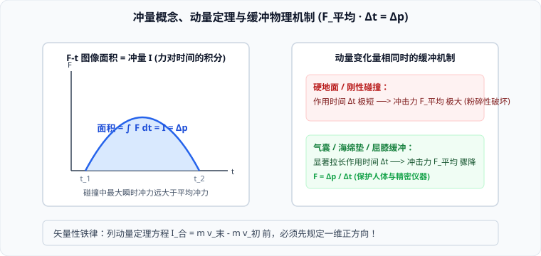

# 01 · 动量与动量定理

## 动量与动量变化量

### 1. 动量的定义与矢量属性
在物理学中，物体的质量 $m$ 和其速度 $\vec{v}$ 的乘积叫作**动量**（Momentum），通常用字母 $\vec{p}$ 表示：
$$\vec{p} = m\vec{v}$$
- **国际单位**：千克·米/秒（$\text{kg} \cdot \text{m/s}$），量纲分析等价于牛·秒（$\text{N} \cdot \text{s}$）；
- **矢量性**：动量是**矢量**，其方向**与物体的瞬时速度方向严格相同**；
- **状态量**：动量与质点某一时刻的瞬时速度一一对应，是描述物体运动状态的量。

### 2. 动量的变化量（$\Delta\vec{p}$）
动量的变化量等于物体末状态动量与初状态动量的**矢量差**：
$$\Delta\vec{p} = \vec{p}_2 - \vec{p}_1 = m\vec{v}_2 - m\vec{v}_1 = m(\vec{v}_2 - \vec{v}_1)$$
- **一维矢量运算规范**：
  > [!IMPORTANT]
  > 在一维直线运动中，求解 $\Delta p$ 前必须**预先规定正方向**！
  > - 若小球以速度 $v$ 水平向右撞墙后，以原速率 $v$ 水平向左弹回：
  >   规定向右为正方向，则初动量 $p_1 = mv$，末动量 $p_2 = -mv$；
  >   动量变化量为：$\Delta p = p_2 - p_1 = (-mv) - mv = -2mv$（负号表示动量变化量方向向左，大小为 $2mv$）。切不可误算为 $mv - mv = 0$！

---

## 冲量：力对时间的累积效应

如果一个力作用在物体上，力的大小为 $F$，力的作用时间为 $\Delta t$，那么力和力的作用时间的乘积叫作力的**冲量**（Impulse），记作 $\vec{I}$。

### 1. 恒力冲量与变力冲量
- **恒力冲量公式**：
  $$\vec{I} = \vec{F} \Delta t$$
  - **矢量性**：冲量是**矢量**，对于恒力，冲量的方向**与力的方向严格一致**；
  - **单位**：牛·秒（$\text{N} \cdot \text{s}$）。
- **变力冲量（微元积分与 $F-t$ 图象面积）**：
  若力的大小随时间变化，则冲量等于力对时间的定积分：
  $$\vec{I} = \int_{t_1}^{t_2} \vec{F}(t) dt$$
  在 $F-t$ 坐标系中，**$F-t$ 曲线与时间横轴所包围的面积，在数值上严格等于该力在这段时间内的冲量大小**！

---

## 动量定理（Impulse-Momentum Theorem）

### 1. 牛顿第二定律推导
设质量为 $m$ 的物体在恒定合外力 $\vec{F}_{\text{合}}$ 作用下做匀变速直线运动，在时间 $\Delta t$ 内速度由 $\vec{v}_1$ 变为 $\vec{v}_2$：
由牛顿第二定律 $\vec{F}_{\text{合}} = m\vec{a}$，且加速度 $\vec{a} = \frac{\vec{v}_2 - \vec{v}_1}{\Delta t}$，代入得：
$$\vec{F}_{\text{合}} = m \frac{\vec{v}_2 - \vec{v}_1}{\Delta t} \implies \vec{F}_{\text{合}} \Delta t = m\vec{v}_2 - m\vec{v}_1$$

### 2. 定理表述与数学表达式
**物体在一个过程中所受合外力的冲量，等于物体在这个过程始末动量的变化量。**
$$\vec{I}_{\text{合}} = \Delta\vec{p} = \vec{p}_2 - \vec{p}_1$$
- 若物体受到多个外力作用，合外力的冲量等于各分外力冲量的**矢量和**：
  $$\vec{I}_{\text{合}} = \vec{I}_1 + \vec{I}_2 + \dots + \vec{I}_n = \Delta\vec{p}$$

---

## 动量定理的核心应用：碰撞冲击与缓冲机制

将动量定理变形为冲击力的动力学表达式：
$$\bar{F} = \frac{\Delta p}{\Delta t}$$
这一简明公式揭示了自然界与工程技术中一切碰撞与防护的底层奥秘：

### 1. 动量变化量 $\Delta p$ 一定时（增大 $\Delta t$ 以减小平均冲力 $\bar{F}$）
- **物理原理**：当物体的动量变化量固定（如从同一高度落到地面，末速度减为零），冲击力 $\bar{F}$ 与碰撞经历时间 $\Delta t$ 成反比；
- **生活与工程实例**：
  - **跳高海绵垫 / 安全气囊**：通过柔软形变极大拉长受力作用时间 $\Delta t$（从几毫秒拉长至数百毫秒），将冲击力降低 $90\%$ 以上，保护人体骨骼不受伤害；
  - **人从高处跳下屈膝下蹲**：通过关节弯曲增加着地减速时间，显著减小地面冲击骨骼的力；
  - **快递防震气泡膜 / 瓦楞纸箱**：延长精密电子元件的撞击减速时间。

### 2. 作用时间 $\Delta t$ 极短时（增大瞬时打击力）
- **物理原理**：在短时间内使动量迅速发生剧烈改变，产生破坏性极强的瞬时冲击力；
- **实例**：铁锤钉钉子、打桩机锤击重桩、武术寸劲发力。

---

## 典型考点与易错辨析

> [!WARNING]
> **高考常考认知误区**
> - [×] “物体的动量越大，它受到的冲量一定越大。”（错！动量是状态量，冲量是过程量。动量很大的物体，只要合外力为零，其受到的合冲量为零）
> - [×] “冲量和功都是由力和位移或时间相乘得到的，两者本质是一样的。”（大错特错！功 $W = F s \cos\theta$ 是力对**空间位移**的积累，是标量，决定动能变化；冲量 $I = F \Delta t$ 是力对**时间**的积累，是矢量，决定动量变化）
> - [√] 动量定理不仅适用于恒力直线运动，对变力（如弹簧冲击、流体阻力）及曲线运动同样普遍成立。
