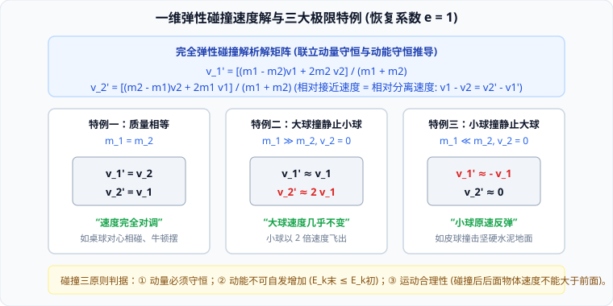

# 03 · 碰撞分类与能量转换

## 碰撞的物理特征与三级分类

在物理学中，**碰撞（Collision）**是指两物体在极短的时间（通常为毫秒量级）内发生相互作用，伴随着巨大的相互作用内力，使物体的运动状态发生剧烈改变的过程。

根据碰撞前后**机械能是否守恒**，碰撞严格分为三大类别：

| 碰撞类型 | 动量守恒性 | 机械能转化特征 | 碰撞后运动形态 | 恢复系数 $e$ |
| :--- | :--- | :--- | :--- | :--- |
| **完全弹性碰撞 (Elastic)** | 严格守恒 | **机械能完全守恒**（$\Delta E_k = 0$），形变完全弹性恢复 | 两物体弹开，无能量耗散 | $e = 1$ |
| **非弹性碰撞 (Inelastic)** | 严格守恒 | **机械能部分损失**（$\Delta E_k < 0$），转化为内能（发热、永久塑性形变） | 两物体弹开，速度衰减 | $0 < e < 1$ |
| **完全非弹性碰撞 (Perfectly Inelastic)** | 严格守恒 | **机械能损失达到理论最大值**（$\Delta E_{k\max}$） | **两物体黏合在一起，以共同速度运动** | $e = 0$ |

---

## 完全弹性碰撞解析解矩阵与三大极限特例

设两球发生一维对心弹性碰撞，质量分别为 $m_1, m_2$，碰前速度分别为 $v_1, v_2$（取向右为正方向），碰后速度分别为 $v_1', v_2'$：

### 1. 守恒方程联立与速度分离定理
- 动量守恒：
  $$m_1 v_1 + m_2 v_2 = m_1 v_1' + m_2 v_2' \implies m_1(v_1 - v_1') = m_2(v_2' - v_2) \quad \text{--- (1)}$$
- 动能守恒：
  $$\frac{1}{2}m_1 v_1^2 + \frac{1}{2}m_2 v_2^2 = \frac{1}{2}m_1 {v_1'}^2 + \frac{1}{2}m_2 {v_2'}^2 \implies m_1(v_1^2 - {v_1'}^2) = m_2({v_2'}^2 - v_2^2) \quad \text{--- (2)}$$
- 将式 (2) 利用平方差展开，并除以式 (1)：
  $$\frac{m_1(v_1 - v_1')(v_1 + v_1')}{m_1(v_1 - v_1')} = \frac{m_2(v_2' - v_2)(v_2' + v_2)}{m_2(v_2' - v_2)}$$
  $$v_1 + v_1' = v_2 + v_2' \implies v_1 - v_2 = v_2' - v_1' \quad \text{--- (3)}$$
> [!IMPORTANT]
> **相对速度分离定理**：在一维对心完全弹性碰撞中，**两物体碰撞前的相对接近速度，严格等于碰撞后的相对分离速度**！这是避开繁琐二次方程的绝杀桥梁。

### 2. 碰后速度解析解
联立式 (1) 与式 (3)，解得碰后速度矩阵：
$$v_1' = \frac{(m_1 - m_2)v_1 + 2m_2 v_2}{m_1 + m_2}$$
$$v_2' = \frac{(m_2 - m_1)v_2 + 2m_1 v_1}{m_1 + m_2}$$

### 3. 三大极限情境解析
若碰撞前 $m_2$ 处于静止状态（$v_2 = 0$）：
1. **质量相等（$m_1 = m_2$）**：
   $$v_1' = 0, \quad v_2' = v_1$$
   **速度完全互换**！撞击小球完全停下，被撞小球以初速度飞出（牛顿摆物理机制）；
2. **重球撞轻球（$m_1 \gg m_2$）**：
   $$v_1' \approx v_1, \quad v_2' \approx 2v_1$$
   大球几乎不受阻碍继续向前运动，轻球以近乎 **2 倍初速度** 高速飞出；
3. **轻球撞重球（$m_1 \ll m_2$）**：
   $$v_1' \approx -v_1, \quad v_2' \approx 0$$
   重球几乎岿然不动，轻球以原速率反向弹回（如乒乓球打在刚性水泥墙上）。

---

## 完全非弹性碰撞：能量损失的最大极值

当两物体碰撞后黏合为一体，以共同速度 $v_{\text{共}}$ 运动：
1. **共速公式**：
   $$m_1 v_1 + m_2 v_2 = (m_1 + m_2) v_{\text{共}} \implies v_{\text{共}} = \frac{m_1 v_1 + m_2 v_2}{m_1 + m_2}$$
2. **损失的动能（系统内能增量）**：
   $$\Delta E_k = \left(\frac{1}{2}m_1 v_1^2 + \frac{1}{2}m_2 v_2^2\right) - \frac{1}{2}(m_1 + m_2) v_{\text{共}}^2 = \frac{1}{2}\frac{m_1 m_2}{m_1 + m_2}(v_1 - v_2)^2$$
   - 引入折合质量（Reduced Mass）$\mu = \frac{m_1 m_2}{m_1 + m_2}$，相对速度 $v_{\text{相对}} = v_1 - v_2$，损失的动能简写为 $\Delta E_k = \frac{1}{2}\mu v_{\text{相对}}^2$；
   - 这是两物体发生一维碰撞时，**理论上可能损失的最大动能量**！

---

## 碰撞可行性检验的三大铁律（高考客观题秒杀判据）

In高考选择题中，题目常给出碰前状态与若干组碰后速度猜测，要求判断哪组可能发生。必须依次通过三大严格物理检验：

1. **动量守恒检验**：
   $$\sum p_{\text{初}} = \sum p_{\text{末}}$$
   若动量矢量和不相等，直接排除！
2. **动能不增检验（热力学第二定律约束）**：
   $$E_{k\text{末}} \le E_{k\text{初}}$$
   碰撞属于无外源做功过程，总机械能绝不可能自发凭空增加！若 $E_{k\text{末}} > E_{k\text{初}}$，直接排除！
3. **运动物理合理性检验（空间与时间逻辑）**：
   - **碰前**：后面的物体速度必须大于前面物体（$v_{\text{后}} > v_{\text{前}}$），否则追不上；
   - **碰后**：同向运动时，后面物体速度绝不能大于前面物体（$v_{\text{后}}' \le v_{\text{前}}'$），否则两物体发生不可思议的“相互穿透”，物理上不可能成立！
