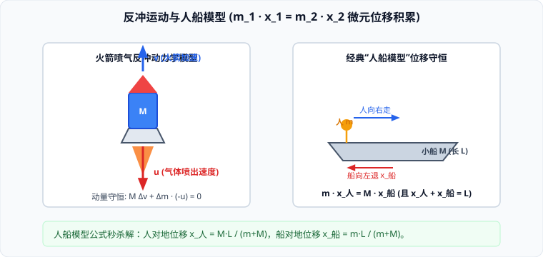

# 04 · 反冲运动与火箭

## 反冲运动的定义与物理本质

如果一个静止的物体在内部巨大相互作用力（内力）的作用下分裂为两部分，一部分向某一方向运动，另一部分必然向相反的方向运动。这种现象叫作**反冲运动**（Recoil Motion）。

### 1. 动量守恒本质推导
设系统初始处于静止状态（总动量为零），在内力作用下分裂为质量分别为 $m_1$ 和 $m_2$ 的两部分，分裂后速度分别为 $\vec{v}_1$ 和 $\vec{v}_2$：
由动量守恒定律：
$$0 = m_1\vec{v}_1 + m_2\vec{v}_2 \implies \vec{v}_2 = - \frac{m_1}{m_2}\vec{v}_1$$
- **反向性**：负号表明两部分的运动方向**严格相反**；
- **质量反比律**：速度大小与各自质量成反比，质量越小的部分获得的速度越大。
- **机械能创生**：反冲过程中，系统的机械能显著增加（从零变为非零），其能量来源于**化学能（如火药爆炸）或弹性势能等其他内部能源的释放**。

---

## 现代火箭推进原理与齐奥尔科夫斯基公式

火箭是反冲运动在现代航天科技中最辉煌的应用。与喷气式飞机依赖大气吸入空气不同，火箭自带氧化剂与燃烧剂，**能够在无空气的高真空宇宙太空中自主加速推进**。

### 1. 动量微分方程推导
设火箭在某一时刻总质量为 $M$，对地速度为 $v$。在微元时间 $dt$ 内，火箭向后以相对于火箭的喷气速度 $u$ 喷出质量为 $dm$ 的高温燃气（对地速度为 $v - u$），火箭主体质量变为 $M - dm$，对地速度增加到 $v + dv$：
根据系统动量守恒：
$$M v = (M - dm)(v + dv) + dm(v - u)$$
展开并忽略二阶微元 $dm \cdot dv$：
$$M v = M v + M dv - v dm - dm \cdot dv + v dm - u dm \implies M dv = u dm$$
两边同除以 $M$ 并积分：
$$\int_{v_0}^v dv = u \int_{M_0}^M \frac{-dM}{M} \implies v - v_0 = u \ln\left(\frac{M_0}{M}\right)$$
这就是著名的**齐奥尔科夫斯基火箭方程（Tsiolkovsky Rocket Equation）**！

### 2. 决定火箭最终速度的两大要素
1. **喷气速度 $u$**：喷气速度越大，火箭最终获得的速度越大。目前现代液体火箭的喷气速度通常在 $3000 \sim 4500\ \text{m/s}$；
2. **质量比（Mass Ratio）$\frac{M_0}{M}$**：火箭发射时的初始总质量 $M_0$ 与燃料耗尽后空壳质量 $M$ 的比值。
   - 由于对数函数的增长极其缓慢，单级火箭由于箭体材料结构强度的限制，质量比很难突破 $10$（最大速度约 $10\ \text{km/s}$，难以摆脱太阳引力）；
   - **多级火箭方案**：为了达到更高速度，现代宇宙航行采用多级火箭设计。每一级燃料烧完后立即抛掉沉重的外壳发动机死重，极大地提升了后续各级的质量比，从而使探测器能够轻松飞向月球、火星与太阳系深处。

---

## 经典应用模型：“人船模型”位移方程全解

在光滑水面上漂浮着一只长为 $L$、质量为 $M$ 的小船，质量为 $m$ 的人从船头走到船尾。求人与船相对于水面（地面参考系）的位移各为多大。

### 1. 核心推导步骤
1. **系统动量守恒**：人与船组成的系统在水平方向上不受任何外力，初始系统静止，故水平总动量时刻恒为零：
   $$m v_1(t) - M v_2(t) = 0 \implies m v_1(t) = M v_2(t)$$
2. **微元累积积分**：在全过程中，两边对时间 $t$ 积分：
   $$\int_0^t m v_1(t) dt = \int_0^t M v_2(t) dt \implies m x_1 = M x_2$$
   即：**在任何微小时间或全过程中，人对地的位移 $x_1$ 与船对地的位移 $x_2$ 严格满足质量反比守恒！**
3. **几何相对位移约束**：人从船头走到船尾，人相对于船的相对位移等于船长 $L$：
   $$x_1 + x_2 = L$$
4. **联立求解**：
   $$m x_1 = M(L - x_1) \implies x_1 = \frac{M}{m + M} L \quad (\text{人对地位移})$$
   $$x_2 = \frac{m}{m + M} L \quad (\text{船对地位移})$$

> [!TIP]
> **人船模型秒杀记忆法则**：  
> **谁的位移，分子就是对方的质量！**  
> - 人的对地位移：$x_{\text{人}} = \frac{M_{\text{船}}}{m_{\text{人}} + M_{\text{船}}} L$  
> - 船的对地位移：$x_{\text{船}} = \frac{m_{\text{人}}}{m_{\text{人}} + M_{\text{船}}} L$  
> 此公式对人爬气球软梯、小球在半圆形光滑槽中滑到底部、两物体由弹簧推开等模型完全普适。
