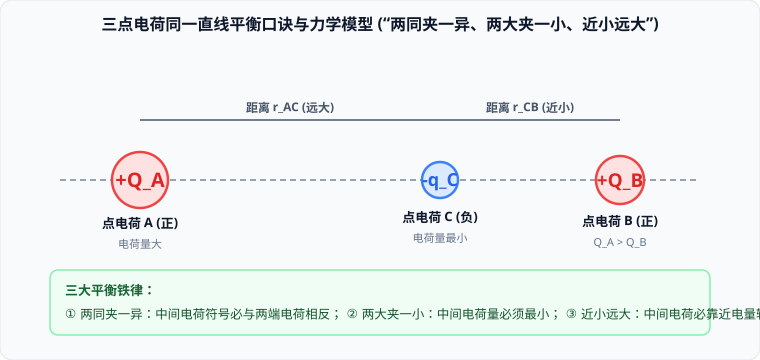

# 01 · 电荷守恒与库仑定律

## 电荷与元电荷

### 1. 两种电荷与元电荷
- 自然界中只存在两种电荷：被丝绸摩擦过的玻璃棒带**正电荷**，被毛皮摩擦过的橡胶棒带**负电荷**。同种电荷相互排斥，异种电荷相互吸引。
- **元电荷（Elementary Charge）**：一个电子或质子所带电荷量的绝对值称为元电荷，用 $e$ 表示：
  $$e = 1.602 \times 10^{-19}\ \text{C}$$
  - **电荷量子化**：实验表明，任何带电体所带的电荷量都是元电荷 $e$ 的**整数倍**，电荷量是量子化（不连续）的。
  - 密立根通过著名的**油滴实验**首次精确测定了元电荷 $e$ 的数值。
- **比荷（Specific Charge）**：带电粒子的电荷量与它的质量之比 $\frac{q}{m}$ 称为比荷（或荷质比）。电子的比荷为 $\frac{e}{m_e} \approx 1.76 \times 10^{11}\ \text{C/kg}$。

### 2. 起电的三大微观机制
起电的本质都是**电子在物体之间或物体内部的转移**，绝非创造了电荷：
1. **摩擦起电**：两种不同材料相互摩擦时，对核外电子束缚能力较弱的物体失去电子而带正电，束缚能力强的物体得到电子带等量负电；
2. **接触起电**：带电体与不带电导体接触，自由电子发生转移；
   - **完全相同的金属球接触后电荷分配律**：
     - 若两球带**同种电荷**：接触后两球平分总电量：
       $$q_1' = q_2' = \frac{q_1 + q_2}{2}$$
     - 若两球带**异种电荷**：接触后正负电荷先完全中和，剩余净电荷再由两球平分：
       $$q_1' = q_2' = \frac{|q_1 - q_2|}{2}$$
3. **感应起电**：将带电体移近不带电的导体，导体内的自由电子在库仑力作用下重新分布，导致**近端感应出异种电荷，远端感应出同种电荷**。

### 3. 电荷守恒定律（Law of Conservation of Charge）
**电荷既不能创生，也不能消灭，它只能从一个物体转移到另一个物体，或者从物体的一部分转移到另一部分；在任何物理过程中，系统的电荷代数和保持不变。**

---

## 库仑定律（Coulomb's Law）

### 1. 定律内容与数学表达式
法国物理学家库仑在 1785 年通过精密的**扭秤实验**发现了静止点电荷之间的相互作用规律：
**真空中两个静止点电荷之间的相互作用力，跟它们的电荷量的乘积成正比，跟它们距离的二次方成反比；作用力的方向在它们的连线上。**
$$F = k \frac{|q_1 q_2|}{r^2}$$
- **静电力常量**：$k = 8.98755 \times 10^9\ \text{N} \cdot \text{m}^2/\text{C}^2 \approx 9.0 \times 10^9\ \text{N} \cdot \text{m}^2/\text{C}^2$；
- **点电荷（Point Charge）**：一种理想化物理模型。当带电体本身的形状和线度远小于它们之间的相互距离，以至于电荷分布对相互作用力的影响可忽略不计时，即可视为点电荷。

### 2. 库仑定律的适用条件与极限陷阱
> [!WARNING]
> **库仑公式的数学极限与物理真实**：
> - 库仑定律的严格适用条件是：**真空、静止、点电荷**；
> - 当两个带电导体球的距离 $r \to 0$ 时，不能依据公式断言库仑力 $F \to \infty$！因为当距离极近时，带电体绝不能再视为“点电荷”，导体球上的电荷会发生显著的**极化感应再分布**（同种电荷互相排斥分布在远端，实际中心距离大于球心距；异种电荷互相吸引聚集在近端，实际中心距离小于球心距）。

---

## 经典平衡模型：三点电荷在一直线上的平衡

在光滑绝缘水平面上放置三个点电荷 $A, B, C$，若仅在彼此库仑力作用下**三个点电荷均处于静止平衡状态**：

### 1. 平衡推导与“三大平衡铁律”
1. **铁律一：“两同夹一异”**
   - 中间电荷受两侧电荷的电场力必须方向相反才能抵消，故两侧电荷的电性必须相同，**中间电荷的电性必然与两侧电荷相反**；
2. **铁律二：“两大夹一小”**
   - 设两端电荷为 $Q_A, Q_B$（距离为 $L$），中间电荷为 $q_C$（距 $A$ 为 $r_1$，距 $B$ 为 $r_2$）：
     对端点电荷 $A$ 平衡：$k\frac{Q_A q_C}{r_1^2} = k\frac{Q_A Q_B}{L^2} \implies q_C = Q_B \left(\frac{r_1}{L}\right)^2 < Q_B$；
     故**中间电荷的电荷量绝对值必然小于两端任意一个电荷的电荷量**；
3. **铁律三：“近小远大”**
   - 对中间电荷 $C$ 平衡：$k\frac{Q_A q_C}{r_1^2} = k\frac{Q_B q_C}{r_2^2} \implies \frac{Q_A}{r_1^2} = \frac{Q_B}{r_2^2} \implies \frac{r_1}{r_2} = \sqrt{\frac{Q_A}{Q_B}}$；
   - 电量较小的一端，距离 $r$ 必然较小；电量较大的一端，距离必然较远。即**中间电荷必须靠近电量较小的一侧**。
