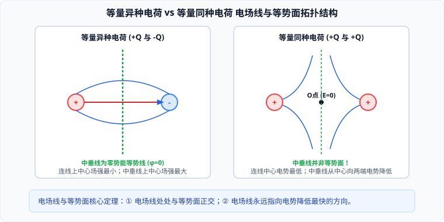

# 02 · 电场强度与电场线

## 电场与电场强度

### 1. 电场的客观物质性
电荷之间的相互作用力是通过**电场**（Electric Field）传递的。
- 只要有电荷存在，电荷周围就必然存在电场；
- 电场是一种看不见、摸不着的客观存在的特殊物质形态，具有质量、能量和动量。电荷通过电场对放入其中的其他电荷施加**静电力**。

### 2. 电场强度的定义式与决定式对比

| 物理维度 | 电场强度的定义式 | 点电荷场强的决定式 | 匀强电场的定量关系式 |
| :--- | :--- | :--- | :--- |
| **数学公式** | $$\vec{E} = \frac{\vec{F}}{q}$$ | $$E = k \frac{Q}{r^2}$$ | $$E = \frac{U}{d}$$ |
| **公式性质** | **比值定义式** | **物理决定式** | 导出关系式 |
| **物理意义** | 描述空间某点电场的强弱与方向 | 决定真空中孤立点电荷 $Q$ 周围场强大小 | 匀强电场场强与电势差的关系 |
| **适用范围** | **一切静电场与涡旋电场普遍成立** | **仅适用于真空中点电荷场** | **仅适用于匀强电场**（$d$ 沿场强方向） |
| **决定因素** | 由场源电荷及位置决定，与检验电荷 $q$ 无关 | 由场源电荷量 $Q$ 及距离 $r$ 唯一决定 | 由两板间电压 $U$ 及间距 $d$ 决定 |

- **方向规定**：**正电荷在电场中所受静电力的方向**规定为该点电场强度的方向。负电荷受力方向与场强方向**严格相反**。
- **国际单位**：牛/库（$\text{N/C}$），在数值和量纲上严格等价于伏/米（$\text{V/m}$）。

### 3. 电场的叠加原理（Superposition Principle）
如果空间存在多个场源电荷，则空间中任意一点的总电场强度，等于各个场源电荷单独存在时在该点所产生的场强的**矢量和**：
$$\vec{E}_{\text{总}} = \vec{E}_1 + \vec{E}_2 + \dots + \vec{E}_n$$
合成时严格遵循**平行四边形定则**或正交分解法。

---

## 电场线：形象化描绘电场的几何工具

为了形象直观地描绘电场在空间的强弱分布与方向，英国物理学家法拉第提出了**电场线**（Electric Field Lines）的假想概念。

### 1. 电场线的五大核心几何物理特性
1. **方向性**：电场线上任意一点的**切线方向**，严格表示该点的电场强度 $\vec{E}$ 的方向；
2. **疏密表强弱**：电场线的**疏密程度**定量反映场强的大小。电场线越密集的区域场强越强，越稀疏的区域场强越弱；
3. **起止性（单向非闭合）**：静电场的电场线**起于正电荷（或无穷远），止于负电荷（或无穷远）**。电场线绝不闭合，在没有电荷的空间不会凭空产生或中断；
4. **互不相交、互不相切**：因为空间中任意指定点的合电场强度矢量是**唯一确定**的，如果电场线相交或相切，交点处将出现两个不同的场强切线方向，这在物理上是不可能的；
5. **不是带电粒子的运动轨迹**：
   > [!IMPORTANT]
   > 电场线仅表示受力的瞬时方向（即瞬时加速度方向），而粒子的运动轨迹还取决于**初速度方向**。只有当电场线为直线、粒子初速度为零（或初速度方向沿电场线）、且仅受静电力时，带电粒子的轨迹才与电场线重合。

---

## 经典电场拓扑构型全景对比

### 1. 等量异种点电荷（$+Q$ 与 $-Q$）
- **两电荷连线上**：
  - 电场方向恒由正电荷指向负电荷；
  - 场强大小沿连线呈现“中间弱、两端强”的对称分布，在**连线中点 $O$ 处场强最小**（但绝对不为零！）；
- **连线中垂面上**：
  - 中垂面上各点的场强方向均与连线平行，且由正电荷一侧指向负电荷一侧；
  - 从中点 $O$ 沿中垂线向无穷远处延伸，**电场线逐渐变疏，场强单调减小**，在无穷远处场强为零；
  - 中垂面是一个与电场线处处正交的**等势面**（若无穷远处为零势能，则中垂面电势恒为零 $\varphi = 0$）。

### 2. 等量同种点电荷（$+Q$ 与 $+Q$）
- **两电荷连线上**：
  - 连线中点 $O$ 处，两电荷产生的场强大小相等、方向相反，**合场强严格为零（$E_O = 0$）**；
  - 从中点 $O$ 向两侧电荷靠近，场强逐渐增大；
- **连线中垂线上**：
  - 场强方向沿中垂线背离连线向外辐射；
  - 中点 $O$ 处场强为零，无穷远处场强亦为零；因此从中点沿中垂线向外延伸，**场强必然先增大后减小**，在某一特征距离 $r = \frac{L}{2\sqrt{2}}$ 处取得极大值！
