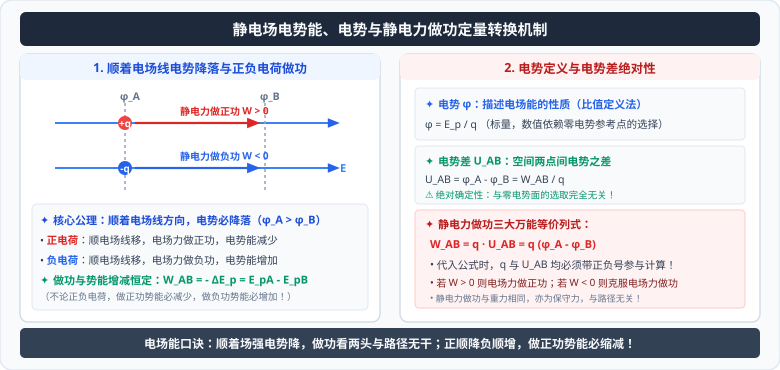

# 03 · 电势能、电势与电势差

  

## 静电力做功与电势能

### 1. 静电力做功的路径无关性（保守力特征）
正如重力做功只取决于初末高度差一样，在静电场中移动电荷时，**静电力所做的功只与电荷的初位置和末位置有关，而与电荷经过的具体运动路径完全无关**。
- 静电力是典型的**保守力**；
- 电荷沿任意闭合路径移动一周回到出发点，静电力做的总功代数和严格为零：$\oint \vec{F}_e \cdot d\vec{r} = 0$。

### 2. 静电力做功与电势能变化量的核心等式
电荷在电场中具有的与其空间位置相关的能量叫作**电势能**（Electric Potential Energy），用 $E_p$ 表示：
$$W_{AB} = E_{pA} - E_{pB} = -\Delta E_p$$
- **静电力做正功（$W_{AB} > 0$）**：电荷的电势能**减少**（电场力释放能量）；
- **静电力做负功（$W_{AB} < 0$，克服静电力做功）**：电荷的电势能**增加**（外力对电荷做功转化为电势能储存）。

> [!TIP]
> **电势能的正负判定技巧**：
> - 正电荷顺着电场线运动：电场力做正功，电势能减小；逆着电场线运动：电势能增大；
> - 负电荷顺着电场线运动：电场力做负功，电势能增大；逆着电场线运动：电势能减小。

---

## 电势（Electric Potential）

电势是用来从“能量”角度刻画电场本身性质的物理量。

### 1. 比值定义式
电荷在电场中某一点的电势能 $E_p$ 与它的电荷量 $q$ 的比值，叫作该点的**电势**（Electric Potential），用 $\varphi$ 表示：
$$\varphi = \frac{E_p}{q}$$
- **标量性**：电势是**标量**，只有大小和正负，没有方向。正负号表示该点电势高于还是低于参考点电势；
- **国际单位**：伏特（Volt，符号 $\text{V}$），$1\ \text{V} = 1\ \text{J/C}$；
- **零电势参考点的选择**：电场中某点的电势数值取决于零势能参考点的选取。在高中物理中，**通常规定大地或离场源电荷无穷远处为零电势点（$\varphi = 0$）**。

### 2. 电势高低的唯一几何判据
> [!IMPORTANT]
> **顺着电场线的方向，电势必然逐渐降低！**  
> 电场线指向的是电势降落最快的空间梯度方向。无论电场线是平行的直线还是复杂的曲线，顺着电场线行进，沿途各点的电势单调递减：
> $$\varphi_{\text{起点}} > \varphi_{\text{终点}}$$

---

## 电势差（Potential Difference / Voltage）

### 1. 定义式与物理意义
电场中两点间电势的差值叫作**电势差**（也称**电压**），记作 $U_{AB}$：
$$U_{AB} = \varphi_A - \varphi_B$$
- 显然有：$U_{BA} = \varphi_B - \varphi_A = -U_{AB}$；
- **绝对性**：电势具有相对性（依赖于零电势点），但**两点间的电势差 $U_{AB}$ 与零电势点的选取完全无关**！

### 2. 静电力做功与电势差的关系公式
将 $\varphi_A = \frac{E_{pA}}{q}, \varphi_B = \frac{E_{pB}}{q}$ 代入做功与电势能关系：
$$W_{AB} = E_{pA} - E_{pB} = q(\varphi_A - \varphi_B) = q U_{AB}$$
变形得到电势差的比值定义式：
$$U_{AB} = \frac{W_{AB}}{q}$$
> [!WARNING]
> **全符号代入法则**：  
> 在应用 $W_{AB} = q U_{AB}$ 时，所有物理量均带有正负号！电荷量 $q$（负电荷必须代负号）、电势差 $U_{AB}$（$\varphi_A < \varphi_B$ 时为负值）必须连同符号一起代入运算，计算结果的正负号自动反映功的正负。

---

## 等势面（Equipotential Surface）

电场中电势相等的各点所构成的曲面（或平面）叫作**等势面**。

### 1. 等势面的四大几何物理特性
1. **等势面上移动电荷不做功**：在同一个等势面上任意移动电荷，由于 $U_{AB} = \varphi_A - \varphi_B = 0$，故静电力做的功严格为零（$W_{AB} = q U_{AB} = 0$）；
2. **电场线与等势面处处正交**：电场线必然处处垂直于等势面，且由电势高的等势面指向电势低的等势面；
3. **等势面绝不相交**：若两个不同电势的等势面相交，交线上各点将出现两个不同的电势值，这在物理上是不可能的；
4. **疏密程度反映场强大小**：对于电势差相等的相邻等势面（等差等势面），**等势面越密集的地方，电场强度 $E$ 越大；等势面越稀疏的地方，场强 $E$ 越小**。
