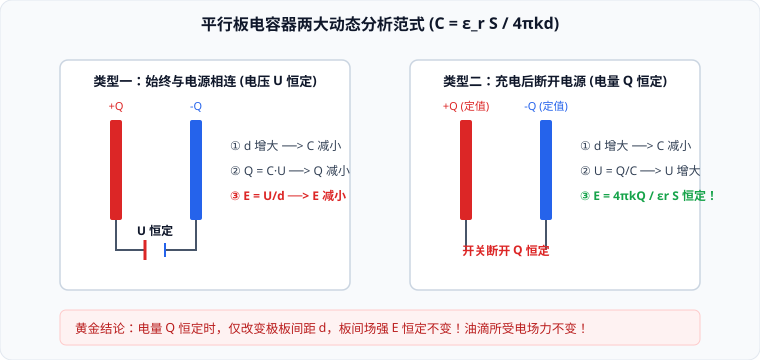

# 05 · 电容器与电容

## 电容器与电容的概念

### 1. 电容器的结构与工作过程
- **构造**：任何两个彼此绝缘又相隔很近的导体，都可以构成一个**电容器**（Capacitor）。两导体称为电容器的两个极板，中间填充的绝缘材料称为电介质；
- **充电**：将电容器两极板接在电源两极，两板分别带上等量异种电荷的过程。充电后电容器内部建立静电场，储存**电场能**；
- **电容器的电荷量 $Q$**：指**其中任意一个极板所带电荷量的绝对值**（而不是两板电荷代数和）。

### 2. 电容的比值定义式
电容器所带的电荷量 $Q$ 与电容器两极板之间的电势差 $U$ 的比值，叫作电容器的**电容**（Capacitance），用字母 $C$ 表示：
$$C = \frac{Q}{U} = \frac{\Delta Q}{\Delta U}$$
- **物理意义**：描述电容器**容纳电荷本领大小**的物理量；
- **国际单位**：法拉（Farad，符号 $\text{F}$）。实用中单位偏大，常用微法（$\mu\text{F}$）和皮法（$\text{pF}$）：
  $$1\ \text{F} = 10^6\ \mu\text{F} = 10^{12}\ \text{pF}$$
- **比值定义特性**：电容 $C$ 只由电容器本身的材料、几何构造决定，**与电容器是否带电、带电多少、电压高低完全无关**。

---

## 平行板电容器的决定式

对于最常见的由两块相互平行的金属薄板构成的平行板电容器，其实验与理论推导表明，其电容满足：
$$C = \frac{\varepsilon_r S}{4\pi k d}$$
- **$\varepsilon_r$（相对介电常数）**：介质材料的电学特性（真空 $\varepsilon_r = 1$，空气略大于 $1$ 近似为 $1$，绝缘陶瓷、石蜡、塑料介质 $\varepsilon_r > 1$）；
- **$S$（正对面积）**：两平行金属板有效相互重叠覆盖的面积；
- **$d$（极板间距）**：两平行金属板之间的空间垂直距离；
- **$k$**：静电力常量。

---

## 平行板电容器两大动态分析模型（高考必考）

动态分析题的关键在于：**准确判定哪一个物理量在变化过程中保持恒定**。

### 动态模型一：电容器始终与恒压电源相连（$U$ 保持恒定）
- **恒定条件**：开关闭合且保持连接，极板间电势差恒等于电源电动势，**$U = \text{常数}$**；
- **各物理量链式因果推导**：
  1. **间距 $d$ 增大**：
     $$C \downarrow \implies Q = CU \downarrow \text{（电荷流回电源，电容器放电）} \implies E = \frac{U}{d} \downarrow$$
  2. **正对面积 $S$ 减小**：
     $$C \downarrow \implies Q = CU \downarrow \implies E = \frac{U}{d} \text{（因 } U, d \text{ 均未变，场强 } E \text{ 恒定不变！）}$$
  3. **插入电介质（$\varepsilon_r$ 增大）**：
     $$C \uparrow \implies Q = CU \uparrow \text{（电源继续向电容充电）} \implies E = \frac{U}{d} \text{（不变）}$$

---

### 动态模型二：电容器充电后断开电源（$Q$ 保持恒定）
- **恒定条件**：充电完成后切断开关，两极板处于孤立绝缘状态，**极板所带电量 $Q = \text{常数}$**；
- **场强 $E$ 的独立性绝杀推导**：
  将 $C = \frac{\varepsilon_r S}{4\pi k d}$ 与 $U = \frac{Q}{C}$ 代入电场强度定义式：
  $$E = \frac{U}{d} = \frac{\frac{Q}{C}}{d} = \frac{Q}{C d} = \frac{Q}{\left(\frac{\varepsilon_r S}{4\pi k d}\right) d} = \frac{4\pi k Q}{\varepsilon_r S}$$
  > [!IMPORTANT]
  > **极度重要的高考黄金结论**：  
  > 当电容器与电源断开（$Q$ 恒定）时，**极板间的电场强度 $E$ 与极板间距 $d$ 完全无关**！  
  > 只要正对面积 $S$ 和电介质不变，无论怎样拉大或推近两极板（改变 $d$），**板间的匀强场强 $E$ 恒定保持不变**！原先在板间静止悬浮的带电微粒依然保持静止。

---

## 静电计（指针式验电器）的测量原理

- **构造**：金属球、金属杆与指针相连，金属外壳绝缘并接地；
- **物理量度**：**静电计指针张开的角度，定量反映静电计金属球与外壳之间的电势差 $U$ 的大小**；
- **连线方式**：将静电计金属球接电容器正极板，外壳接负极板（并接地）。此时指针偏角越大，表明电容器两板间的电势差 $U$ 越大。
