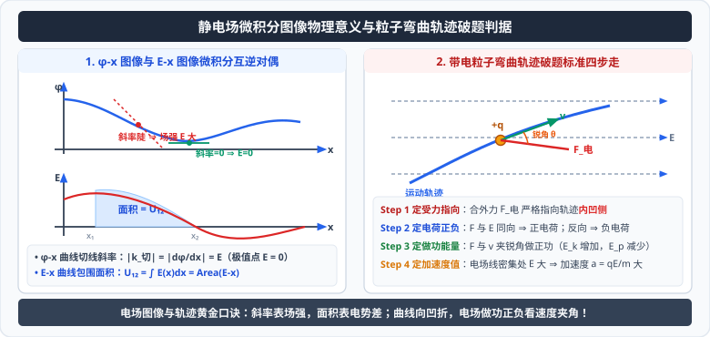

# 考点 · 静电场性质综合与电场图像模型

## 静电场三大微积分图象模型

<div style="text-align: center; margin: 20px 0;">
  
</div>

高考中经常通过图象给出电场的空间分布信息，考查利用微分斜率与积分面积提取物理量的能力：

### 1. $\varphi-x$ 图象（电势—位置图象）
- **切线斜率的物理意义**：
  由微分关系 $E = -\frac{d\varphi}{dx}$ 可知，**$\varphi-x$ 图线上任意一点的切线斜率绝对值，等于该点的电场强度大小**：
  $$E = \left|\frac{d\varphi}{dx}\right| = |k_{\text{切}}|$$
  - 切线越陡峭（斜率越大），该处的电场强度 $E$ 越大；切线越平缓，场强越小；
  - **极值点特征**：若图线上某点出现极大值或极小值（切线斜率为零），则该点的电场强度**严格为零（$E = 0$）**！
- **电场方向判据**：
  沿着电场线方向电势单调降低。若 $\varphi$ 随 $x$ 增大而减小（图线下行），则电场强度方向沿 $x$ 轴正方向；反之若图线上行，场强沿 $x$ 轴负方向。

### 2. $E-x$ 图象（电场强度—位置图象）
- **图象所围面积的物理意义**：
  由积分定义 $U = \int E(x) dx$ 可知，**$E-x$ 曲线与位移横轴所包围的几何图形面积，在数值上严格等于两点间的电势差 $U$**：
  $$U_{12} = \int_{x_1}^{x_2} E(x) dx = \text{Area}(E-x)$$
  - 横轴上方的“正面积”与下方的“负面积”代数求和，可直接求出空间任意两点的电势差。

### 3. $E_p-x$ 图象（电势能—位置图象）
- **切线斜率的物理意义**：
  由功能关系 $dE_p = - dW = - F dx$ 可知，切线斜率绝对值等于带电粒子在该位置所受**静电力的大小**：
  $$F = \left|\frac{dE_p}{dx}\right|, \quad E = \frac{F}{q} = \frac{1}{q}\left|\frac{dE_p}{dx}\right|$$

---

## 带电粒子弯曲轨迹综合判据（“轨迹法”四步走）

在静电场中，已知带电粒子的曲线运动轨迹与电场线（或等势面）分布，分析其运动特性的标准破题范式：

```
弯曲轨迹 ──> 确定受力方向 (向凹侧) ──> 比对电场线 ──> 判定电荷正负
     │
     └─── 观察速度与力夹角 ──> 判定做功正负 ──> 判定动能增减 & 电势能增减
```

1. **第一步：定受力方向**
   - 曲线运动的动力学铁律：合外力恒指向轨迹的内凹侧。由此直接确定粒子在该位置所受**静电力 $\vec{F}$ 的指向**；
2. **第二步：定电荷正负**
   - 观察静电力 $\vec{F}$ 的方向与该点电场线切线方向的关系：
     - 若 $\vec{F}$ 与电场线同向 $\implies$ 粒子带**正电荷**；
     - 若 $\vec{F}$ 与电场线反向 $\implies$ 粒子带**负电荷**；
3. **第三步：定动能与电势能增减**
   - 观察粒子运动方向与静电力的夹角：
     - 若静电力与速度方向夹角为锐角 $\implies$ 静电力做**正功** $\implies$ 动能**增加**，电势能**减少**；
     - 若静电力与速度方向夹角为钝角 $\implies$ 静电力做**负功** $\implies$ 动能**减少**，电势能**增加**；
4. **第四步：定加速度大小**
   - 电场线越密（或等势面越密）的位置，场强 $E$ 越大，由牛顿第二定律 $a = \frac{qE}{m}$，粒子在该位置的**加速度越大**。

---

## 静电平衡状态与静电屏蔽

当金属导体置于外电场中时，导体内的自由电子在外电场静电力作用下发生大规模定向定向宏观移动（静电感应），在导体表面出现感应电荷。感应电荷建立的“反向感应电场”与“原外电场”相互抵消，最终达到动态平衡。

### 1. 处于静电平衡状态导体的四大特征
1. **内部场强处处为零**：导体内任意一点的合电场强度严格为零：
   $$\vec{E}_{\text{合}} = \vec{E}_{\text{外}} + \vec{E}_{\text{感}} = \mathbf{0} \implies \vec{E}_{\text{感}} = - \vec{E}_{\text{外}}$$
2. **整个导体是等势体**：导体表面是等势面，导体内任意两点间电势差为零，表面各点电势处处相等；
3. **电场线垂直于导体表面**：导体外表面附近的电场线处处垂直于导体表面，绝无平行于表面的切向分量；
4. **净电荷只分布在外表面**：导体内部没有净电荷，净电荷只能分布在导体的外表面；且外表面曲率越大的地方（尖锐处）电荷面密度越大，尖端附近电场极强（产生**尖端放电**现象）。

### 2. 静电屏蔽（Electrostatic Shielding）
- **封闭导体壳内部不受外部电场影响**：金属网罩或空心金属壳能够完全阻隔外部电场的渗透，使空腔内部场强恒为零；
- **接地导体壳使外部不受内部电场影响**：若空腔内有带电体，只要将金属外壳**良好接地**，外表面的感应电荷便导入大地，外部空间便完全不受内部带电体的影响。
- **实际应用**：高压带电作业服（金属丝编织网）、同轴屏蔽电缆线、电子仪器金属外壳。
