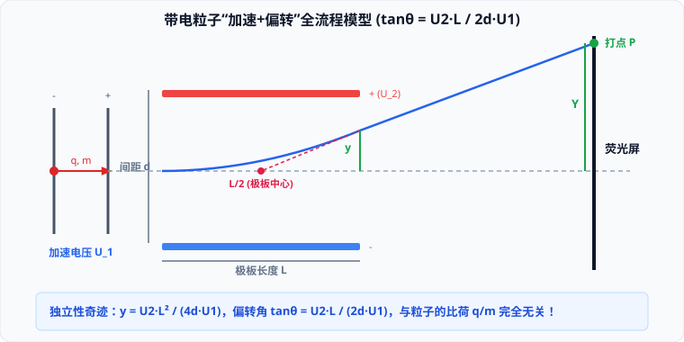

# 02 · 带电粒子在电场中的偏转

## 粒子在偏转电场中的类平抛运动模型

质量为 $m$、电荷量为 $q$ 的带电粒子以初速度 $v_0$ 垂直电场线射入匀强偏转电场。设极板长度为 $L$，极板间距为 $d$，极板间偏转电压为 $U_2$。

### 1. 正交分解运动方程矩阵

| 运动方向 | 受力情况 | 加速度 | $t$ 时刻速度 | 极板出射时的状态量 |
| :--- | :--- | :--- | :--- | :--- |
| **沿初速度方向 ($x$)** | 不受静电力 ($F_x = 0$) | $a_x = 0$ | $v_x = v_0$（匀速运动） | 穿越电场时间： $t = \frac{L}{v_0}$ |
| **垂直初速度方向 ($y$)** | 恒定静电力： $F_y = qE = \frac{qU_2}{d}$ | $a_y = \frac{qU_2}{md}$ | $v_y = a_y t$（初速为零匀加速） | 竖直出射分速度： $v_y = \frac{qU_2 L}{mdv_0}$ |

### 2. 核心输出量公式推导
1. **侧移偏转位移 $y$（粒子离开电场时偏离中线的距离）**：
   $$y = \frac{1}{2}a_y t^2 = \frac{1}{2}\left(\frac{qU_2}{md}\right)\left(\frac{L}{v_0}\right)^2 = \frac{q U_2 L^2}{2md v_0^2}$$
2. **偏转角 $\theta$（出射速度与初速度方向的夹角）**：
   $$\tan\theta = \frac{v_y}{v_x} = \frac{qU_2 L}{md v_0^2}$$
3. **粒子离开偏转电场时的合动能（动能定理）**：
   $$E_k = E_{k0} + W_e = \frac{1}{2}mv_0^2 + q E y = \frac{1}{2}mv_0^2 + q\frac{U_2}{d}y$$

---

## 核心几何定理：速度反向延长线必过极板水平中点

设粒子离开偏转极板时的瞬时速度切线反向延长，与中央轴线交于点 $P(x', 0)$：
- 在直角三角形中：
  $$\tan\theta = \frac{y}{L - x'}$$
- 将偏转位移 $y = \frac{q U_2 L^2}{2md v_0^2}$ 与 $\tan\theta = \frac{q U_2 L}{md v_0^2}$ 代入：
  $$\frac{q U_2 L}{md v_0^2} = \frac{\frac{q U_2 L^2}{2md v_0^2}}{L - x'} \implies 1 = \frac{L}{2(L - x')} \implies L - x' = \frac{L}{2} \implies x' = \frac{L}{2}$$

> [!IMPORTANT]
> **极板中点出射定理**：  
> **做类平抛运动的带电粒子离开电场时，其速度的反向延长线必过偏转极板长度的几何中点 $(\frac{L}{2}, 0)$**！  
> 粒子离开电场后做匀速直线运动，打到距离极板右端为 $D$ 的荧光屏上的总侧移距离 $Y$ 为：
> $$Y = \left(\frac{L}{2} + D\right)\tan\theta$$

---

## 经典二级联动：“先加速后偏转”独立性奇迹

若粒子的初速度 $v_0$ 是由加速电压 $U_1$ 从静止开始加速获得的：
1. **加速阶段**：$q U_1 = \frac{1}{2}mv_0^2 \implies mv_0^2 = 2qU_1$；
2. **联立代入偏转方程**：
   - 偏转位移：
     $$y = \frac{q U_2 L^2}{2d (mv_0^2)} = \frac{q U_2 L^2}{2d (2qU_1)} = \frac{U_2 L^2}{4 d U_1}$$
   - 偏转角正切值：
     $$\tan\theta = \frac{q U_2 L}{d (mv_0^2)} = \frac{q U_2 L}{d (2qU_1)} = \frac{U_2 L}{2 d U_1}$$

> [!TIP]
> **高考物理的“独立性奇迹”**：  
> 在“先经同一加速电场加速、后经同一偏转电场偏转”的系统中，**偏转距离 $y$ 和偏转角 $\theta$ 与粒子的质量 $m$、电荷量 $q$ 以及比荷 $\frac{q}{m}$ 完全无关**！  
> 只要带电粒子的极性相同，电子、质子、氘核、$\alpha$ 粒子的运动轨迹将**完全重合**，在荧光屏上汇聚于同一点！

---

## 粒子不打在极板上的临界电压约束

带电粒子能顺利飞出偏转电场的几何充要条件是：离开极板时的偏转距离不超过极板间距的一半：
$$y \le \frac{d}{2} \implies \frac{U_2 L^2}{4 d U_1} \le \frac{d}{2} \implies U_2 \le \frac{2d^2}{L^2} U_1$$
若偏转电压 $U_2$ 超过此临界阈值，粒子将在飞离电场前直接撞击极板被吸收。
