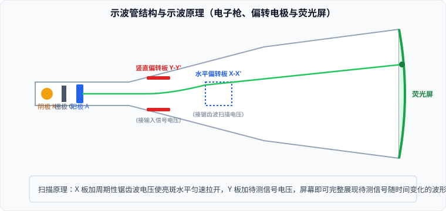

# 03 · 示波管工作原理

## 示波管的三大核心构件

示波器是物理学、电子工程和生物医学中观测电信号波形最核心的科学仪器。其心脏部件是真空玻璃管构成的**示波管**（Cathode Ray Tube, CRT）。

### 1. 电子枪（Electron Gun）——发射并加速聚焦电子束
- **热阴极 $K$**：由灯丝加热金属阴极，使金属内部的自由电子获得足够热动能逸出表面（**热电子发射**）；
- **控制栅极 $G$**：套在阴极外面的圆筒，带负电位。通过调节栅极负电位的高低，控制飞向阳极的电子数量，从而调节荧光屏上光斑的**明亮程度（辉度）**；
- **加速阳极 $A_1, A_2$**：带有中心小孔的同轴金属圆筒，接数千伏的高压正电位。不仅对电子施加巨大的向前静电力将电子高速**加速**，还利用曲面静电场对发散电子束起到类似透镜的**静电聚焦**作用，将电子汇聚成一束极细的高速粒子流。

### 2. 偏转电极（Deflecting Plates）——静电二维正交转向系统
- **竖直偏转板 $Y-Y'$**：水平放置的一对平行金属板。当板间加上电压 $u_y$ 时，产生竖直方向的匀强电场，使电子束在**竖直方向（$Y$ 轴）**发生受控偏转；
- **水平偏转板 $X-X'$**：竖直放置的一对平行金属板。当板间加上电压 $u_x$ 时，产生水平方向的匀强电场，使电子束在**水平方向（$X$ 轴）**发生受控偏转。

### 3. 荧光屏（Fluorescent Screen）——能量转换与视觉显象
- 管底内壁涂有一层薄荧光粉（如掺杂的硫化锌晶体）；
- 当高速电子撞击荧光粉时，高能电子的动能激发荧光分子发光，在撞击点产生肉眼可见的发光亮点；
- 人眼的**视觉暂留效应**（约 $0.1\ \text{s}$）与荧光粉的余辉特性，使得高速移动的亮点连成一条连续光滑的明亮波形线。

---

## 示波管的波形显示机制与扫描原理

荧光屏上的二维光斑坐标 $(X, Y)$，完全由加在两组偏转板上的瞬时电压 $(u_x, u_y)$ 线性决定：
$$X(t) \propto u_x(t), \quad Y(t) \propto u_y(t)$$

### 1. 单独加载电压时的显示图景

| 加载电压模式 | $Y-Y'$ 极板状态 | $X-X'$ 极板状态 | 荧光屏上呈现的物理图景 |
| :--- | :--- | :--- | :--- |
| **无偏转电压** | $u_y = 0$ | $u_x = 0$ | 电子沿轴线直射，屏幕**正中心静止亮斑** |
| **仅竖直加恒定直流** | $u_y = U_0$ (恒定) | $u_x = 0$ | 亮斑沿竖直中线向上（或向下）**静态偏移一个距离** |
| **仅竖直加正弦交流** | $u_y = U_m \sin\omega t$ | $u_x = 0$ | 亮斑在竖直线上做高频简谐振动，形成一条**竖直亮线** |
| **仅水平加锯齿波扫描** | $u_y = 0$ | $u_x$ 为周期性线性锯齿波 | 亮斑以恒定速度从左向右匀速扫过，形成一条**水平亮线（扫描基线）** |

---

## 同步扫描原理（稳定波形显现的充要条件）

为了在屏幕上把随时间交变的电信号波形 $u_y(t)$ 完整“展开”并“固定”住：

1. **水平扫描机制**：
   在 $X-X'$ 板上必须加载一种随时间线性增长的**锯齿波电压（Sawtooth Voltage）**：
   $$u_x(t) = k t \quad (0 \le t \le T_x)$$
   由于水平偏移量 $X \propto u_x \propto t$，**电子束在水平方向被严格匀速向右拉开**，水平位移 $X$ 恰好充当了**时间轴 $t$** 的几何标尺！
2. **扫描同步充要条件**：
   - 设输入待测信号的周期为 $T_y$，机内锯齿波扫描电压的周期为 $T_x$；
   - 要想使屏幕上显示出一个稳定、静止不滚动的待测信号波形，扫描周期必须严格等于待测信号周期的整数倍：
     $$T_x = n T_y \quad (n = 1, 2, 3, \dots)$$
     - 当 $n = 1$ 时（$T_x = T_y$）：屏幕上稳定显示出 **$1$ 个完整的待测波形**；
     - 当 $n = 2$ 时（$T_x = 2T_y$）：屏幕上稳定显示出 **$2$ 个完整的待测波形**；
   - 若 $T_x$ 与 $T_y$ 不满足整数比关系，由于每次扫描开始时待测信号的相位不同，多次扫描画出的轨迹将错位重叠，屏幕上的波形将剧烈左右晃动甚至一片混乱。示波器面板上的“同步整步调节”旋钮正是用于微调 $T_x$ 实现锁定。
