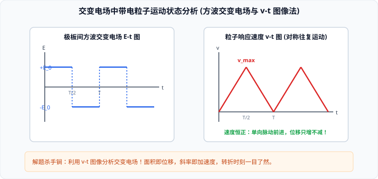

# 考点 · 带电粒子在交变电场中的运动模型

## 交变电场问题的物理特征与核心思想

带电粒子在随时间交替变化的电场（如方波交变电场、正弦交变电场）中运动时，静电力的大小或方向周期性变化，导致粒子的加速度大小或方向也随时间交变。

解决此类问题的三大核心思想：
1. **分段解析法**：根据电场周期的切换节点，将运动拆解为若干个匀变速直线运动阶段；
2. **空间对称与时间周期性**：关注一个完整周期 $T$ 内的速度增量 $\Delta v_T$ 与净位移 $\Delta x_T$；
3. **$v-t$ 图像法（终极秒杀工具）**：将复杂的受力突变转化为清晰的速度—时间几何图线。**斜率代表加速度 $a = \frac{qE}{m}$，图线与时间轴包围的面积严格代表粒子的空间位移**。

---

## 模型一：初速为零粒子在方波交变电场中的直线运动

两平行金属板 $A, B$ 间距为 $d$，板间加载周期为 $T$ 的方波交变电压（前半周期 $E$ 向右，后半周期 $E$ 向左，大小均为 $E_0$）。一质量为 $m$、电荷量为 $+q$ 的粒子在板间由静止释放。

### 1. 入射时刻（释放相位）对运动轨迹的决定性支配

| 释放时刻 $t_0$ | 粒子运动状态特征 | $v-t$ 图像形态 | 最终运动结局 |
| :--- | :--- | :--- | :--- |
| **$t_0 = 0$ 释放** | 前半周期向前匀加速，后半周期向前匀减速到零；下一周期重复 | 图像全部位于时间轴上方（三角波脉动），速度恒 $\ge 0$ | **单向脉动前进**，位移只增不减，向 $B$ 板持续推进 |
| **$t_0 = \frac{T}{4}$ 释放** | 加速 $\frac{T}{4}$ 到达 $v_m$，反向受力减速 $\frac{T}{4}$ 到零；再反向加速 $\frac{T}{4}$，反向减速 $\frac{T}{4}$ 回到原点 | 图像在时间轴上下完全对称，正负面积严格相等 | **以释放点为中心做周期性往复振荡**，一个周期内净位移严格为零！ |
| **$t_0 = \frac{T}{8}$ 释放** | 向前加速时间（$\frac{3T}{8}$）大于反向加速时间（$\frac{T}{8}$） | 正向面积大于负向面积 | **总位移向前推进，但中途伴随局部反向折返倒退** |
| **$t_0 \ge \frac{T}{2}$ 释放** | 刚释放即受向左的电场力 | 速度立即变为负值 | **直接反向撞击 $A$ 板** |

---

## 模型二：带电粒子在交变电场中的偏转运动

带电粒子以恒定速度 $v_0$ 沿中心轴线射入交变偏转极板，板长为 $L$，板距为 $d$。粒子穿过极板的时间为：
$$t_{\text{飞}} = \frac{L}{v_0}$$

根据粒子在板间的驻留时间 $t_{\text{飞}}$ 与交变周期 $T$ 的比例，分为两大经典题型：

### 1. 极短驻留时间模型（$t_{\text{飞}} \ll T$）
- **物理简化**：由于粒子穿越极板所耗时间极短，在这一微小时间窗内，**交变电压几乎没有发生变化，可完全近似视为恒定恒定匀强电场**！
- **分析范式**：直接应用直流偏转公式：
  $$y(t) = \frac{q u(t) L^2}{2md v_0^2}, \quad \tan\theta(t) = \frac{q u(t) L}{md v_0^2}$$
  出射的偏转位移与出射角正比于粒子**射入瞬间的瞬时极板电压 $u(t)$**。屏幕上被打出一条明亮的扫描线段。

### 2. 跨周期长驻留时间模型（$t_{\text{飞}} = nT$）
- **速度分量抵消机制**：
  若粒子在板间飞行时间恰好等于交流电的整周期（$t_{\text{飞}} = T$ 或 $2T$）：
  竖直方向的合冲量在全周期内正负严格抵消：
  $$I_y = \int_0^T q E(t) dt = 0 \implies v_y = 0$$
  > [!IMPORTANT]
  > **平行出射定理**：  
  > 只要粒子在板内飞行时间满足 $t_{\text{飞}} = nT$，**粒子离开极板时的竖直分速度必严格为零，粒子必平行于极板射出偏转电场**！出射速度大小恒等于入射初速度 $v_0$。

---

## 典型考点与解题算法步骤

> [!TIP]
> **交变电场大题五步标准化算法**：
> 1. **算加速度**：求出各阶段恒定加速度 $a = \frac{qE_0}{m} = \frac{qU_0}{md}$；
> 2. **画 $v-t$ 图**：以释放时刻 $t_0$ 为起点，严格按周期画出锯齿状或折线状 $v-t$ 曲线；
> 3. **算特征面积**：计算各阶段三角形或梯形的几何面积，确定粒子在各时刻的空间坐标 $x(t)$；
> 4. **排查碰撞边界**：检查位移极值是否超过极板间距 $d$（是否在中途已提前撞板）；
> 5. **能量校核**：动能变化量由始末速度直接计算 $\Delta E_k = \frac{1}{2}mv_{\text{末}}^2 - \frac{1}{2}mv_{\text{初}}^2$。
