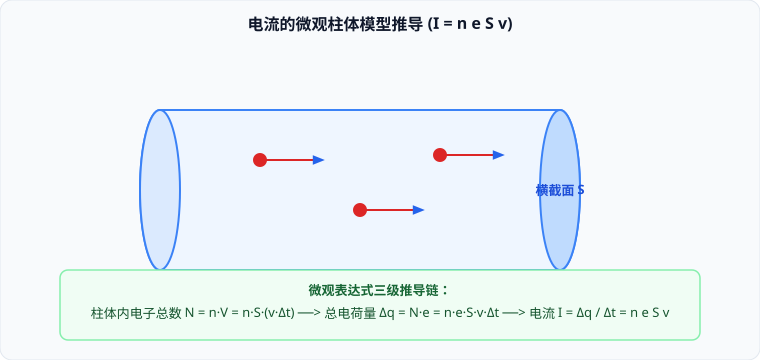

# 01 · 电流与电阻定律

## 电流的形成与宏观量度

电荷的定向移动形成**电流**（Electric Current）。

### 1. 形成持续电流的充要条件
1. 导体内部存在可以自由移动的自由电荷（金属中的自由电子、电解质溶液中的正负离子、稀薄电离气体中的离子与电子）；
2. 导体两端存在持续维持的**电势差（电压）**，由电源等外部能量转换装置提供。

### 2. 电流的宏观定义式
在物理学中，通过导体横截面的电荷量 $q$ 与通过这些电荷所用时间 $t$ 的比值叫作**电流**（通常简称为电流强度），记作 $I$：
$$I = \frac{q}{t} = \frac{\Delta q}{\Delta t}$$
- **标量性**：电流是**标量**。虽然电流具有方向，但电流的合成遵循代数代数加减法（节点电流定律），绝不遵循平行四边形定则；
- **方向规定**：**正电荷定向移动的方向规定为电流的方向**。在最常见的金属导体中，定向移动的是带负电的自由电子，因此自由电子的实际定向移动方向与物理规定的电流方向**严格相反**；
- **国际单位**：安培（Ampere，符号 $\text{A}$），$1\ \text{A} = 1\ \text{C/s}$。常用单位有毫安（$\text{mA}$）和微安（$\mu\text{A}$）。

---

## 电流的微观表达式推导（柱体微元模型）

> [!TIP]
> **可汗学院直观微观图景：数电子**  
> 设有一段粗细均匀的导体，其横截面积为 $S$，导体单位体积内的自由电子数为 $n$（电子数密度），每个电子的电荷量为 $e$，电子定向移动的平均漂移速率为 $v$。

### 1. 柱体模型推导四步法
1. **微元距离**：在微元时间 $\Delta t$ 内，电子沿导线定向移动的距离为：
   $$\Delta l = v \Delta t$$
2. **柱体体积**：在这段时间内，能够穿过指定截面 $S$ 的所有电子，必定位于底面积为 $S$、高为 $\Delta l$ 的虚拟圆柱体内：
   $$\Delta V = S \cdot \Delta l = S v \Delta t$$
3. **总电荷量**：该柱体内的自由电子总数 $N = n \cdot \Delta V = n S v \Delta t$，其携带的总电荷量为：
   $$\Delta q = N e = n e S v \Delta t$$
4. **导出微观表达式**：
   $$I = \frac{\Delta q}{\Delta t} = \frac{n e S v \Delta t}{\Delta t} \implies I = n e S v$$

### 2. 导体内“三种速度”的核心辨析（极易混淆）

| 物理速度类型 | 物理本质 | 运动规律与特征 | 数量级大小 |
| :--- | :--- | :--- | :--- |
| **电子热运动平均速率** | 自由电子在金属晶格间杂乱无章的热碰撞 | 方向完全随机各向同性，宏观不形成净电荷流动 | $\sim 10^5\ \text{m/s}$（极高） |
| **电子定向漂移速率 $v$** | 自由电子在静电力驱动下的宏观定向平均速度 | 形成宏观电流的决定速度（$I = neSv$） | $\sim 10^{-5} \sim 10^{-4}\ \text{m/s}$（**极慢，慢如蜗牛！**） |
| **电场建立与传播速度** | 闭合电路瞬间导线内建立静电场的速度 | 属于电磁波的传播速度，支配灯泡瞬间点亮 | **光速 $c \approx 3 \times 10^8\ \text{m/s}$** |

---

## 电阻定律与电阻率

### 1. 电阻的比值定义式（伏安特性）
导体两端的电压 $U$ 与通过导体的电流 $I$ 的比值叫作导体的**电阻**（Resistance），记作 $R$：
$$R = \frac{U}{I}$$
- 国际单位：欧姆（$\Omega$），$1\ \Omega = 1\ \text{V/A}$。

### 2. 电阻定律（决定式）
实验表明，粗细均匀的导体，其电阻 $R$ 与它的长度 $l$ 成正比，与它的横截面积 $S$ 成反比，还与导体的材料及温度有关：
$$R = \rho \frac{l}{S}$$
- **$\rho$（电阻率）**：反映材料本身导电性能优劣的物理量。国际单位为欧·米（$\Omega \cdot \text{m}$）；
- $\rho$ 越小，说明该材料导电性能越好（如银 $\rho \approx 1.6 \times 10^{-8}\ \Omega\cdot\text{m}$，铜 $\rho \approx 1.7 \times 10^{-8}\ \Omega\cdot\text{m}$，常用作优质导线）；
- 康铜、锰铜合金的电阻率极大且随温度变化极小，常用于制作**标准定值精密电阻**。

### 3. 电阻率与温度的定量关系
- **金属导体**：电阻率 $\rho$ 随温度升高而**增大**（温度升高，金属离子热振动加剧，对电子定向移动的碰撞阻碍增强）；
- **半导体（如硅、锗）**：电阻率 $\rho$ 随温度升高而**显著减小**（热激发使内部自由载流子浓度指数级倍增），广泛应用于制作**热敏电阻**；
- **超导现象**：当某些合金材料冷却到某一特定极低临界温度 $T_c$ 时，其电阻率会**骤降为绝对的零**（完全抗磁性与零电阻），在磁悬浮列车与受控核聚变强磁场中有极高战略价值。
