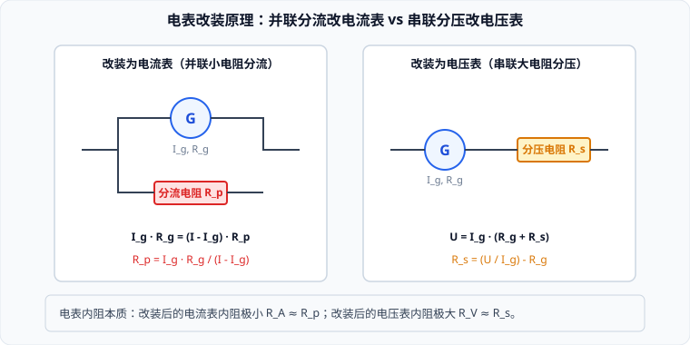

# 02 · 串联电路、并联电路与电表改装

## 串联电路与并联电路的基本规律矩阵

由欧姆定律与电荷、能量守恒定律，串联与并联电路的物理量关系呈现出高度的对偶美感：

| 物理维度 | 串联电路（Series Circuit） | 并联电路（Parallel Circuit） |
| :--- | :--- | :--- |
| **电流关系** | 电流处处严格相等： $$I = I_1 = I_2 = \dots = I_n$$ | 总电流等于各支路电流之和： $$I = I_1 + I_2 + \dots + I_n$$ |
| **电压关系** | 总电压等于各部分电压之和： $$U = U_1 + U_2 + \dots + U_n$$ | 各支路两端的电压严格相等： $$U = U_1 = U_2 = \dots = U_n$$ |
| **等效总电阻** | 总电阻等于各分电阻之和： $$R = R_1 + R_2 + \dots + R_n$$ | 总电阻的倒数等于各支路电阻倒数和： $$\frac{1}{R} = \frac{1}{R_1} + \frac{1}{R_2} + \dots + \frac{1}{R_n}$$ |
| **双电阻特例** | $$R = R_1 + R_2$$ | $$R = \frac{R_1 R_2}{R_1 + R_2}$$ |
| **分配规律** | **正比分压**：各电阻电压与电阻成正比 $$\frac{U_1}{U_2} = \frac{R_1}{R_2}$$ | **反比分流**：各支路电流与电阻成反比 $$\frac{I_1}{I_2} = \frac{R_2}{R_1}$$ |
| **功率分配** | **正比分功**：电阻越大，消耗功率越大 $$\frac{P_1}{P_2} = \frac{R_1}{R_2}$$ | **反比分功**：电阻越小，消耗功率越大 $$\frac{P_1}{P_2} = \frac{R_2}{R_1}$$ |

> [!NOTE]
> **并联电阻的三大定性定理**：
> 1. **“越并越小”定理**：并联总电阻严格小于其中任何一个并联支路的电阻（$R < \min\{R_i\}$）；
> 2. **“同增同减”定理**：电路中任何一个支路的电阻增大，系统的等效总电阻必然增大；
> 3. **极值主导性**：若一个大电阻与一个小电阻并联（$R_1 \gg R_2$），等效总电阻无限逼近较小的电阻 $R \approx R_2$。

---

## 表头 G（小量程灵敏电流计）的三大参数

常用灵敏电流计（表头）是利用通电线圈在磁场中受安培力偏转的原理制成的。其核心电学参数有三个：
1. **满偏电流 $I_g$**：指针偏转到最大刻度时的电流（量程通常极小，为 $100\ \mu\text{A} \sim 5\ \text{mA}$）；
2. **内阻 $R_g$**：表头线圈自身的内阻（通常为几十欧至数百欧）；
3. **满偏电压 $U_g$**：指针满偏时表头两端的电压，由欧姆定律决定：
   $$U_g = I_g R_g$$

---

## 电表改装的数学与动力学推导

表头的满偏电流 $I_g$ 和满偏电压 $U_g$ 都极小，无法直接测量日常电路中的强电流和大电压，必须通过串、并联电阻对其量程进行扩大量程改装：

### 1. 改装为大量程电流表（并联小电阻分流）
- **核心需求**：要将量程为 $I_g$ 的表头改装为量程为 $I$（$I > I_g$）的电流表，需要分担掉多余的电流 $I - I_g$；
- **连接方式**：给表头**并联**一个较小的分流电阻 $R_p$；
- **方程推导**：
  两支路电压相等：
  $$I_g R_g = (I - I_g) R_p$$
- **分流电阻计算式**：
  $$R_p = \frac{I_g R_g}{I - I_g} = \frac{R_g}{\frac{I}{I_g} - 1} = \frac{R_g}{n - 1}$$
  （式中 $n = \frac{I}{I_g}$ 为量程扩大的倍数）；
- **改装后电流表的总内阻**：
  $$R_A = \frac{R_g R_p}{R_g + R_p} = \frac{R_g}{n}$$
  > **物理本质**：理想电流表内阻应为 $0$。改装后电流表内阻 $R_A$ 极小，串联入待测电路时对原电路的分压干扰极小。

---

### 2. 改装为大量程电压表（串联大电阻分压）
- **核心需求**：要将量程为 $U_g$ 的表头改装为量程为 $U$（$U > U_g$）的电压表，需要分担掉多余的电压 $U - U_g$；
- **连接方式**：给表头**串联**一个较大的分压电阻 $R_s$；
- **方程推导**：
  总电压等于各部分电压之和：
  $$U = I_g(R_g + R_s) = U_g + I_g R_s$$
- **分压电阻计算式**：
  $$R_s = \frac{U - U_g}{I_g} = \frac{U}{I_g} - R_g = (n - 1) R_g$$
  （式中 $n = \frac{U}{U_g}$ 为电压量程扩大的倍数）；
- **改装后电压表的总内阻**：
  $$R_V = R_g + R_s = n R_g$$
  > **物理本质**：理想电压表内阻应为 $\infty$。改装后电压表内阻 $R_V$ 极大，并联在待测元件两端时从主电路分走的分流漏电极小。

---

## 电表校准与改装误差分析

改装完成的电表必须用标准表进行校对核准：
1. **电流表校准误差**：
   - 若实测读数比标准表读数偏**小**，说明流入表头的电流偏小、并联电阻 $R_p$ 分流过多 $\implies R_p$ 阻值偏**小**，应换用或串联一个微小电阻增大 $R_p$；
   - 若读数偏**大**，说明 $R_p$ 分流不足 $\implies R_p$ 阻值偏**大**，应并联一个大电阻微调减小 $R_p$。
2. **电压表校准误差**：
   - 若实测读数比标准表读数偏**小**，说明串联分压电阻 $R_s$ 分压过多，表头两端电压过小 $\implies R_s$ 偏**大**，应微调减小 $R_s$；
   - 若读数偏**大**，说明表头分压偏多 $\implies R_s$ 偏**小**，应微调增大 $R_s$。
