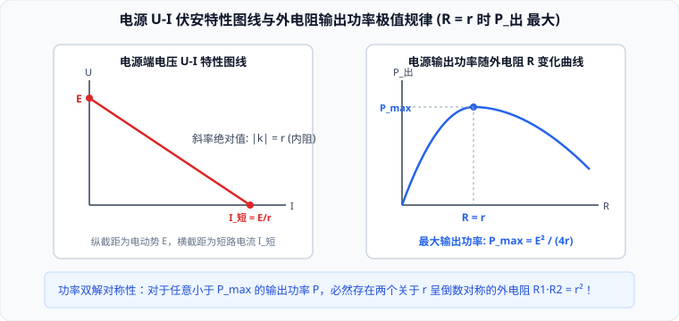

# 03 · 闭合电路欧姆定律

## 电源与电动势的物理本质

### 1. 非静电力与电源的作用
在静电场中，静电力总是驱使正电荷从高电势流向低电势。要维持持续恒定的电流，必须有一个“水泵”般的能量转换装置，能够克服静电力的阻碍，将正电荷从电势较低的负极搬运回电势较高的正极。这一装置就是**电源**（Power Source）。
- **非静电力（Non-electrostatic Force）**：电源内部促使电荷逆着静电力运动的力。在化学电池中，非静电力是**化学溶解与氧化还原反应力**；在发电机中，非静电力是**洛伦兹力**；在太阳能电池中，非静电力是**光生伏特效应内建力**。
- **能量转化本质**：非静电力做功的过程，就是将**其他形式的能（化学能、机械能、光能）转化为电势能**的过程。

### 2. 电动势的比值定义式
非静电力把正电荷从负极移送到正极所做的功 $W$ 与被移送的电荷量 $q$ 的比值，叫作电源的**电动势**（Electromotive Force, EMF），用字母 $E$ 表示：
$$E = \frac{W}{q}$$
- **国际单位**：伏特（Volt，符号 $\text{V}$），$1\ \text{V} = 1\ \text{J/C}$；
- **标量性**：电动势是**标量**，方向习惯上规定在电源内部由负极指向正极（即电势升高的方向）；
- **物理意义**：电动势表征**电源把其他形式的能转化为电能本领大小**的物理量。电动势只由电源本身的物理和化学性质决定，**与电源的大小、是否接入电路以及外电路的结构完全无关**。

---

## 闭合电路欧姆定律的能量守恒推导

设闭合电路由内电路（电源内部，内阻为 $r$）和外电路（负载电阻为 $R$）组成。电路中通过的稳恒电流为 $I$：

### 1. 能量平衡推导
在时间 $t$ 内：
1. **电源非静电力做的总功（转化的总电能）**：
   $$W_{\text{总}} = E q = E I t$$
2. **外电路上消耗的电能（转化为内能或机械功）**：
   $$W_{\text{外}} = U_{\text{外}} I t = I^2 R t$$
3. **内电阻上消耗的电能（产生内阻焦耳热）**：
   $$W_{\text{内}} = U_{\text{内}} I t = I^2 r t$$
4. 根据**能量守恒定律**，全电路中电源产生的总电能等于内外电路消耗的总电能：
   $$W_{\text{总}} = W_{\text{外}} + W_{\text{内}} \implies E I t = I^2 R t + I^2 r t$$
两边同除以 $I t$，得到闭合电路的能量平衡式：
$$E = I R + I r = U_{\text{外}} + U_{\text{内}}$$

### 2. 定律内容与数学公式
**闭合电路中的电流跟电源的电动势成正比，跟内、外电路的电阻之和成反比。**
$$I = \frac{E}{R + r}$$
- **路端电压（外电压 $U$）公式**：
  $$U = E - I r$$

---

## 路端电压随外电阻的变化规律与极限分析

根据路端电压公式 $U = E - I r = E - \frac{E}{R + r} r = \frac{E R}{R + r} = \frac{E}{1 + \frac{r}{R}}$：

### 1. 外电阻变化与端电压的单调关系
- **外电阻 $R$ 增大**：总电流 $I = \frac{E}{R+r}$ 减小，内阻分压 $I r$ 减小，**路端电压 $U$ 增大**；
- **外电阻 $R$ 减小**：总电流 $I$ 增大，内阻分压 $I r$ 增大，**路端电压 $U$ 减小**。

### 2. 两大极端物理边界
1. **断路状态（Open Circuit，$R \to \infty$）**：
   - 电路未接通，外电阻无穷大，电流 $I = 0$；
   - 内电压降落为零：$U_{\text{内}} = I r = 0$；
   - **路端电压达到最大值，且严格等于电源电动势**：
     $$U_{\text{断}} = E$$
   > [!TIP]
   > 实验室常用高内阻电压表直接接在电源两极，此时测得的近似开路端电压就是电源电动势 $E$。
2. **短路状态（Short Circuit，$R = 0$）**：
   - 用无电阻导线直接连接电源正负极，路端电压为零：$U = 0$；
   - **短路电流达到极大值**：
     $$I_{\text{短}} = \frac{E}{r}$$
   - 由于电源内阻 $r$ 通常很小（干电池几欧，铅蓄电池零点几欧），短路电流极其巨大，会瞬间产生毁灭性焦耳热烧毁电源甚至引发火灾！因此一切电路必须安装熔断器或空气开关防止短路。

---

## 电源的 $U-I$ 伏安特性图线全解

根据路端电压方程 $U = E - I r$，在以路端电压 $U$ 为纵轴、干路电流 $I$ 为横轴的直角坐标系中，图线是一条倾斜向下的直线：

- **纵轴截距**：令 $I = 0$（断路），纵截距在数值上严格等于**电源电动势 $E$**；
- **横轴截距**：令 $U = 0$（短路），横截距在数值上严格等于**短路电流 $I_{\text{短}} = \frac{E}{r}$**；
- **斜率的物理意义**：
  直线的斜率为负值，其**绝对值在数值上严格等于电源的内阻 $r$**：
  $$r = \left|\frac{\Delta U}{\Delta I}\right|$$
  - 直线越陡峭（斜率绝对值越大），电源内阻 $r$ 越大；直线越平缓，内阻越小（理想电压源内阻为零，图线为水平线）。
