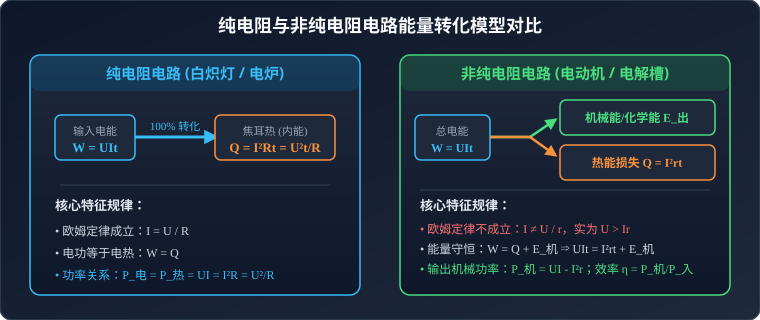

# 04 · 电能与电功率

## 核心物理概念与微观图景

> [!NOTE]
> 本节严格遵循中国普通高中物理教科书（人教版必修第三册）体系，引入可汗学院（Khan Academy）能量流动图景与微观碰撞模型，系统梳理电功、电热与电功率的物理本质。

### 1. 电功（Electric Work）

* **宏观定义**：导体两端存在电势差 $U$ 时，在静电场力的推动下，自由电荷沿导体定向移动，静电力所做的功称为**电功**，用符号 $W$ 表示。
* **数学表达**：
  若在时间 $t$ 内通过导体横截面的电荷量为 $q$，静电力移动电荷所做的功为：
  $$W = qU$$
  由电流强度定义式 $q = It$，代入可得电功普遍适用的计算公式：
  $$W = UIt$$
* **物理意义**：电功是**电能转化为其他形式能**（如内能、机械能、化学能、光能等）的绝对量度。导体中消耗了多少电能，静电力就做了多少功。
* **单位**：国际单位制中为焦耳（$\text{J}$），常用生活单位为“千瓦·时”（$\text{kW}\cdot\text{h}$，俗称“度”）：
  $$1\,\text{kW}\cdot\text{h} = 10^3\,\text{W} \times 3600\,\text{s} = 3.6 \times 10^6\,\text{J}$$

### 2. 电功率（Electric Power）

* **定义**：单位时间内电流所做的功称为**电功率**，描述电流做功的快慢程度，用符号 $P$ 表示：
  $$P = \frac{W}{t} = UI$$
* **单位**：瓦特（$\text{W}$），$1\,\text{W} = 1\,\text{J/s} = 1\,\text{V}\cdot\text{A}$。
* **额定功率与实际功率**：
  * **额定电压 $U_{\text{额}}$ 与额定功率 $P_{\text{额}}$**：用电器在正常工作条件下的规定电压与消耗功率。
  * **实际电压 $U_{\text{实}}$ 与实际功率 $P_{\text{实}}$**：用电器在实际电路中的端电压与实际消耗功率。对于纯电阻用电器（阻值 $R$ 恒定）：
    $$P_{\text{实}} = \frac{U_{\text{实}}^2}{R} = \left(\frac{U_{\text{实}}}{U_{\text{额}}}\right)^2 P_{\text{额}}$$

---

## 焦耳定律与电热微观机理

### 1. 焦耳定律（Joule's Law）

英国物理学家焦耳通过大量实验定量测定了电流热效应：
> **定律内容**：电流通过导体产生的热量，跟电流强度的二次方、导体的电阻以及通电时间成正比。

* **数学表达式**：
  $$Q = I^2 R t$$
* **热功率（Thermal Power）**：单位时间内导体产生的焦耳热：
  $$P_{\text{热}} = \frac{Q}{t} = I^2 R$$

### 2. 可汗学院直观思维：电热的微观碰撞机制

为什么电流通过电阻会生热？从固体物理与微观统计角度审视：
1. **电场加速**：导线内部建立恒定电场 $\vec{E}$，自由电子受电场力 $\vec{F} = -e\vec{E}$ 驱动，在极短自由行程内加速积累动能；
2. **晶格碰撞**：定向漂移的电子与金属晶格阵列中的晶格正离子发生剧烈无规则碰撞（散射），电子将获得的定向定向动能传递给晶格离子；
3. **内能激增**：受到碰撞激发的晶格正离子在其平衡位置附近的无规则热振动加剧，根据热力学微观定义，宏观上表现为导体内能增大、温度升高。
4. **恒定能量流**：电场持续做功注入动能，电子与晶格持续碰撞消散为热振动能量，形成稳定的电能向焦耳热的持续转化。

---

## 纯电阻与非纯电阻电路深度剖析

高考力电综合试题中，区别纯电阻与非纯电阻是能量分析的首要基石。



### 1. 核心对比特征矩阵

| 物理参量 / 规律 | 纯电阻电路（如白炽灯、电炉、电热毯） | 非纯电阻电路（如直流电动机、电解槽、充电电池） |
| :--- | :--- | :--- |
| **电路元件本质** | 仅含产生电阻效应的导体元件 | 包含电磁感应反电动势或化学转化势垒的元件 |
| **能量转化路径** | 电能 $\xrightarrow{100\%}$ 内能（焦耳热） | 电能 $\rightarrow$ 内能（焦耳热）$+$ 机械能 / 化学能 |
| **欧姆定律适用性** | **严格成立**：$I = \dfrac{U}{R}$ | **不成立**：$I \neq \dfrac{U}{R}$，实为 $U > Ir$（$I = \dfrac{U - E_{\text{反}}}{r}$） |
| **电功与电热关系** | $W = Q$ | $W > Q$（$W = Q + E_{\text{出}}$） |
| **电功公式适用** | $W = UIt = I^2Rt = \dfrac{U^2}{R}t$ | **仅能使用** $W = UIt$ |
| **电热公式适用** | $Q = I^2Rt = UIt = \dfrac{U^2}{R}t$ | **仅能使用** $Q = I^2rt$ |
| **输入与分配功率** | $P_{\text{总}} = P_{\text{热}} = UI = I^2R = \dfrac{U^2}{R}$ | $P_{\text{入}} = UI$；$P_{\text{热}} = I^2r$；$P_{\text{出}} = UI - I^2r$ |
| **能量转换效率** | 热转化效率 $100\%$ | 机械效率 $\eta = \dfrac{P_{\text{出}}}{P_{\text{入}}} = 1 - \dfrac{Ir}{U} < 100\%$ |

---

## 直流电动机物理建模与反电动势

### 1. 反电动势（Back EMF）的物理来源

电动机通电后，线圈在安培力驱动下发生旋转。然而，旋转的线圈同时在定子磁场中**切割磁感线**！
根据法拉第电磁感应定律与楞次定律：
* 旋转线圈必感应产生感应电动势 $E_{\text{反}}$；
* 感应电动势的方向必然**阻碍线圈中原驱动电流的流通**，故称之为**反电动势**（Back Electromotive Force）。
* 反电动势大小正比于旋转角速度 $\omega$：$E_{\text{反}} = k \omega$。

由闭合回路电压降平衡（基尔霍夫电压定律）：
$$U = E_{\text{反}} + Ir$$
两边同乘以电流 $I$：
$$UI = E_{\text{反}}I + I^2 r$$
* $UI = P_{\text{入}}$：电源输入电动机的总电功率；
* $I^2 r = P_{\text{热}}$：线圈内阻损耗的热功率；
* $E_{\text{反}}I = P_{\text{机}}$：电动机转化为旋转机械能的净输出机械功率！

> [!TIP]
> **可汗学院直观洞见**：
> 电动机并不是一个“阻值很大”的电阻，而是一个**受控的感应发电机**与一个小电阻的串联。输入电动机的电压 $U$，绝大部分是用来平衡其转动时自己“发出来的电”（反电动势 $E_{\text{反}}$），只有极小的一部分电压 $\Delta U = U - E_{\text{反}} = Ir$ 降落在内阻上推动电流。

### 2. 电动机工作状态临界分析

#### 状态 A：正常稳定运转状态
* 条件：转子自由旋转，转速稳定。
* 电流：$I = \dfrac{U - E_{\text{反}}}{r} \ll \dfrac{U}{r}$（电流较小）。
* 输出机械功率：$P_{\text{出}} = UI - I^2r$。
* 效率：$\eta = \dfrac{P_{\text{出}}}{P_{\text{入}}} = 1 - \dfrac{Ir}{U}$（通常达 $85\% \sim 95\%$）。

#### 状态 B：卡死（堵转）状态
* 条件：电机负载过大或机械传动卡死，转子转速 $\omega = 0$。
* 物理突变：线圈不再切割磁感线，$E_{\text{反}} = 0$！
* 此时电动机**完全蜕变为纯电阻元件**！
* 堵转电流：
  $$I_{\text{堵}} = \frac{U}{r} \ggg I_{\text{正常}}$$
* 堵转电热功率：
  $$P_{\text{堵}} = \frac{U^2}{r}$$
* 危险警示：由于内阻 $r$ 通常仅为几欧姆甚至零点几欧姆，堵转电流比正常工作电流大数十倍，产生的焦耳热会以几十倍的速率聚集，在数秒内烧毁漆包线绝缘层并引起火灾！

---

## 典型高考综合题模型

### 模型：电源-电动机-提升重物动力学模型

**【物理情境】**
直流电源电动势为 $E$，内阻为 $r_0$。接有一台额定电压为 $U$、线圈电阻为 $r$ 的直流电动机。电动机通过无摩擦轻滑轮以恒定速度 $v$ 匀速提升质量为 $m$ 的重物。重力加速度为 $g$。

```
     ┌────[ 电源 (E, r₀) ]────┐
     │                       │
     └───[ S ]────[ (M) r ]───┘
                    │
                 [提升重物 m 匀速 v]
```

**【标准化解题规范与动力学联立】**
1. **重物动力学平衡方程**：
   重物匀速上升，绳子拉力 $F = mg$。
   电动机输出的机械功率为：
   $$P_{\text{出}} = Fv = mgv$$
2. **电路能量守恒方程**：
   设回路中实际电流为 $I$。根据能量守恒定律，电源提供的总电功率等于回路所有发热元件的热功率与电动机输出机械功率之和：
   $$EI = I^2 r_0 + I^2 r + P_{\text{出}}$$
   整理为关于电流 $I$ 的一元二次方程：
   $$(r_0 + r) I^2 - EI + mgv = 0$$
3. **电动机端电压分析**：
   电动机两端实际电压为路端电压：
   $$U = E - I r_0$$
   电动机输入功率：
   $$P_{\text{入}} = UI = (E - Ir_0)I$$
4. **判别式临界求解**：
   一元二次方程有实数解要求判别式 $\Delta \ge 0$：
   $$\Delta = E^2 - 4(r_0 + r)mgv \ge 0 \implies v \le \frac{E^2}{4(r_0 + r)mg}$$
   此式直接导出了电源能支持电动机匀速提升该重物的**最大极限速度**！

---

## 高频易错盲区与避坑指南

> [!WARNING]
> 高考力电综合大题中关于电功率计算的致命误区：

* [×] **误区 1**：认为电动机两端电压为 $U$、电阻为 $r$，其消耗总功率即为 $P = \dfrac{U^2}{r}$。
  > [√] **正解**：$\dfrac{U^2}{r}$ 是电动机**卡死（堵转）**时的破坏性热功率！正常运转时，总输入功率必为 $P_{\text{入}} = UI$，$U > Ir$。

* [×] **误区 2**：在含有电动机的回路中，直接应用全电路欧姆定律计算电流 $I = \dfrac{E}{R_{\text{外}} + r_0}$。
  > [√] **正解**：全电路欧姆定律仅适用于全纯电阻电路。含非纯电阻电路必须使用能量守恒方程 $E I = I^2 r_{\text{内}} + I^2 r_{\text{线}} + P_{\text{机}}$，解关于 $I$ 的方程。

* [×] **误区 3**：混淆“电动机的输入功率”与“电动机的机械输出功率”。
  > [√] **正解**：$P_{\text{入}} = UI$ 是从电网吸纳的总电能速率；$P_{\text{出}} = UI - I^2r$ 才是对外输出做机械功的有用功率。效率 $\eta = \dfrac{P_{\text{出}}}{P_{\text{入}}}$ 必然小于 1。
