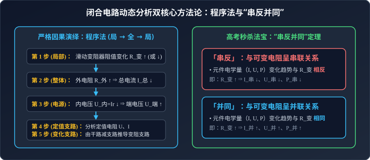

# 考点 · 闭合电路动态分析与电源输出功率

## 考点模型深度解析

> [!IMPORTANT]
> 闭合电路动态分析与功率极值是高考力电综合试题中的必考母题。动态分析考查严密的因果链逻辑推导与电学规律综合运用能力；电源输出功率极值则将欧姆定律与数学二次函数、均值不等式及极值思想深度融合。

---

## 动态电路分析的核心方法体系

闭合电路中由于某一部分滑动变阻器阻值发生变化、开关闭合或断开，导致整个电路的电阻、电流、各部分电压发生一系列连锁反应。



### 1. 严格逻辑推演：程序分析法

程序分析法遵循**“局部 $\to$ 整体 $\to$ 局部”**的严密因果逻辑链：

```
[局部] 滑动变阻器 R_变 变化
   │
   ▼
[整体] 电路总电阻 R_总 判断
   │ （并联支路电阻增大，总电阻必增大；串联电阻增大，总电阻亦增大）
   ▼
[整体] 干路总电流 I_总 = E / (R_总 + r)
   │ （R_总 增大 ⇒ I_总 减小；R_总 减小 ⇒ I_总 增大）
   ▼
[整体] 内电压与路端电压
   │  内电压 U_内 = I_总 · r （随 I_总 同向变化）
   │  路端电压 U_端 = E - I_总 · r （随 I_总 反向变化）
   ▼
[局部] 各定值电阻支路
   │  对于固定电阻 R₀，其 U、I 遵循欧姆定律 U = I · R₀（U 与 I 同向同比例变化）
   ▼
[局部] 变化支路（可变电阻所在支路）
      应用干路减支路推导：I_变 = I_总 - I_定 或 U_变 = U_端 - U_串
```

### 2. 高考秒杀神器：“串反并同”口诀及其数学严格证明

对于只含一个可变电阻 $R_{\text{变}}$、其余元件均为定值电阻的直流线性闭合电路：

> **「串反」**：凡是与可变电阻 $R_{\text{变}}$ 直接或间接呈**串联**关系的用电器，其电流 $I$、电压 $U$、电功率 $P$ 的变化趋势均与 $R_{\text{变}}$ 的阻值变化趋势**相反**！
> * 若 $R_{\text{变}} \uparrow$，则该元件的 $I_{\text{串}} \downarrow$、$U_{\text{串}} \downarrow$、$P_{\text{串}} \downarrow$。

> **「并同」**：凡是与可变电阻 $R_{\text{变}}$ 直接或间接呈**并联**关系的用电器，其电流 $I$、电压 $U$、电功率 $P$ 的变化趋势均与 $R_{\text{变}}$ 的阻值变化趋势**相同**！
> * 若 $R_{\text{变}} \uparrow$，则该元件的 $I_{\text{并}} \uparrow$、$U_{\text{并}} \uparrow$、$P_{\text{并}} \uparrow$。

#### 数学证明简述：
* 设可变电阻所在支路为 $R_{\text{并}}$，与之并联的定值支路为 $R_1$。
* 并联部分等效电阻 $R_{\text{并联}} = \dfrac{R_1 R_{\text{变}}}{R_1 + R_{\text{变}}}$，对 $R_{\text{变}}$ 求导恒大于 0，即 $R_{\text{变}} \uparrow \implies R_{\text{并联}} \uparrow$。
* 该并联部分分得的电压 $U_{\text{并}} = \dfrac{R_{\text{并联}}}{R_{\text{并联}} + R_{\text{串}} + r} E$ 单调递增！
* 因此并联支路两端电压必增大，定值电阻 $R_1$ 的电流 $I_1 = \dfrac{U_{\text{并}}}{R_1}$ 增大，功率 $P_1 = \dfrac{U_{\text{并}}^2}{R_1}$ 增大（**并同**）。
* 与此同时，回路总电流 $I_{\text{总}} = \dfrac{E}{R_{\text{总}} + r}$ 单调减小，故所有串联在干路或定值支路上的元件电流均减小，分压均减小（**串反**）。证毕。

### 3. 极限状态检验法（极端思维）

当滑片移动到两个极端极限位置时（如 $R_{\text{变}} \to 0$ 或 $R_{\text{变}} \to \infty$）：
* 若 $R_{\text{变}} = 0$：该元件被短路，电路结构简化；
* 若 $R_{\text{变}} \to \infty$：该支路直接断路断开；
* 通过对比极端状态下的电路物理量，可以瞬间检验并秒杀定性选择题中的模糊判断。

---

## 电源输出功率极值与等效电源模型


### 1. 外电阻变化时电源输出功率极值定理推导

设电源电动势为 $E$，内阻为 $r$，外电路为纯电阻 $R$。
电源的输出功率即外电路消耗的电功率：
$$P_{\text{出}} = I^2 R = \left(\frac{E}{R + r}\right)^2 R = \frac{E^2 R}{R^2 + 2Rr + r^2}$$
分子分母同除以 $R$（$R \neq 0$）：
$$P_{\text{出}} = \frac{E^2}{R + \frac{r^2}{R} + 2r} = \frac{E^2}{\left(\sqrt{R} - \frac{r}{\sqrt{R}}\right)^2 + 4r}$$

* **极值条件**：根据均值不等式，当且仅当 $\sqrt{R} = \dfrac{r}{\sqrt{R}}$，即 **$R = r$（外电阻等于电源内阻，阻抗匹配）** 时，分母取得最小值 $4r$。
* **最大输出功率**：
  $$P_{\text{出 max}} = \frac{E^2}{4r}$$
* **单调性规律**：
  * 当 $0 < R < r$ 时：$P_{\text{出}}$ 随着外电阻 $R$ 的增大而**单调递增**；
  * 当 $R > r$ 时：$P_{\text{出}}$ 随着外电阻 $R$ 的增大而**单调递减**；
  * 当 $R = r$ 时：电源输出功率达到峰值。

### 2. 输出功率的双解对称性与效率守恒

观察 $P_{\text{出}} - R$ 图像可知，对于任意小于最大输出功率的功率值 $P_0$（$P_0 < P_{\text{出 max}}$），必然存在**两个不同的外电阻值** $R_1$ 与 $R_2$，使得电源输出相同的功率 $P_0$。

将 $P_0 = \dfrac{E^2 R}{(R+r)^2}$ 展开为关于 $R$ 的一元二次方程：
$$P_0 R^2 + (2rP_0 - E^2)R + P_0 r^2 = 0$$
由韦达定理（Vieta's formulas）：
$$R_1 \cdot R_2 = \frac{P_0 r^2}{P_0} = r^2 \implies r = \sqrt{R_1 R_2}$$
> **重要推论 1（几何均值）**：电源内阻 $r$ 恰好是两对应外电阻 $R_1$ 与 $R_2$ 的**几何平均数**！

电源供电效率 $\eta = \dfrac{P_{\text{出}}}{P_{\text{总}}} = \dfrac{I^2 R}{EI} = \dfrac{R}{R + r}$：
* 对应 $R_1$ 时，$\eta_1 = \dfrac{R_1}{R_1 + r}$；
* 对应 $R_2$ 时，$\eta_2 = \dfrac{R_2}{R_2 + r}$；
代入 $r^2 = R_1 R_2$：
$$\eta_1 + \eta_2 = \frac{R_1}{R_1 + \sqrt{R_1 R_2}} + \frac{R_2}{R_2 + \sqrt{R_1 R_2}} = \frac{\sqrt{R_1}}{\sqrt{R_1} + \sqrt{R_2}} + \frac{\sqrt{R_2}}{\sqrt{R_2} + \sqrt{R_1}} = 1$$
> **重要推论 2（效率互补）**：两对应状态下电源的供电效率之和恒等于 1，即 $\eta_1 + \eta_2 = 100\%$！

---

## 高考模型拓展：等效电源法与定值电阻功率极值

### 1. 陷阱辨析：定值电阻 $R_0$ 上的最大功率
若外电路包含定值电阻 $R_0$ 与可变电阻 $R_{\text{变}}$ 串联，求 $R_0$ 消耗的最大功率：
* $P_{R_0} = I^2 R_0$；
* 由于 $R_0$ 阻值恒定，功率只取决于回路电流 $I$；
* 回路电流 $I = \dfrac{E}{R_0 + R_{\text{变}} + r}$；
* **结论**：当 $R_{\text{变}} = 0$ 时，回路电流最大，$R_0$ 获得**绝对最大功率**：
  $$P_{R_0 \text{ max}} = \left(\frac{E}{R_0 + r}\right)^2 R_0$$
> [!WARNING]
> 千万不能套用极值条件让 $R_0 = r$ 或让 $R_0 = R_{\text{变}} + r$！对于定值电阻，电流越大功率必越大！

### 2. 模型转化：可变电阻 $R_{\text{变}}$ 上的最大功率（等效电源法）
求可变电阻 $R_{\text{变}}$ 消耗的最大功率：
* 将串联的定值电阻 $R_0$ 视为电源的内部电阻，与真实电源打包封装为**“等效电源”**：
  * 等效电动势：$E' = E$
  * 等效内阻：$r' = r + R_0$
* 由电源输出功率极值定理，$R_{\text{变}}$ 相当于该等效电源的外电路：
  * 当 **$R_{\text{变}} = r' = R_0 + r$** 时，$R_{\text{变}}$ 获得最大功率：
    $$P_{R_{\text{变}} \text{ max}} = \frac{E'^2}{4r'} = \frac{E^2}{4(R_0 + r)}$$

---

## 含电容器电路的动态分析与电荷量转移

在直流电路中，电容器充放电完毕后处于稳态，其主要特征与解题步骤如下：

### 1. 电容支路的稳态断路原则
* 稳态时，电容支路中没有恒定电流通过（相当于**断路**），与其串联的定值电阻两端无电势差，无分压作用；
* 电容器两极板间的电压等于**与其并联的支路两端电势差**。

### 2. 动态迁移电荷量 $\Delta Q$ 的计算规范
1. **分析初始稳态**：根据闭合电路欧姆定律计算出初始电容器两极板间电势差 $U_1$，上极板带电量 $Q_1 = C U_1$；
2. **分析末态稳态**：变阻器滑动或开关动作后，重新计算末态电势差 $U_2$；
3. **极板电荷转移量判定**：
   * 若极性未变（两端始终同正同负）：
     $$\Delta Q = C |U_2 - U_1|$$
   * 若极性反转（原正极板变为负极板）：
     $$\Delta Q = Q_1 - (-Q_2) = C (U_1 + U_2)$$
4. **流经电阻的电流方向判定**：根据极板电量的增加（充电）或减少（放电），结合极板电荷正负，追踪正电荷流动方向，从而判定通过检流计或电阻的电流流向。

---

## 经典高考易错陷阱与辨析

* [×] **误区 1**：认为电源的外电阻 $R$ 越大，电源输出功率一定越大。
  > [√] **正解**：只有当 $R < r$ 时，加大 $R$ 才能使输出功率增大；当 $R > r$ 时，加大 $R$ 输出功率反而减小。输出功率在 $R = r$ 时达到极大值。

* [×] **误区 2**：混淆“电源输出功率最大”与“电源供电效率最高”。
  > [√] **正解**：电源输出功率最大时（$R = r$），供电效率仅为 $\eta = \dfrac{r}{r+r} = 50\%$，有一半能量耗散为电源内部焦耳热；而供电效率 $\eta = \dfrac{R}{R+r} = \dfrac{1}{1 + \frac{r}{R}}$ 随外电阻 $R$ 增大而单调递增，当 $R \to \infty$（开路状态）时，效率趋近于 $100\%$，但此时输出功率趋近于 0！
