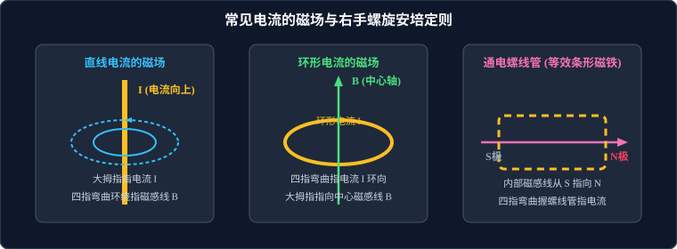

# 01 · 磁场与磁感应强度

## 核心物理概念与内涵

> [!NOTE]
> 本节严格遵循中国普通高中物理教科书（人教版高中物理选择性必修第二册）体系，并结合可汗学院（Khan Academy）空间矢量与场论直观思维，系统阐明磁场的客观存在性与定量表征。

### 1. 磁现象的电本质

* **奥斯特实验（1820年）**：丹麦物理学家奥斯特发现通电导线能使旁边的小磁针发生偏转，首次揭示了**电与磁的深刻内在联系**，证明了电流具有磁效应。
* **磁场的客观实在性**：
  * 磁体与磁体之间、磁体与通电导体之间、通电导体与通电导体之间的相互作用，都是通过其周围客观存在的特殊物质——**磁场（Magnetic Field）** 传递的。
  * 磁场同电场一样，虽然肉眼不可见，但具有能量、动量，对放入其中的磁极和电流施加机械力。
* **安培分子电流假说（Ampère's Hypothesis）**：
  * 安培认为：在原子、分子等物质微粒内部，存在着一种环形微观电流——**分子电流**。分子电流使每个微粒成为一个微小的磁元件，具有两个磁极。
  * **磁化的物理本质**：当外界没有磁场时，分子电流取向杂乱无章，宏观上对外不显磁性；在强磁场作用下，各分子电流取向趋向一致，宏观上显出极强的合磁性。
  * **终极物理图像**：现代量子力学揭示，分子电流本质源于原子核外电子的**轨道运动**与电子自身的**自旋（Spin）**。**一切磁现象归根结底都起源于电荷的运动！**

---

## 磁感应强度的比值定义法与空间矢量性

### 1. 磁感应强度（Magnetic Flux Density）

为了定量表征磁场各点的强弱与方向，引入物理量——**磁感应强度 $\vec{B}$**。

* **方向规定**：在磁场中的任意一点，小磁针静止时 **N极所指的方向**，规定为该点的磁感应强度方向。
* **大小的定量测量（比值定义法）**：
  将一段长为 $L$、通有电流 $I$ 的检验导线**垂直**放入磁场中某点，测得其所受的安培力大小为 $F$。实验表明，比值 $\dfrac{F}{IL}$ 与导线长度 $L$ 和电流强度 $I$ 无关，仅由该点磁场性质决定：
  $$B = \frac{F}{IL} \quad (\vec{B} \perp \vec{L})$$
  若导线方向与磁场方向夹角为 $\theta$，则导线受到的安培力为 $F = ILB\sin\theta$，故普遍定义为：
  $$B = \frac{F}{IL \sin\theta} \quad (\theta \neq 0)$$
* **单位**：国际单位制中为**特斯拉（Tesla）**，符号为 $\text{T}$：
  $$1\,\text{T} = 1\,\frac{\text{N}}{\text{A}\cdot\text{m}} = 1\,\frac{\text{kg}}{\text{A}\cdot\text{s}^2}$$
  地表附近地磁场强度约为 $3 \sim 5 \times 10^{-5}\,\text{T}$；普通强力钕铁硼磁铁表面可达 $0.5 \sim 1.5\,\text{T}$。

---

## 常见电流的磁场与安培定则

磁感线是形象描述磁场分布的空间曲线：任意一点的切线方向即该点 $\vec{B}$ 的方向，磁感线的疏密程度反映磁感应强度的大小。

### 1. 磁感线的拓扑性质（与静电场电场线的本质区别）

* **闭合无头无尾**：静电场的电场线起始于正电荷、终止于负电荷（有源场）；而磁感线是**连续的闭合回线**，在磁体外部由 N 极指向 S 极，在磁体内部由 S 极指向 N 极。
* **高斯磁定律（Gauss's Law for Magnetism）**：自然界中至今未发现孤立的“磁单极子”，穿过任意闭合曲面的净磁通量恒等于零：
  $$\oint_S \vec{B} \cdot d\vec{A} = 0 \quad (\nabla \cdot \vec{B} = 0)$$
* **互不相交**：空间任意一点的磁感应强度合矢量是唯一的，故任意两条磁感线在空间绝对不会相交或相切。

### 2. 安培定则（右手螺旋定则）操作规范

| 电流模型 | 磁场几何特征 | 安培定则操作规范 |
| :--- | :--- | :--- |
| **直线电流** | 以导线为轴的一簇**同心圆柱面**闭合曲线，越靠近导线磁场越强 | **右手握住直导线**：让大拇指指向**电流方向**，弯曲的四指所指的方向就是**磁感线的环绕方向**。 |
| **环形电流** | 中心轴线为直线，两边弯曲向外包围环形导线 | **右手握住环形导线**：让弯曲的四指指向**电流环绕方向**，大拇指所指的方向就是**轴线上磁感线的方向**。 |
| **通电螺线管** | 内部为几乎均匀的平直磁感线（强磁场），外部分布等效于**条形磁铁** | **右手握住螺线管**：让弯曲的四指指向**线圈中电流的环绕方向**，大拇指所指的一端就是螺线管的 **N 极**（内部磁感线指向大拇指）。 |

---

## 磁通量及其标量代数性

### 1. 磁通量（Magnetic Flux）的定义

设在磁感应强度为 $B$ 的匀强磁场中，有一个面积为 $S$ 且与磁场方向垂直的平面，将 $B$ 与 $S$ 的乘积定义为穿过该平面的**磁通量**，符号为 $\Phi$：
$$\Phi = B \cdot S_{\perp}$$
若平面法向量 $\vec{n}$ 与磁场 $\vec{B}$ 夹角为 $\theta$（即平面与磁场夹角为 $\alpha = 90^\circ - \theta$），则：
$$\Phi = \vec{B} \cdot \vec{S} = B S \cos\theta = B S \sin\alpha$$

* **单位**：韦伯（Weber），符号为 $\text{Wb}$：
  $$1\,\text{Wb} = 1\,\text{T}\cdot\text{m}^2 = 1\,\text{V}\cdot\text{s}$$
* **物理图景（可汗学院思维）**：磁感应强度 $B = \dfrac{\Phi}{S_{\perp}}$ 又称**磁通密度**（Flux Density），物理上代表垂直穿过单位面积的“磁感线条数”。

### 2. 磁通量的标量性与正反方向规定

> [!WARNING]
> 磁通量是**标量（Scalar）**，但具有“正负”，正负绝不代表方向，仅代表穿过平面的**入射面方向**！

1. **正方向选定**：事先规定平面的某一面为“正面”（法向量 $\vec{n}$ 指向）；
2. **符号判据**：若磁感线从正面穿入、背面穿出，则 $\Phi > 0$；若从背面穿入、正面穿出，则 $\Phi < 0$；
3. **抵消法则（Net Flux）**：若磁感线同时从正反两面穿过某平面，穿过该平面的净磁通量等于两者的**代数和**：
   $$\Phi_{\text{净}} = \Phi_{\text{正}} - \Phi_{\text{反}}$$
   * 例如：将闭合线框放在通电直导线两侧，若两侧穿过线框平面的磁场方向相反，则总磁通量必发生部分或完全抵消！
4. **磁通量的变化量 $\Delta \Phi$**：
   $$\Delta \Phi = \Phi_2 - \Phi_1$$
   若线圈翻转 $180^\circ$，初始磁通量为 $\Phi_1 = BS$，末态反向穿过 $\Phi_2 = -BS$，则变化量绝对值为：
   $$|\Delta \Phi| = |\Phi_2 - \Phi_1| = |-BS - BS| = 2BS$$

---

## 高频易错辨析与避坑指南

* [×] **误区 1**：根据定义式 $B = \dfrac{F}{IL}$，认为磁感应强度 $B$ 与导线所受安培力 $F$ 成正比，与 $IL$ 成反比。
  > [√] **正解**：$B = \dfrac{F}{IL}$ 是**比值定义法**！磁感应强度是由磁场本身决定的固有物理量，与是否放入导线、导线电流大小、导线长度均毫无关系。当导线平行于磁场放置时，$F = 0$，但该处 $B$ 绝不为 0。

* [×] **误区 2**：认为穿过闭合回路的磁感线条数越多，磁通量一定越大。
  > [√] **正解**：磁通量取决于**净磁通量**。若穿过回路的相反方向磁感线同样很多，两者相互抵消后，净磁通量可能极小甚至为零。

* [×] **误区 3**：线圈在匀强磁场中翻转 $180^\circ$，认为磁通量变化量 $\Delta \Phi = BS - BS = 0$。
  > [√] **正解**：线圈翻转后法向量反向，磁通量符号变号，$\Delta \Phi = (-BS) - BS = -2BS$。在电磁感应中将产生巨大的感应电荷！
