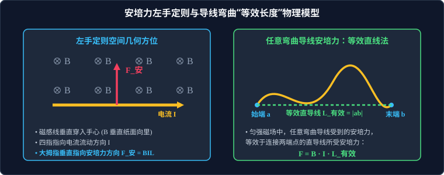

# 02 · 磁场对通电导线的作用力（安培力）

## 核心物理概念与内涵

> [!NOTE]
> 本节严格遵循人教版物理选择性必修第二册体系，结合微元积分思想与矢量叉乘（Vector Cross Product），全面解析安培力的产生机制、几何判定规范与工程仪表应用。

### 1. 安培力（Ampère Force）的基本规律

通电导线在磁场中受到的电磁力称为**安培力**。

* **大小计算公式**：
  若电流强度为 $I$、直导线长度为 $L$、所在匀强磁场磁感应强度为 $B$，导线方向与磁场方向夹角为 $\theta$（$0 \le \theta \le \pi$）：
  $$F = I L B \sin\theta$$
  * **垂直状态（$\theta = 90^\circ$）**：导线垂直磁场时，所受安培力达到最大值：
    $$F_{\text{max}} = B I L$$
  * **平行状态（$\theta = 0^\circ$ 或 $180^\circ$）**：导线平行磁场时，不受安培力：
    $$F = 0$$
* **矢量叉乘本质**：
  在大学物理与高等电磁学中，安培力微元表示为电流微元与磁感应强度的矢量外积：
  $$d\vec{F} = I (d\vec{l} \times \vec{B})$$

---

## 左手定则与空间几何正交关系

判定安培力方向必须使用**左手定则（Left-Hand Rule）**：



### 1. 左手定则标准化操作步骤
1. **展开左手**：伸开左手，使大拇指跟其余四指垂直，并且都跟手掌在同一个平面内；
2. **手心迎磁**：让磁感线从手心垂直穿入（若 $\vec{B}$ 与导线不垂直，手心迎向 $\vec{B}$ 垂直于导线的分量）；
3. **四指指电流**：四指指向电流流动的方向；
4. **拇指定力向**：大拇指所指的方向就是通电导线在磁场中所受安培力的方向。

### 2. 空间正交性与几何约束关系
由矢量积性质 $d\vec{F} = I (d\vec{l} \times \vec{B})$：
* 安培力 $\vec{F}$ **必须同时垂直于导线电流方向 $\vec{I}$ 和磁场方向 $\vec{B}$**！
  $$\vec{F} \perp \vec{I} \quad \text{且} \quad \vec{F} \perp \vec{B}$$
* 即：$\vec{F}$ 恒垂直于由电流 $\vec{I}$ 和磁场 $\vec{B}$ 所确定的空间平面；
* **重点警示**：磁场 $\vec{B}$ 与电流 $\vec{I}$ 之间可以成任意夹角 $\theta$（不一定正交），但安培力 $\vec{F}$ 与它们各自的角度**永远必须是 $90^\circ$**！

---

## 弯曲导线安培力计算：微元积分与“等效长度法”

高考物理中常出现半圆形、折线形、甚至任意不规则曲线通电导线的安培力计算。

### 1. 严格数学积分推导
在匀强磁场 $\vec{B}$ 中，任意空间曲线导线受到的合安培力为所有线元受力的矢量积分：
$$\vec{F} = \int_{\text{起点}}^{\text{终点}} d\vec{F} = \int_{a}^{b} I (d\vec{l} \times \vec{B}) = I \left( \int_{a}^{b} d\vec{l} \right) \times \vec{B}$$
由于 $\int_{a}^{b} d\vec{l} = \vec{L}_{ab}$（连接导线始端 $a$ 到末端 $b$ 的**有向位移线段**），故：
$$\vec{F} = I (\vec{L}_{ab} \times \vec{B})$$

> **等效长度定理（Effective Length Theorem）**：
> 在匀强磁场中，任意形状的通电平面或空间弯曲导线所受的合安培力，完全等效于连接其**起点与终点的直线段**（通以相同电流）所受的安培力！
> $$F = B I L_{\text{有效}} \sin\theta \quad (L_{\text{有效}} = |\vec{L}_{ab}|)$$

### 2. 经典几何构型与结论

1. **半圆形通电导线（半径为 $R$，电流为 $I$）**：
   * 始端与末端的直线距离为直径 $L_{\text{有效}} = 2R$；
   * 受力大小：$F = 2BIR$（方向垂直于直径弦连线）。
2. **任意闭合平面或空间回路**：
   * 回路起点与终点重合，其封闭回路积分 $\oint d\vec{l} = \vec{0}$；
   * **核心推论**：**任意形状的闭合通电线圈置于匀强磁场中，其所受合安培力恒为零！**
   $$\vec{F}_{\text{合}} = \vec{0}$$
   * 注意：虽然合力为零，但线圈可能承受**磁力矩（Torque）**使其绕轴发生旋转。

---

## 两平行通电直导线间的相互作用规律

根据毕奥-萨伐尔定律与安培力规律，可导出平行直导线间的受力：

* **同向电流相互吸引**：导线 1 的电流在其右侧产生向里的磁场，导线 2 处于该磁场中，由左手定则判定受向左的吸引力；同理导线 1 受向右的吸引力。
* **反向电流相互排斥**：导线 1 与导线 2 受向外的斥力。
* **牛顿第三定律严格成立**：无论两根导线的粗细、长短或电流大小是否相同，两导线间的安培力 $F_{12}$ 与 $F_{21}$ 必定**大小相等、方向相反、作用在不同物体上**，是一对相互作用力！

---

## 磁电式电流表的工作原理

磁电式电表（Galvanometer）利用磁场对通电线圈的力矩作用制成。

### 1. 结构与辐向磁场设计
* 由永久磁铁、极靴和圆柱形铁芯组成。
* **辐向磁场（Radial Magnetic Field）**：极靴与铁芯的特殊几何设计使得空气隙中的磁感线均沿半径方向分布。
* **关键物理功能**：无论线圈转到哪个角度，线圈平面**始终与该处的磁感线平行**（$\theta = 90^\circ$ 恒成立），线圈两边所受安培力大小恒定且力臂始终最大！

### 2. 动平衡力矩与刻度均匀性
* 线圈两垂直边受安培力大小为 $F = NBIL$（$N$ 为线圈匝数）；
* 产生的电磁偏转力矩：
  $$M_{\text{磁}} = F \cdot d = N B I (L d) = N B I S$$
  （$S = Ld$ 为线圈有效截面积）。
* 游丝（螺旋弹簧）产生阻碍旋转的反抗弹性力矩，转角为 $\theta$ 时：
  $$M_{\text{弹}} = k \theta$$
* 指针静止平衡时两力矩相等：
  $$N B I S = k \theta \implies \theta = \left(\frac{N B S}{k}\right) I$$
* **刻度均匀的数学依据**：式中 $\dfrac{NBS}{k}$ 为结构常数，因此**表针偏转角 $\theta$ 与流过线圈的电流 $I$ 严格成正比**，这也是为什么磁电式电表的表盘刻度是绝对均匀等间距的物理本质！

---

## 经典高考题型：斜面通电导体棒动力学平衡模型

**【模型构建】**
在倾角为 $\alpha$ 的光滑或粗糙平行倾斜导轨上，放置一质量为 $m$、长度为 $L$ 的金属棒，通入方向如图的恒定电流 $I$。导轨处于匀强磁场中。求棒保持静止的受力平衡条件。

```
          /|  (磁场方向可能竖直向上、水平向右、垂直斜面等)
         / |
        /  |
       /   |  金属棒质量 m，长 L，通电流 I
      /α   |
     /─────┘
```

**【标准化正交分解与解题算法】**
1. **受力分析三要素**：重力 $G = mg$（竖直向下）、支持力 $F_N$（垂直斜面向上）、安培力 $F_{\text{安}} = BIL$（方向由左手定则严格判定）、静摩擦力 $F_f$（沿斜面方向，若光滑则为零）。
2. **磁场不同方向下的安培力分解特征**：
   * **若磁场竖直向上**：由左手定则，安培力**水平向右**。
     沿斜面方向列平衡方程：$BIL \cos\alpha = mg \sin\alpha \implies B = \dfrac{mg \tan\alpha}{IL}$。
   * **若磁场垂直斜面向上**：由左手定则，安培力**沿斜面向上**。
     平衡方程直接为：$BIL = mg \sin\alpha \implies B = \dfrac{mg \sin\alpha}{IL}$。
   * **若磁场水平向左**：由左手定则，安培力**竖直向上**。
     平衡方程为：$BIL = mg$（此时棒对斜面压力恰好为零）。
3. **矢量三角形法快速分析动态极值**：
   在重力 $mg$ 与斜面支持力方向确定的前提下，当安培力方向**平行于斜面向上**时，所需安培力 $F_{\text{安}}$ 取到最小值 $F_{\text{min}} = mg \sin\alpha$，此时磁场应**垂直斜面向上**。

---

## 高频易错盲区与避坑指南

* [×] **误区 1**：用右手去判定安培力的方向。
  > [√] **正解**：记住高考定则口诀——**“因电而动用左手，因动而电用右手”**！通电导线受力运动是“因电而动”，必须严格使用**左手定则**；后续电磁感应切割产生感应电流是“因动而电”，使用右手定则。

* [×] **误区 2**：认为通电弯曲导线的长度就是展开后的实际导线长度。
  > [√] **正解**：匀强磁场中合安培力只认**始末端点的空间直线位移** $L_{\text{有效}}$！即使是一根长达 100 米的杂乱曲折导线，如果两端点距离只有 1 米，其合安培力就只有 $B I \times 1\,\text{m}$。
