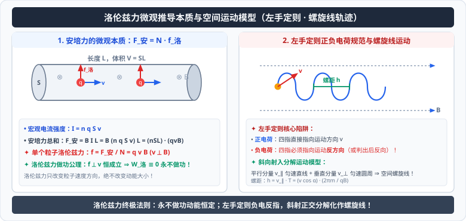

# 03 · 磁场对运动电荷的作用力（洛伦兹力）

  

## 核心物理概念与内涵

> [!NOTE]
> 本节严格遵循人教版高中物理选择性必修第二册体系，结合微观统计平均与相对论电动力学视角，建立宏观安培力与微观洛伦兹力之间的桥梁，揭示洛伦兹力的动力学特征。

### 1. 洛伦兹力的概念

运动电荷在磁场中受到的作用力称为**洛伦兹力（Lorentz Force）**，以荷兰物理学家亨德里克·洛伦兹的名字命名。

宏观的安培力本质上是**磁场对导线内部所有定向移动自由电荷所施加的洛伦兹力的宏观宏观统计合力表现**。

---

## 洛伦兹力公式的微观严格推导

设一段处于磁感应强度为 $B$ 的匀强磁场中的直导线，长度为 $L$，横截面积为 $S$。
导线内单位体积内自由电荷数为 $n$，每个自由电荷所带电荷量为 $q$，在导线内部沿轴线定向漂移的平均速率为 $v$，导线与磁场方向垂直（$\vec{v} \perp \vec{B}$）。

1. **宏观电流强度计算**：
   在时间 $t$ 内流过横截面的电荷量为：
   $$Q = n (S \cdot v t) q$$
   宏观电流：
   $$I = \frac{Q}{t} = n q S v$$
2. **整段导线所受宏观安培力**：
   $$F_{\text{安}} = B I L = B (n q S v) L = (n S L) \cdot (q v B)$$
3. **微观单个电荷受力平均值**：
   导线内的自由电荷总数 $N = n \cdot V = n S L$。
   设每个运动电荷受到的磁场力为 $f$，则 $F_{\text{安}} = N f$：
   $$f = \frac{F_{\text{安}}}{N} = \frac{(n S L)(q v B)}{n S L} = q v B$$

当电荷运动方向 $\vec{v}$ 与磁场方向 $\vec{B}$ 夹角为 $\theta$ 时，普遍形式为：
$$f = q v B \sin\theta \quad (0 \le \theta \le \pi)$$

* 矢量叉乘形式：
  $$\vec{f} = q (\vec{v} \times \vec{B})$$

---

## 洛伦兹力的大小特征与临界分析

1. **最大值（垂直射入）**：当 $\vec{v} \perp \vec{B}$（$\theta = 90^\circ$）时，$\sin\theta = 1$：
   $$f_{\text{max}} = q v B$$
2. **零力状态（平行运动）**：当 $\vec{v} \parallel \vec{B}$（$\theta = 0^\circ$ 或 $180^\circ$）时，$\sin\theta = 0$：
   $$f = 0$$
   此时带电粒子不受磁场力，在磁场中保持原有速度做**匀速直线运动**。
3. **静止电荷受力为零**：当 $v = 0$ 时，$f = 0$。
   > [!IMPORTANT]
   > **与电场力的重大本质区别**：
   > * 静止电荷在静电场中必受电场力：$F_{\text{电}} = qE$（与速度无关）；
   > * 静止电荷在恒定磁场中**绝对不受磁场力**（$f_{\text{磁}} = 0$）。磁场只对**运动电荷**产生相互作用！

---

## 洛伦兹力的方向判定：左手定则的操作规范与致命陷阱

判定洛伦兹力方向必须使用**左手定则**，但对于正负电荷有严格的四指指向规则：

### 1. 左手定则的标准操作规范
* **伸开左手**：使大拇指与四指垂直，都在同一掌面内；
* **迎磁入掌**：磁感线垂直穿过手心（手心迎着 $\vec{B}$ 垂直于速度的分量）；
* **四指指向与电荷属性**：
  * **若为正电荷（$q > 0$）**：四指必须严格指向**正电荷的运动方向 $\vec{v}$**；
  * **若为负电荷（$q < 0$）**：四指必须指向**负电荷运动的反方向**（因为负电荷的定向移动等效于反方向的正电流向）！
* **拇指指示受力**：大拇指所指的方向，即为带电粒子所受洛伦兹力 $\vec{f}$ 的方向。

> [!WARNING]
> **高考极高频失分陷阱**：
> 遇到电子（$\text{e}^-$）、质子反离子、$\beta$ 粒子等**负电荷**时，考生极易顺手将四指直接指向负电荷速度方向而未进行反向翻转，导致判定的洛伦兹力方向直接相反（$180^\circ$ 错误），整道力电综合大题满盘皆输！
> **备用简化技巧**：先当成正电荷用左手定则正常判定，得出大拇指方向后，**直接取相反方向**作为负电荷的受力方向。

---

## “洛伦兹力永不做功”物理公理与运动学推论

### 1. 严格数学证明
根据矢量叉乘的内禀几何性质，矢积 $\vec{v} \times \vec{B}$ 必定垂直于参与叉乘的每一个矢量：
$$\vec{f} \perp \vec{v} \quad \text{且} \quad \vec{f} \perp \vec{B}$$
由于质点的瞬时位移微元 $d\vec{r} = \vec{v} dt$，洛伦兹力在任意瞬时所做的元功为：
$$dW = \vec{f} \cdot d\vec{r} = (\vec{f} \cdot \vec{v}) dt$$
因为 $\vec{f} \perp \vec{v}$，其标量点积恒为零：
$$\vec{f} \cdot \vec{v} = 0 \implies dW \equiv 0$$

> **洛伦兹力做功公理（Theorem on Lorentz Work）**：
> 在任意恒定或非恒定空间磁场中，**洛伦兹力对运动带电粒子所做的功恒等于零！**

### 2. 动能定理与运动学推论
由动能定理：
$$W_{\text{合}} = \Delta E_k \implies \frac{d}{dt}\left(\frac{1}{2}m v^2\right) = \vec{f} \cdot \vec{v} = 0$$
* **推论 1**：磁场中的洛伦兹力**只能改变带电粒子的速度方向，绝不能改变带电粒子的速率和动能**！
* **推论 2**：粒子在纯磁场中运动时，任何时刻的动能 $E_k$ 和速率 $v$ 均**守恒不变**。
* **推论 3**：洛伦兹力在粒子轨道法向提供向心加速度 $a_n = \dfrac{qvB}{m}$，其轨道切向加速度恒为零（$a_t = 0$）。

---

## 深度思辨（可汗学院视角）：既然洛伦兹力不做功，为何宏观安培力可以做功？

这是一个困扰许多物理学子的著名微观-宏观悖论：电动机之所以能对外输出机械功，靠的就是通电导线受到的安培力做功；既然安培力是洛伦兹力的宏观集合，洛伦兹力不做功，安培力的功从何而来？

**【物理图像剖析】**
设金属导体棒以速度 $\vec{v}_{\text{棒}}$ 沿垂直磁场方向运动，棒内自由电子沿棒轴线以速度 $\vec{v}_{\text{漂}}$ 漂移形成电流。
* 电子的**绝对速度**为两者的矢量合速度：
  $$\vec{v}_{\text{合}} = \vec{v}_{\text{棒}} + \vec{v}_{\text{漂}}$$
* 作用于电子的洛伦兹力 $\vec{f}_{\text{总}} = -e (\vec{v}_{\text{合}} \times \vec{B})$ 亦分解为两个分力：
  1. $f_1 = -e (\vec{v}_{\text{漂}} \times \vec{B})$：方向平行于棒运动方向，推动导体棒向前运动，宏观表现为**安培力**，做**正功**：$W_1 > 0$；
  2. $f_2 = -e (\vec{v}_{\text{棒}} \times \vec{B})$：方向沿棒轴线并与电子漂移方向相反，阻碍电流流动，宏观表现为**反感应电动势**，做**负功**：$W_2 < 0$！
* 总功严格为零：
  $$W_{\text{总}} = W_1 + W_2 = 0 \implies W_1 = -W_2$$
* **结论**：安培力所做的宏观机械正功 $W_1$，在微观上完全由克服反向洛伦兹力分力 $f_2$ 做负功所“透支”，而克服 $f_2$ 所需的能量，正是**驱动电路的电源所消耗的电能**！
* 洛伦兹力本身没有提供任何能量，它充当了一个完美的**无损能量转换传输媒介（Transmission Medium）**！

---

## 高频易错盲区与避坑指南

* [×] **误区 1**：认为带电粒子在磁场中运动，只要速度不为零，就一定会受到洛伦兹力。
  > [√] **正解**：若粒子速度方向与磁场方向平行（同向或反向），$\sin\theta = 0$，洛伦兹力为零，粒子做匀速直线运动。

* [×] **误区 2**：在计算重力、电场力和洛伦兹力共同作用下的做功问题时，将洛伦兹力计入动能定理合外力功。
  > [√] **正解**：动能定理方程中 $W_{\text{合}} = W_G + W_{\text{电}} + W_f = \Delta E_k$，洛伦兹力的功 $W_{\text{洛}}$ 永远为 0，切不可画蛇添足写入方程。
