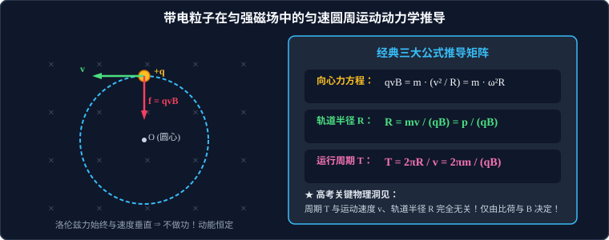

# 04 · 带电粒子在匀强磁场中的圆周运动

## 核心物理概念与运动图景

> [!NOTE]
> 本节严格遵循人教版高中物理选择性必修第二册体系，结合微积分向心加速度几何推导与时空对称性，深度建立带电粒子在恒定磁场中回旋运动的完整动力学架构。

### 1. 运动性质的本质判定

当质量为 $m$、带电量为 $q$ 的粒子以初速度 $\vec{v}$ **垂直射入**磁感应强度为 $B$ 的匀强磁场中时（不计粒子重力）：
1. **力的方向特性**：洛伦兹力 $\vec{f}$ 大小恒定为 $qvB$，且方向在运动平面内始终垂直于瞬时速度 $\vec{v}$；
2. **力的做功特性**：洛伦兹力不做功，粒子的动能 $E_k$ 和速率 $v$ 保持严格恒定；
3. **加速度特性**：洛伦兹力完全充当指向轨道曲率中心的**向心力**，法向加速度大小恒定：
   $$a_n = \frac{f}{m} = \frac{qvB}{m} = \text{常数}$$
4. **运动学结论**：带电粒子必然在垂直于磁场的二维平面内做**匀速圆周运动（Uniform Circular Motion）**！



---

## 核心公式推导矩阵

### 1. 动力学方程与轨道半径公式

由牛顿第二定律，洛伦兹力充当向心力：
$$q v B = m \frac{v^2}{R} = m \omega^2 R = m \frac{4\pi^2}{T^2} R$$

解出**轨道半径（Radius of Orbit）**：
$$R = \frac{m v}{q B}$$

#### 轨道半径的多元等价表达式（高考解题工具箱）：
* **动量关联式**：设粒子动量为 $p = mv$，则：
  $$R = \frac{p}{qB}$$
* **动能关联式**：由于 $E_k = \dfrac{p^2}{2m} \implies p = \sqrt{2mE_k}$，则：
  $$R = \frac{\sqrt{2m E_k}}{qB}$$
* **加速电场关联式**：若粒子最初由静止经加速电压 $U$ 电场加速后垂直射入磁场，由动能定理 $qU = \dfrac{1}{2}mv^2$：
  $$R = \frac{1}{B} \sqrt{\frac{2mU}{q}}$$
  > [!TIP]
  > **比荷判断法则**：经同一加速电场加速后进入相同匀强磁场，粒子的轨道半径 $R \propto \sqrt{\dfrac{m}{q}}$，与比荷的平方根成反比！

---

### 2. 运动周期公式与角速度

粒子完成一个完整圆周运动所花费的时间称为**周期（Period）**：
$$T = \frac{2\pi R}{v} = \frac{2\pi \left(\dfrac{mv}{qB}\right)}{v} = \frac{2\pi m}{qB}$$

* **角速度（Angular Velocity）**：
  $$\omega = \frac{2\pi}{T} = \frac{qB}{m}$$
* **回旋频率（Cyclotron Frequency）**：单位时间内转过的整圈数：
  $$f_{\text{回}} = \frac{1}{T} = \frac{qB}{2\pi m}$$

---

## 物理哲学洞见：周期 $T$ 与速度无关性的深刻内涵

仔细审视周期公式：
$$T = \frac{2\pi m}{qB}$$

> [!IMPORTANT]
> **高考核心基石定理**：
> 带电粒子在匀强磁场中做匀速圆周运动的**周期 $T$、角速度 $\omega$ 和回旋频率 $f$，与粒子的运行速度 $v$ 及轨道半径 $R$ 绝对无关！** 它完全由粒子内禀的**比荷 $\dfrac{q}{m}$** 与外加磁感应强度 $B$ 唯一决定。

### 可汗学院直观思考：两相完美抵消的几何奇迹
* 如果一个粒子的速度变成了原来的 2 倍（$v \to 2v$）：
  * 它在磁场中跑得快了一倍；
  * 但根据 $R = \dfrac{mv}{qB}$，它在磁场中弯转出的轨道半径也**恰好变成了原来的 2 倍**（$R \to 2R$）；
  * 跑完一整圈所需要的周长路程 $S = 2\pi R$ 同样**精确地变成了原来的 2 倍**！
* **路程加倍与速度加倍完全抵消**，导致跑完完整一圈的时间 $T = \dfrac{S}{v}$ **分秒不差、完全相等**！
* 这一惊人的“速度无关性”是现代高能物理实验仪器——**回旋加速器**得以实现共振加速的理论物理前提！

---

## 粒子在有界磁场中运动时间的计算法宝：圆心角换算法

当粒子穿越有界磁场（仅在磁场中划过一段圆弧）时，计算其在磁场中停留的时间 $t$ 遵循以下几何换算：

```
                    / 速度 v_出
                   / 
                  A ─────── 出射点
                 /
                /   圆心角 θ = 速度偏转角 φ
               /
              O (圆心)
               \
                \
                 \ 
                  B ─────── 入射点
                   \
                    \ 速度 v_入
```

### 1. 速度偏转角与圆心角的等价定理
由平面几何知：速度向量始终与圆弧半径垂直（$\vec{v}_{\text{入}} \perp OA$，$\vec{v}_{\text{出}} \perp OB$）。
> **定理**：带电粒子的**速度偏转角 $\varphi$** 恒等于其在磁场中轨迹圆弧所张的**圆心角 $\theta$**：
> $$\varphi = \theta$$

### 2. 运动时间通用计算公式
$$t = \frac{\theta}{2\pi} T = \frac{\theta}{360^\circ} T = \frac{m \theta}{q B} \quad (\theta \text{ 采用弧度制 } \text{rad})$$

---

## 空间三维拓展：斜向射入磁场的螺旋线运动

当带电粒子的初速度 $\vec{v}$ 与磁感应强度 $\vec{B}$ 方向成任意夹角 $\theta$（$0 < \theta < 90^\circ$）时，可利用正交分解法建立空间运动图景：

1. **平行于磁场方向（$\parallel$）**：
   * 分速度：$v_{\parallel} = v \cos\theta$；
   * 受力：不受洛伦兹力（$f_{\parallel} = 0$）；
   * 运动性质：沿磁场方向以恒定速度 $v_{\parallel}$ 做**匀速直线运动**。
2. **垂直于磁场方向（$\perp$）**：
   * 分速度：$v_{\perp} = v \sin\theta$；
   * 受力：受恒定大小的洛伦兹力 $f = q v_{\perp} B$ 提供向心力；
   * 运动性质：在垂直于 $\vec{B}$ 的横截面内做**匀速圆周运动**：
     $$R = \frac{m v_{\perp}}{qB} = \frac{mv\sin\theta}{qB}$$
     $$T = \frac{2\pi m}{qB}$$
3. **合成空间轨迹：等距螺旋线（Helical Motion）**：
   * 粒子一边在截面内做圆周旋转，一边以恒定速度沿磁场方向向前推进；
   * **螺距（Pitch of Helix）**：粒子每回旋一周沿磁场方向推进的直线距离 $h$：
     $$h = v_{\parallel} \cdot T = (v \cos\theta) \cdot \frac{2\pi m}{qB} = \frac{2\pi m v \cos\theta}{qB}$$
* **自然界应用**：地球磁场捕获太阳风中的高能质子与电子，粒子绕地磁场磁感线做高频螺旋运动，在极地稠密大气层激发发光，形成绚丽的**极光（Aurora）**！

---

## 高频易错盲区与避坑指南

* [×] **误区 1**：认为粒子速度越大，在磁场中做圆周运动的周期就越小（频率越高）。
  > [√] **正解**：周期 $T = \dfrac{2\pi m}{qB}$ 与速度 $v$ 毫无关系！速度大只是轨道半径 $R$ 大，转一圈的总时间完全不变。

* [×] **误区 2**：在利用 $t = \dfrac{\theta}{2\pi} T$ 计算粒子在磁场中的运动时间时，误将圆心角 $\theta$ 算成弦切角或入射角。
  > [√] **正解**：必须规范绘制轨迹圆心与始末半径，通过几何关系明确圆心角 $\theta$。弦切角 $\alpha$ 与圆心角的关系为 $\theta = 2\alpha$。
