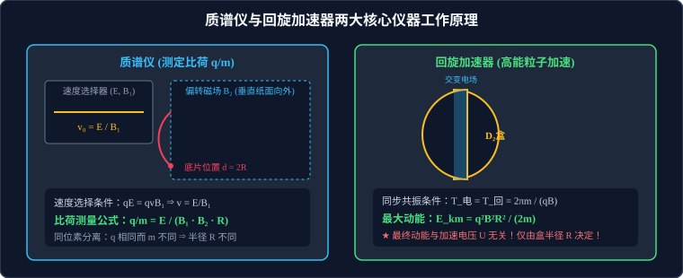

# 05 · 质谱仪与回旋加速器

## 核心物理概念与工程架构

> [!NOTE]
> 本节严格遵循人教版物理选择性必修第二册体系，系统解构现代核物理与近代科学仪器的两大典范——质谱仪与回旋加速器，建立正交场选择、磁偏转分离与电磁交变共振的完整分析范式。



---

## 质谱仪（Mass Spectrometer）

质谱仪是英国物理学家阿斯顿（F. W. Aston）于 1919 年发明的精密科学仪器，阿斯顿利用质谱仪成功证实了同位素的存在，并因此荣获诺贝尔化学奖。

### 1. 三级物理功能架构

```
 [离子源] ──► [加速电场 U] ──► [速度选择器 (E, B₁)] ──► [偏转分离磁场 B₂] ──► [感光底片]
```

#### 第一级：高压加速电场
带电粒子（质量 $m$、电荷量 $q$）由静止在电势差为 $U$ 的电场中加速：
$$qU = \frac{1}{2} m v^2 \implies v = \sqrt{\frac{2qU}{m}}$$

#### 第二级：正交速度选择器（Velocity Selector）
在相互垂直的匀强电场 $\vec{E}$ 与匀强磁场 $\vec{B}_1$ 区域中，沿垂直于电场和磁场的方向注入粒子束。
* **二力平衡条件**：粒子受到向下的电场力 $F_{\text{电}} = qE$ 与向上的洛伦兹力 $f = qvB_1$（以正电荷为例）。
  若粒子能沿直线匀速无偏转地穿过狭缝，必须满足：
  $$qE = qvB_1 \implies v_0 = \frac{E}{B_1}$$
* **速度滤波筛选特性（可汗学院物理洞察）**：
  * 若粒子速率 $v > v_0$：洛伦兹力占优势（$qvB_1 > qE$），粒子向上偏转并打在金属板上被吸收；
  * 若粒子速率 $v < v_0$：静电力占优势（$qE > qvB_1$），粒子向下偏转并被吸收；
  * **极为关键的物理性质**：直线穿过条件 $v_0 = \dfrac{E}{B_1}$ 与带电粒子的**质量 $m$、电荷量大小 $q$ 乃至电荷的正负符号完全无关**！只要速度大小恰好为 $v_0$，任何粒子均能沿直线顺利穿出！

#### 第三级：匀强偏转磁场（Deflection Chamber）
穿出速度选择器的等速带电粒子垂直射入磁感应强度为 $B_2$ 的匀强磁场中，在纯洛伦兹力驱动下做半径为 $R$ 的半圆周轨迹运动，最终撞击在照相底片上：
$$R = \frac{m v_0}{q B_2}$$
底片记录点距离狭缝射入点的直线距离为直径 $d = 2R$：
$$d = \frac{2 m v_0}{q B_2} = \frac{2 m E}{q B_1 B_2}$$

### 2. 比荷测量与同位素分离公式
由上述几何关系，直接测定粒子的**比荷（Specific Charge）**：
$$\frac{q}{m} = \frac{E}{B_1 B_2 R} = \frac{2E}{B_1 B_2 d}$$

> **同位素分离的数学机理**：
> 对于同位素原子核（如 $^{12}\text{C}$ 与 $^{14}\text{C}$），其核电荷数 $q$ 完全相同，由于中子数不同导致质量 $m$ 存在微小差异。因为轨道半径 $R \propto m$，质量不同的同位素将在照相底片的不同刻度位置留下清晰独立的感光谱线，从而实现同位素的高精度定量分离与丰度测量。

---

## 回旋加速器（Cyclotron）

1932 年，美国物理学家欧内斯特·劳伦斯（Ernest Lawrence）发明了回旋加速器，彻底突破了传统高压静电加速器绝缘击穿的工程瓶颈，荣获 1939 年诺贝尔物理学奖。

### 1. 结构设计与两大场的分工

回旋加速器由两个半圆形中空扁金属盒（称为 **D形盒** $D_1$ 和 $D_2$）置于真空容器中构成。两盒留有一条狭窄间隙，盒面垂直于匀强磁场 $\vec{B}$，狭缝之间施加高频交变电压。

| 区域与场类型 | 物理规律与核心作用 | 能量做功判定 |
| :--- | :--- | :--- |
| **两盒狭窄间隙（交变高频电场 $\vec{E}$）** | 周期性反向的匀强电场，粒子每次穿过狭缝均被电场力顺向加速，动能提升 $\Delta E_k = qU$ | **电场力做正功**：$W = qU > 0$，提供粒子全部动能增量 |
| **D形盒内部（静电屏蔽空腔 + 恒定强磁场 $\vec{B}$）** | 金属壳提供完美的静电屏蔽，内部电场 $E=0$；匀强磁场使粒子在盒内做半圆匀速圆周运动并掉头 | **洛伦兹力不做功**：$W = 0$，速度大小不变，仅负责引导转向 |

### 2. 核心动力学机制推导

#### A. 谐振同步加速条件（Resonance Condition）
带电粒子在 D 形盒内每运动半个圆周所花费的时间为：
$$t_{\text{半周}} = \frac{T}{2} = \frac{\pi m}{qB}$$
为了使粒子每次刚跨出 D 形盒狭缝边缘时，对面的电场方向恰好反转为顺着运动方向的加速电场，**交变高频电场的周期 $T_{\text{电}}$ 必须严格等于粒子在磁场中的回旋运动周期 $T_{\text{回}}$**：
$$T_{\text{电}} = T_{\text{回}} = \frac{2\pi m}{qB}$$
交变电场的高频振荡频率：
$$f_{\text{电}} = f_{\text{回}} = \frac{qB}{2\pi m}$$

#### B. 最大动能定理（高考极度高频考点）
粒子在盒内被一次次加速，速度 $v$ 逐步跃升，根据 $R = \dfrac{mv}{qB}$，轨道半径成阶梯状不断向外扩展，形成阿基米德螺旋线般的轨迹。
当粒子运动到 D 形盒边缘、轨道半径达到 D 形盒的**最大物理半径 $R_m$** 时，由引出偏转极板将高能粒子引出：
$$R_m = \frac{m v_m}{q B} \implies v_m = \frac{q B R_m}{m}$$

代入动能公式，导出**最终最大极限动能**：
$$E_{km} = \frac{1}{2} m v_m^2 = \frac{1}{2} m \left(\frac{q B R_m}{m}\right)^2 = \frac{q^2 B^2 R_m^2}{2m}$$

> [!IMPORTANT]
> **高考必背铁律：最大动能的“电压无关性”**
> 带电粒子从回旋加速器引出时所获得的最终最大动能 $E_{km}$，**与两 D 形盒间的加速电压 $U$ 毫无关系！**
> 它仅仅由**D形盒的最大半径 $R_m$**、**磁感应强度 $B$** 以及粒子自身的**电荷量与质量（$q, m$）** 唯一决定！

#### C. 加速电压 $U$ 的真实物理功能：加速次数与运转时间
既然最终动能与 $U$ 无关，为什么工程上仍然要追求更高的加速电压？
* 粒子每穿过一次狭缝获得动能 $qU$，旋转一整圈穿过 2 次狭缝，获得动能 $2qU$；
* **总加速次数 $N$**：
  $$N = \frac{E_{km}}{qU} = \frac{q B^2 R_m^2}{2 m U}$$
* **在磁场中回旋的总圈数 $n$**：
  $$n = \frac{N}{2} = \frac{q B^2 R_m^2}{4 m U}$$
* **粒子在加速器中的总运动时间 $t_{\text{总}}$**（忽略狭缝极窄的微小穿越时间）：
  $$t_{\text{总}} \approx n \cdot T = \left(\frac{q B^2 R_m^2}{4 m U}\right) \cdot \left(\frac{2\pi m}{qB}\right) = \frac{\pi B R_m^2}{2U}$$
* **物理推论**：
  * 增大加速电压 $U$，不能增大粒子的最终能量；
  * 但增大 $U$ 可以**成反比大幅减少总加速次数 $N$ 和总飞行时间 $t_{\text{总}}$**！这能极大地降低高能粒子与空气残留分子碰撞散射的几率，极大地提升束流品质与引出效率。

---

## 回旋加速器的能量上限：相对论效应与失步现象

经典物理回旋加速器为何不能无限制地将质子加速到数千吉电子伏（$\text{GeV}$）？
根据爱因斯坦狭义相对论，当粒子运动速率 $v$ 达到光速 $c$ 的可观比例时（如 $v > 0.1c$），粒子的相对论动质量发生显著膨胀：
$$m = \frac{m_0}{\sqrt{1 - \frac{v^2}{c^2}}}$$
导致粒子在磁场中的实际回旋周期显著变长：
$$T = \frac{2\pi m}{qB} = \frac{2\pi m_0}{qB \sqrt{1 - \frac{v^2}{c^2}}}$$
* **相位失步（Desynchronization）**：粒子的回旋周期变大，而外部交流电的振荡周期 $T_{\text{电}}$ 保持固定，导致粒子到达狭缝时，交流电压不再处于峰值，甚至可能在电场反向的阻碍减速相到达狭缝，无法继续被加速！
* **现代解决方案**：发明**同步回旋加速器（Synchrocyclotron）**，通过实时计算机控制，随着粒子速度的增加动态调低高频电场的频率 $f_{\text{电}}(t)$，使之与粒子逐渐变长的周期保持严格实时共振！

---

## 高频易错盲区与避坑指南

* [×] **误区 1**：认为要想让回旋加速器输出动能翻倍，只需要将交流高频电源的电压 $U$ 提高到 2 倍。
  > [√] **正解**：最大动能 $E_{km} = \dfrac{q^2 B^2 R_m^2}{2m}$ 与 $U$ 完全无关！要让动能翻倍，必须增大 D 形盒半径 $R_m$（至 $\sqrt{2}$ 倍）或提高磁感应强度 $B$（至 $\sqrt{2}$ 倍）。

* [×] **误区 2**：在速度选择器中，正负电荷穿过选择器的方向判定一致。
  > [√] **正解**：速度选择器是**单向通道**！如果粒子从右向左反向射入，无论正负电荷，电场力与洛伦兹力方向都将变为同向，合力绝不为零，粒子必定强烈偏转被吸收。速度选择器只允许粒子从特定一端沿特定方向射入！
