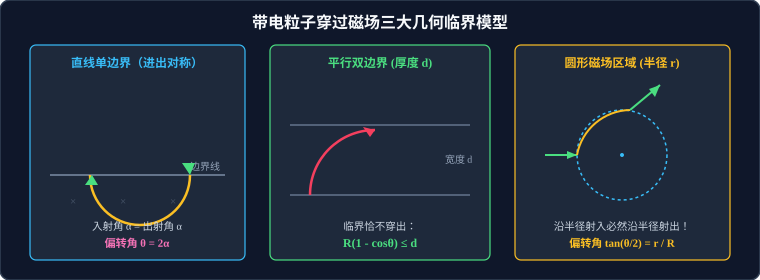

# 考点 · 磁场中圆周运动几何轨迹解题模型

## 考点模型深度解析

> [!IMPORTANT]
> 带电粒子在有界匀强磁场中的圆周运动，是历年高考物理全国卷与各省新高考卷压轴计算题出现频率最高、思维难度最大的超级母题。
> 此类题目将**洛伦兹力动力学、平面几何图形性质（圆的弦切角、相交弦定理、直角三角形相似与勾股定理）、极限与动点轨迹包络**等知识高度综合，解题核心在于“将物理运动精准转化为几何图形”。



---

## 解题通法通则：几何作图“三步曲”

面对任何磁场圆周运动问题，必须严格执行规范的几何构建流程：

```
第一步：【定圆心】 ──► 利用双速度垂线或弦中垂线，几何锁定轨迹圆心 O
        │
第二步：【求半径】 ──► 结合边界几何尺寸与勾股定理/三角函数，求出轨道半径 R
        │
第三步：【定时间】 ──► 判定速度偏转角 φ = 圆心角 θ，按 t = (θ / 2π) · T 计算飞行时间
```

### 1. 第一步：找圆心（Find Center）的几何法则
* **法则 1（双垂线交点）**：已知入射点 $A$ 的速度方向和出射点 $B$ 的速度方向，分别过 $A$、$B$ 两点作两速度矢量的**垂直线**，两垂线的交点必为圆心 $O$。
* **法则 2（中垂线交切线垂线）**：已知入射点 $A$ 的速度方向和出射点 $B$ 的具体空间坐标。连接 $AB$ 构成圆弧的弦，作弦 $AB$ 的**垂直平分线**，该平分线与过入射点 $A$ 的速度垂线的交点即为圆心 $O$。
* **法则 3（弦切角定理）**：速度方向与弦 $AB$ 的夹角称为**弦切角 $\alpha$**。由平面几何弦切角定理知：**圆心角 $\theta$ 严格等于弦切角 $\alpha$ 的 2 倍**（$\theta = 2\alpha$）。

### 2. 第二步：求半径（Find Radius）的代数求解
1. 在辅助线构建的直角三角形中，利用勾股定理或三角函数建立代数方程：
   * 经典直角三角形：$R^2 = (R - d)^2 + x^2$ 或 $\sin\theta = \dfrac{d}{R}$；
2. 联立物理动力学公式：
   $$R = \frac{mv}{qB}$$
   求得未知速度 $v$、磁感应强度 $B$ 或空间距离参数。

### 3. 第三步：定时间（Calculate Time）的圆心角映射
速度矢量的偏转角 $\varphi$ 在数值上严格等于圆弧所对的圆心角 $\theta$：
$$\varphi_{\text{偏转}} = \theta_{\text{圆心角}}$$
在磁场中的停留运动时间为：
$$t = \frac{\theta}{2\pi} T = \frac{\theta}{360^\circ} \left(\frac{2\pi m}{qB}\right) = \frac{m \theta}{q B} \quad (\theta \text{ 采用弧度制})$$

---

## 三大经典有界磁场几何临界模型

### 1. 直线单边界磁场模型（进出对称定理）

当带电粒子从一条平直磁场边界以角度 $\alpha$ 射入半无限大磁场，并最终从同一直线边界射出时：

* **对称出射定理**：
  * **出射角等于入射角**（出射速度与边界的夹角等于入射速度与边界的夹角 $\alpha$）；
  * **出射速率等于入射速率**；
  * 粒子在磁场中转过的圆心角：
    * 若顺时针偏转（劣弧）：$\theta = 2\alpha$；
    * 若逆时针偏转（优弧）：$\theta = 2\pi - 2\alpha$。
* **入射点与出射点间距（弦长）**：
  $$L_{AB} = 2 R \sin\alpha$$
* **射入磁场的最大深度（纵向极值）**：
  $$h_{\text{max}} = R (1 - \cos\alpha)$$

---

### 2. 平行双边界磁场模型（穿透临界与偏转极值）

磁场分布在相距为 $d$ 的两平行平直边界之间（如板间区域）：

* **垂直射入模型（$\vec{v} \perp$ 边界）**：
  * **临界条件**：当轨迹圆恰好与下边界相切时，临界半径为 $R_{\text{临界}} = d$。
  * 若 $R \le d$（即 $v \le \dfrac{qBd}{m}$）：粒子无法穿透磁场，在磁场中回转 $180^\circ$ 后从原边界反向飞出，运动时间恒为半个周期 $t = \dfrac{T}{2} = \dfrac{\pi m}{qB}$。
  * 若 $R > d$（即 $v > \dfrac{qBd}{m}$）：粒子能够穿透对侧边界，偏转角由 $\sin\theta = \dfrac{d}{R}$ 决定，运动时间 $t = \dfrac{\arcsin(d/R)}{2\pi} T$。
* **斜射入模型（与边界成 $\theta$ 角）**：
  * 粒子恰好不穿出另一边界的几何临界为**轨迹圆与该边界相切**：
    $$R (1 - \cos\theta) = d \implies R_{\text{临界}} = \frac{d}{1 - \cos\theta}$$

---

### 3. 圆形区域磁场模型（径向对称性与磁聚焦）

匀强磁场被限制在半径为 $r$ 的圆形区域内，粒子轨迹圆半径为 $R$：

* **径向对称出射定理**：
  > **核心物理结论**：凡是沿**半径方向（指向磁场圆心）射入**圆形磁场的带电粒子，偏转后飞出磁场时，**出射速度方向的反向延长线必过磁场圆心（即沿半径方向射出）！**
* **对称性推论**：
  * 入射点、出射点与两圆心（磁场圆心 $O_{\text{磁}}$、轨迹圆心 $O_{\text{轨}}$）构成**对称筝形（Kite）**；
  * 粒子在磁场中的速度偏转角 $\theta$ 与几何几何半径满足：
    $$\tan\left(\frac{\theta}{2}\right) = \frac{r}{R}$$
* **磁聚焦模型（Magnetic Focusing）**：
  若一束相互平行的同种单能带电粒子射入圆形磁场，当粒子轨迹半径恰好等于圆形磁场半径（$R = r$）时，所有粒子穿出磁场后将汇聚于圆周上的同一点（焦点），这在粒子加速器束流聚焦中有极高工程价值。

---

## 压轴思维突破：三大“动态圆”高级分析技法

高考综合题常出现“速度大小未知”、“发射方向连续分散”或“入射点移动”等不确定条件，此时必须运用**“动态圆”**探寻几何临界与包络边界：

### 1. 放缩圆模型（Radius Scaling Method）
* **特征**：入射点位置固定，射入速度方向固定，**速度大小 $v$ 未知或连续变化**。
* **几何规律**：因为速度方向确定，所有不同速度对应的轨迹圆圆心必分布在**同一条过入射点的速度垂直线上**（圆心线）。
* **操作技法**：
  将圆心沿该直线滑动，将轨迹圆像吹气球一样从小到大“放缩”，寻找轨迹圆与各边界发生**相切（内切或外切）**的临界状态，从而锁定临界速度 $v_{\text{临界}}$ 或临界半径 $R$。

### 2. 旋转圆模型（Rotating Circle Method）
* **特征**：入射点位置固定，**速率 $v$ 恒定（半径 $R = \dfrac{mv}{qB}$ 固定大小）**，但**速度方向向平面各个方向各向同性发射**（如点状放射源）。
* **几何规律**：
  所有轨迹圆都必须经过固定的入射点 $P$，且圆半径均为 $R$。由平面几何知，所有可能轨迹圆的圆心 $O'$ 都分布在**以入射点 $P$ 为圆心、以 $R$ 为半径的“辅助圆心圆”上**！
* **操作技法**：
  将一个固定大小（半径 $R$）的圆绕着固定点 $P$ 旋转 $360^\circ$：
  * **粒子覆盖区域（包络圆）**：所有粒子运动轨迹所能覆盖的最大空间区域是一个以 $P$ 为圆心、以 **$2R$ 为半径的同心圆**！
  * 寻找旋转圆与接收屏或障碍物相切的临界出射角 $\alpha$，秒杀“粒子打在板上的最长线段长度”或“粒子溢出的最大角度范围”。

### 3. 平移圆模型（Translating Circle Method）
* **特征**：一束平行、等速的带电粒子流入射（速度方向固定，速率 $v$ 固定，轨道半径 $R$ 恒定），但**入射点沿一条线段平行移动**。
* **几何规律**：所有轨迹圆大小相同、偏转方向相同，仅仅在空间做刚体平移。
* **操作技法**：平移轨迹圆，寻找入射边界两端点对应的起始轨迹与终止轨迹，分析两极端轨迹在出射屏上所截取的有效范围。

---

## 高考答题规范与防失分守则

> [!WARNING]
> 解答磁场中圆周运动大题时，必须严格遵守以下评分细则：

1. **必须画图**：在草稿纸和试卷解答区域必须规范画出**磁场边界、入射点、出射点、圆心位置及速度垂线**，标明圆心角 $\theta$ 或关键几何夹角；
2. **严禁直接写结论**：必须先写出原始向心力动力学方程 $qvB = \dfrac{mv^2}{R}$，再写出 $R = \dfrac{mv}{qB}$；
3. **几何推导要交代直角三角形**：在答卷上必须写明“在 $\text{Rt}\triangle OAC$ 中，由几何关系得 $\sin\theta = \dots$”，不可无中生有直接写出包含三角函数的结果；
4. **注意多解性检验**：
   * 磁场方向或电荷正负未明确时，存在向上偏转与向下偏转的双解；
   * 穿入磁场的临界存在“直接穿出”与“在边界相切返回”的多解可能。
