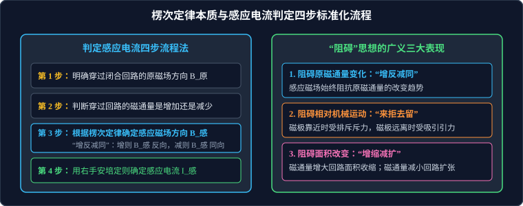

# 01 · 电磁感应现象与楞次定律

## 核心物理概念与内涵

> [!NOTE]
> 本节严格遵循人教版高中物理选择性必修第二册体系，结合法拉第实验发现与热力学能量守恒定律，建立感应电流从微观驱动到宏观响应的完整逻辑图景。

### 1. 电磁感应现象的发现与产生条件

1831 年，英国物理学家法拉第（Michael Faraday）经过长达十年的艰辛实验，终于突破了“磁生电”的关键机制：**只有当磁场发生变化时，才会激发感应现象！**

* **感应电流的产生条件（充要判据）**：
  > **核心充要条件**：**只要穿过闭合导体回路的磁通量发生变化（$\Delta \Phi \neq 0$），回路中就会产生感应电流！**
* **磁通量发生变化 $\Delta \Phi \neq 0$ 的物理途径**：
  根据 $\Phi = B \cdot S_{\perp} = B S \cos\theta$：
  1. **$B$ 发生变化（$\Delta B \neq 0$）**：磁体相对移动、开关通断、滑动变阻器调节改变电流等；
  2. **$S$ 发生变化（$\Delta S \neq 0$）**：闭合回路的导体棒在导轨上滑动切割，改变闭合区域面积；
  3. **$\theta$ 发生变化（$\Delta \theta \neq 0$）**：闭合线圈在磁场中绕轴发生旋转（如交流发电机）。
* **感应电动势的优先存在性**：
  即使电路没有闭合（断开），只要穿过线圈或导体切割时的磁通量发生变化，导体两端依然会产生**感应电动势（Induced EMF）**。回路闭合是形成感应电流的必要条件，但电动势的产生只取决于磁通量变化！

---

## 楞次定律（Lenz's Law）的物理本质与“阻碍”内涵

1834 年，俄国物理学家楞次概括出了判定感应电流方向的普遍定律：
> **定律内容**：**感应电流具有这样的方向，即感应电流的磁场总要阻碍引起感应电流的磁通量的变化。**



### 1. 深度辨析：“阻碍”的深刻物理哲学

“阻碍”绝不等于“相反”，高考必须精准把握以下三大唯物辨证内涵：
1. **“阻碍”不是“相反”**：
   * 当回路中原磁通量**增加**时，感应电流的磁场与原磁场方向**相反**（反抗增加）；
   * 当回路中原磁通量**减少**时，感应电流的磁场与原磁场方向**相同**（补偿减少）；
   * 规律提炼：**“增反减同”**！
2. **“阻碍”不是“阻止”**：
   * 感应电流的磁场只是延缓、抗拒原磁通量的改变，但绝不可能阻止原磁通量的变化，最终磁通量依然会按照外因驱动的方向持续演进。
3. **能量守恒的客观要求（可汗学院物理洞见）**：
   * 楞次定律是**能量守恒定律在电磁感应领域的必然体现**！
   * 试想：如果感应电流的磁场方向顺应原磁通量的增加（“增同”），那么感应磁场将进一步增大磁通量，从而激发更大的感应电流，形成恶性正反馈爆炸，凭空源源不断创造能量，这彻底违背了热力学第一定律！
   * 正是因为感应电流必然产生反向抗拒力，外力必须克服这种电磁阻碍做功，才能将机械能或化学能转化为回路中的电能！

---

## 判定感应电流的标准化“四步流程法”

高考答题时，利用楞次定律判定感应电流方向必须严格执行以下四步：

```
第 1 步：查明回路原磁场方向 B_原
   │
   ▼
第 2 步：判定穿过回路的磁通量是增大（↑）还是减小（↓）
   │
   ▼
第 3 步：根据楞次定律“增反减同”法则，确定感应电流的磁场方向 B_感
   │     • 若 Φ 增大 ⇒ B_感 与 B_原 相反
   │     • 若 Φ 减小 ⇒ B_感 与 B_原 相同
   ▼
第 4 步：右手握紧线圈，大拇指指向 B_感，四指弯曲指向即为感应电流 I_感 的流动方向
```

---

## 广义楞次定律：四大秒杀解题推论

在定性选择题中，逐一分析磁场方向极其繁琐，运用广义楞次定律的衍生推论可以实现“一秒破题”：

### 1. 阻碍原磁通量变化 —— **“增反减同”**
* 感应电流的磁场始终对抗原磁通量的变化趋势。

### 2. 阻碍相对机械运动 —— **“来拒去留”**
* **物理机制**：感应电流在磁场中受到安培力，安培力的宏观力学效果必然是**阻碍引起感应的相对机械运动**。
* **规律呈现**：
  * 当磁铁靠近闭合线圈时，线圈产生感应电流，所受电磁力表现为**排斥力（拒）**；
  * 当磁铁远离闭合线圈时，线圈产生感应电流，所受电磁力表现为**吸引力（留）**；
  * 无论是靠近还是远离，外力克服安培力所做的机械功全部转化为电路中的焦耳热！

### 3. 阻碍回路面积形变 —— **“增缩减扩”**
* 若闭合回路是由柔软导线制成，或含有可滑动的导体棒：
  * 当穿过回路的磁通量**增加**时，回路面积具有**自动收缩**的趋势（通过缩小截面积 $S$ 来抗拒 $\Phi$ 的增大）；
  * 当穿过回路的磁通量**减少**时，回路面积具有**自动扩张**的趋势（通过扩大截面积 $S$ 来抗拒 $\Phi$ 的减小）。

### 4. 阻碍原电流变化 —— **“增离减靠”**
* 两个平行放置、电流同向或反向的闭合导线圈：
  * 当一侧线圈电流急剧增大时，两线圈相互推开排斥（远离）；
  * 当一侧线圈电流减小时，两线圈相互靠近吸引。

---

## 切割磁感线产生感应电流：右手定则

当导体棒在磁场中做切割磁感线运动时，使用**右手定则（Right-Hand Rule）**比楞次定律四步法更加迅捷：

### 1. 右手定则的操作规范
1. **伸开右手**：使大拇指与其余四指垂直，并且都跟手掌在同一个平面内；
2. **手心迎磁**：让磁感线垂直穿入手心；
3. **拇指指运动**：大拇指指向导体棒**相对磁场运动的方向 $\vec{v}$**；
4. **四指指电流/电势**：四指所指的方向就是**感应电流的方向**（在导体内部，从低电势端指向高电势端）。

> [!IMPORTANT]
> **左手定则与右手定则的终极防混淆判据**：
> * **“因电而动用左手”**：已知电流求导线受到的安培力、已知带电粒子运动求洛伦兹力（受力分析）$\to$ **左手定则**；
> * **“因动而电用右手”**：已知导体棒在磁场中运动，求产生的感应电流方向、感应电动势正负极 $\to$ **右手定则**。

---

## 高频易错盲区与避坑指南

* [×] **误区 1**：认为磁感应强度 $B$ 很大、或穿过线圈的磁通量 $\Phi$ 很大的地方，感应电流一定很大。
  > [√] **正解**：感应电流取决于磁通量的**变化率 $\dfrac{\Delta \Phi}{\Delta t}$**，而不是磁通量 $\Phi$ 本身的大小！即使 $\Phi$ 极大，只要 $\Phi$ 保持恒定不发生改变（$\Delta \Phi = 0$），感应电流就绝对为零。

* [×] **误区 2**：在利用右手定则判定导体棒两端电势高低时，把四指指向的一端当作负极。
  > [√] **正解**：正在切割磁感线的导体棒**等效于内电路电源**！在电源内部，电流是从**低电势负极流向高电势正极**的。因此，四指所指的电流流出端是**电源的正极（高电势端）**！
