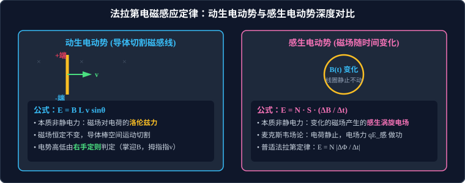

# 02 · 法拉第电磁感应定律

## 核心物理概念与内涵

> [!NOTE]
> 本节严格遵循人教版高中物理选择性必修第二册体系，引入微元积分与麦克斯韦场论视角，全面解构法拉第电磁感应定律的数学形式、微观非静电力机理与高考定量计算范式。

### 1. 法拉第电磁感应定律（Faraday's Law of Induction）

* **定律内容**：闭合回路中感应电动势的大小，跟穿过这一回路的**磁通量的变化率**成正比。
* **数学表达式**：
  $$E = N \left| \frac{\Delta \Phi}{\Delta t} \right|$$
  其中：
  * $E$ 为感应电动势（单位：伏特 $\text{V}$）；
  * $N$ 为感应线圈的匝数；
  * $\dfrac{\Delta \Phi}{\Delta t}$ 为磁通量的变化率（单位：韦伯每秒 $\text{Wb/s}$，且 $1\,\text{Wb/s} = 1\,\text{V}$）。
* **微积分瞬时表达式**：
  $$E(t) = -N \frac{d\Phi}{dt}$$
  （式中负号由德国物理学家诺依曼引入，数学上表达了楞次定律关于感应电动势反抗原磁通量改变的阻碍特性）。

---

## 核心物理量概念辨析：$\Phi$、$\Delta \Phi$ 与 $\dfrac{\Delta \Phi}{\Delta t}$

高考极易在以下三个物理量的内涵与图像斜率上设置概念陷阱：

| 物理量 | 物理意义 | 几何图像对应 | 运动学类比 | 决定因素 |
| :--- | :--- | :--- | :--- | :--- |
| **磁通量 $\Phi$** | 某时刻穿过回路平面的磁感线净条数 | $\Phi - t$ 图像上的纵坐标值 | 质点的位置 $x$ | 磁感应强度 $B$、面积 $S$ 及夹角 $\theta$ |
| **磁通量变化量 $\Delta \Phi$** | 某时间段内磁通量的改变差值（$\Phi_2 - \Phi_1$） | $\Phi - t$ 图像上初末点的纵坐标差 | 质点的位移 $\Delta x$ | 初末状态的磁通量之差 |
| **磁通量变化率 $\dfrac{\Delta \Phi}{\Delta t}$** | 磁通量随时间变化的快慢程度 | **$\Phi - t$ 图像切线的斜率 $k$** | 质点的速度 $v = \dfrac{\Delta x}{\Delta t}$ | 磁通量改变的快慢程度，**直接决定感应电动势 $E$ 的大小**！ |

> [!TIP]
> **可汗学院直观警示**：
> $\Phi$ 很大时，斜率可以为零（$E=0$）；$\Phi$ 为零时，斜率可以极大（$E$ 达到峰值）。求感应电动势，目光永远要盯紧 **$\Phi - t$ 图线的切线斜率**！

---

## 动生电动势与感生电动势深度对比

电磁感应中的感应电动势根据产生机理分为**动生电动势**与**感生电动势**两类：



### 1. 动生电动势（Motional EMF）

* **产生机制**：磁场恒定不变，导体棒在磁场中做**切割磁感线运动**而产生的感应电动势。
* **计算公式**：
  当直导线长度为 $L$、运动速度为 $v$、磁感应强度为 $B$，三者相互垂直时：
  $$E = B L v$$
  若速度方向与导线、磁场方向成夹角 $\theta$：
  $$E = B L v \sin\theta$$
* **非静电力微观本质：洛伦兹力**
  * 设导体棒内有一带正电的自由电荷 $q$ 随棒以速度 $v$ 运动，受到沿棒方向的洛伦兹力分量 $f = qvB$；
  * 该洛伦兹力充当“非静电力”，将正电荷不断推向导体棒一端，使两端聚集异种电荷建立静电场；
  * 当静电力与洛伦兹力平衡时：$q E_{\text{内}} = q v B \implies E_{\text{内}} = v B$；
  * 两端电势差：$U = E_{\text{内}} L = B L v$。

### 2. 感生电动势（Induced EMF）

* **产生机制**：导体回路固定静止不动，**空间磁场随时间发生变化**而在回路中激发的感应电动势。
* **计算公式**：
  若面积为 $S$ 的线圈垂直置于磁场中，磁场变化率为 $\dfrac{\Delta B}{\Delta t}$：
  $$E = N S \frac{\Delta B}{\Delta t}$$
* **非静电力微观本质：麦克斯韦感生涡旋电场**
  * 麦克斯韦电磁场理论指出：**随时间变化的磁场在其周围空间激发一种闭合环状的电场——感生电场（涡旋电场 $\vec{E}_{\text{感}}$）**；
  * 处于涡旋电场中的自由电荷受到感生电场力 $\vec{F}_{\text{电}} = q \vec{E}_{\text{感}}$ 的驱动，定向移动形成感应电流；
  * **哲学升华**：即使空间中根本没有导体线圈，变化的磁场依然会在真空中激发出真实的涡旋电场！线圈只是用来检测并传导这一电场的载体。

---

## 转动切割磁感线模型：微元积分与等效平均速度

当一根长为 $L$ 的金属导体棒绕其一端为转轴 $O$，在垂直于匀强磁场 $B$ 的平面内以恒定角速度 $\omega$ 逆时针匀速转动时：

```
      O (转轴) ════════════════════════════► 端点 A (线速度 v = ωL)
      │◄────────── 棒长 L ──────────────►│
```

### 1. 微元积分推导
在距转轴为 $r$ 处取一极小长度微元 $dr$，其线速度为 $v(r) = \omega r$。
微元产生的感应电动势为：
$$dE = B \cdot v(r) \cdot dr = B (\omega r) dr$$
对整根导体棒求积分：
$$E = \int_0^L B \omega r dr = B \omega \left[ \frac{1}{2} r^2 \right]_0^L = \frac{1}{2} B \omega L^2$$

### 2. 等效平均速度法
由于棒上线速度沿径向线性增大，其中点处的线速度即为全棒的算术平均速度：
$$\bar{v} = \frac{v_O + v_A}{2} = \frac{0 + \omega L}{2} = \frac{1}{2}\omega L$$
直接代入动生公式：
$$E = B L \bar{v} = B L \left(\frac{1}{2}\omega L\right) = \frac{1}{2} B \omega L^2$$

---

## 瞬时电动势 vs 平均电动势与迁移电荷量计算铁律

在高考电磁感应大题中，必须严格区分瞬时量与平均量的适用场景：

### 1. 瞬时值（Instantaneous Value）的应用
* 公式：$E = BLv$ 或 $E(t) = N \left|\dfrac{d\Phi}{dt}\right|$；
* **唯一适用场景**：求解**某一特定时刻的瞬时电流 $I = \dfrac{E}{R_{\text{总}}}$**、**瞬时安培力 $F_{\text{安}} = BIL$**、**瞬时电功率 $P = I^2 R$** 以及动力学瞬时加速度 $a = \dfrac{F_{\text{合}}}{m}$。

### 2. 平均值（Average Value）与迁移电荷量积分定理
* 公式：$\bar{E} = N \dfrac{|\Delta \Phi|}{\Delta t}$；
* **唯一适用场景**：求解**在某一段时间 $\Delta t$ 内通过导体横截面的电荷量 $q$**！

#### 迁移电荷量定理推导：
设在时间 $\Delta t$ 内，穿过回路的磁通量变化量为 $\Delta \Phi$，回路总电阻为 $R_{\text{总}}$。
流过横截面的电荷量为电流对时间的积分：
$$q = \int_0^{\Delta t} i(t) dt = \bar{I} \Delta t$$
将平均电流 $\bar{I} = \dfrac{\bar{E}}{R_{\text{总}}}$ 与平均电动势代入：
$$q = \left( \frac{N \frac{\Delta \Phi}{\Delta t}}{R_{\text{总}}} \right) \Delta t = N \frac{\Delta \Phi}{R_{\text{总}}}$$

> [!IMPORTANT]
> **高考必须牢记的电量黄金定理**：
> 通过回路某横截面的感应电荷量 $q$：
> $$q = N \frac{\Delta \Phi}{R_{\text{总}}}$$
> **它只取决于磁通量的总变化量 $\Delta \Phi$ 和回路总电阻 $R_{\text{总}}$，与发生这一变化经历的时间长短 $\Delta t$、是加速、减速还是变加速运动绝对毫无关系！**

* 对于平直导轨滑棒模型，若棒滑行位移为 $x$，则 $\Delta \Phi = B \cdot (Lx)$：
  $$q = \frac{B L x}{R_{\text{总}}}$$
  此式在高考中是**由已知电荷量 $q$ 反求滑行位移 $x$、或由位移求电量**的秒杀必用桥梁！

---

## 高频易错盲区与避坑指南

* [×] **误区 1**：在计算转动切割电动势时，直接用端点线速度套入公式得 $E = BL(\omega L) = B\omega L^2$。
  > [√] **正解**：棒上各点速度不同，必须使用平均速度 $\bar{v} = \dfrac{1}{2}\omega L$，正确结果必带系数 $\dfrac{1}{2}$，即 $E = \dfrac{1}{2}B\omega L^2$。

* [×] **误区 2**：在利用 $q = \dfrac{\Delta \Phi}{R_{\text{总}}}$ 计算电荷量时，分母总电阻漏掉内阻 $r$。
  > [√] **正解**：$R_{\text{总}}$ 必须是**整个闭合回路的全部电阻之和**（外电路定值电阻 $R$ 与导体棒自身内阻 $r$ 的串联和 $R + r$）。
